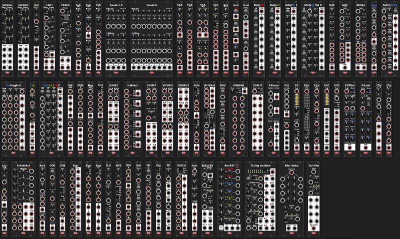

# Infinite-Noise rack modules

<!-- Version and License Badges -->

Every time I've looked into the hardware euro-rack path I've end up with a rack potentially costing 3-6000€ depending how crazy I go (whether I want a "full rack" or simply "expand" my Behringer APR2600). So for now my poor-mans hardware solution is a Behringer -ARP2600, -Neutron, -Crave, Hydrasynth and Korg SQ-1/NTS-2 that I can patch between. But thankfully we have **VCV-Rack** as a software alternative to the physical hardware. While it was +30 years since I last did any C++ coding, I decided to make a few modules that I personally would like to have in my rack, and I hope others will enjoy them as well. *For those interested, some time ago I made a (Windows only) [Waveform/Wavetable-Generator](http://www.infinite-noise.com/WaveformGenerator.aspx) software, for generating single-cycle waveforms and wavetabels.*

The Infinite-Noise modules are built for VCV Rack 2.5 and later. If you want to see what has been added, changed, or fixed in the latest versions, see the [Changelog](CHANGELOG.md). A full **[Manual](doc/manual.md)** is also available with a description of each and every module. Besides the changelog and manual, I also have a simple [Status-list](Status.md) listing the current status of each module, along with "known issues" (if there are any) or perhaps "notes" to myself about what I might want to add or change in the future *(everything is subject to change, or perhaps never be changed — so take it for what it is)*.

## Nightly builds
The latest automated development builds for Windows, Linux, and macOS are available from the **[Nightly release](https://github.com/pellelil/InfNoiseRack/releases/tag/Nightly)**. The Nightly release should be regarded as an "in development" version, even though I will try ensure it will only contain bug free modules. However it might contain new modules under development, which means things might change.

## Credit
I would like to offer a big thank you to **Paul Dempsey** (aka pachde) for his GitHub Actions workflow and his ["GenericBlank" template](https://github.com/Paul-Dempsey/GenericBlank), which kick-started this project, along with [How to Setup your Windows VS Code Environment for VCV Rack Plugin Development and Debugging](https://medium.com/@tonetechnician/how-to-setup-your-windows-vs-code-environment-for-vcv-rack-plugin-development-and-debugging-6e76c5a5f115) by **tonetechnician**. Also a big thank you to **Andrew Belt** and everyone else who has been part of the development of **VCV Rack** and its plug-ins/modules. Likewise, a big thank you to ALL the people who have made open-source plug-ins for VCV Rack, and those who have been active in the Development section of the VCV forum, especially those who were willing to answer all of my n00b questions on the forum ... so much to learn. Not to forget **Bloodbat**, who made the container used by the Nightly build workflow.

## License
All source code is copyright © 2024-2026 Infinite-Noise (Pelle Liljendal) and is licensed under the [GPL-3.0-or-later (GNU General Public License, version v3+)](http://www.gnu.org/licenses/gpl.html).