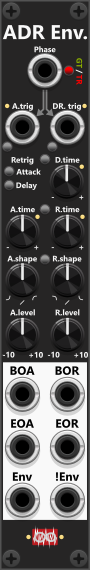
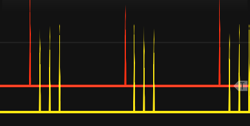

# ADR Envelope
The ADR Envelope is a three-phase **Attack/Delay/Release envelope generator** (or simply a two-phase Attack/Release envelope when the delay time is 0). It ramps the Envelope output between an attack end-level (**A.level**) and a release end-level (**R.level**), with independent time and shape for each phase. It is driven by a shared **Phase input** (gate or trigger-mode) or **dedicated A.trig / DR.trig inputs**, and small manual buttons beside those ports to manually fire them. At the bottom of the module you find the 5 outputs, where the first 4 outputs a trigger when the attack/release phases begin/end, and the last outputs the envelope as it transitions between the A.level and R.level values.

*You could argue that this module is an **ASDR envelope generator** (Attack, Sustain, Delay, Release), or an **ASR envelope** when no delay is dialed in. Attack, Delay, and Release are timed stages; Sustain is the held level (**A.level**) while waiting for Delay/Release — so the A.level knob is effectively the sustain level. However "ASDR" would probably confuse users into thinking it was an **ADSR** generator, so the "S" (Sustain) is deliberately left out of the name and the description below.*

Unlike a classic ADSR that always returns to 0 V, both phase end-levels are set by knobs in the range −10V to +10V. Defaults are A.level = 10V and R.level = 0V, which covers the usual unipolar envelope case, but you can set any levels you might need (e.g. set A.level to 0V and R.level to 10 in order to inverte the envelope). Initialized (before any inputs are supplied) the module will be at the end of/after of a release phase (waiting for an attack phase to begin), hence the Envelope will be default output R.level. Using an ADR envelope, there are three phases (only two if delay time is 0):
+ **Attack**: Envelope transitions toward **A.level** (over **A.time**, with **A.shape**), which is then hold.
+ **Delay**: Holds current envelope output level till **D.time** has elapsed.
+ **Release**: Envelope transitions toward **R.level** (over **R.time**, with **R.shape**), which is then hold.

If a phase is interrupted mid-ramp (for example the phase gate falls before attack finishes), the module starts the new phase from the current Envelope voltage, not from the previous target (e.g. A.level). Likewise if an attack trigger is detected while the release phase is active, the attack will by default begin at the curren Envelope voltage - unless A.retrig is enabled, in which case a full new Attack-phase (envelope rising from R.level to A.level) will begin. **Attrack/Delay retrig is only possible when using dedicated A.trig and/or DR.trig inputs** as the Phase input will always switch between Attack or Delay/Release whether it is gate- or trigger-mode.

Using the context menu you can setup **Rate Chaos** individually for Attack-, Delay- and Relase-time. If the time (e.g. Attack time) is non-zero and the Rate Chaos is higher than 0% each time a phase begins it will internally change the "time" of the phase subtle or not so subtle (e.g. alter between slow and fast attacks). General use of Rate Chaos is described in the [main manual](manual.md#rate-chaos).

It's worth noting that the **A.time/R.time knobs basically dial in a Rate** and not a fixed time (how "quickly" will the envelope rise/fall its full transition). Lets say A.level is 10V, R.level is 0V, and both A.time and R.time have been set to 1 second. This means both the rise-rate and fall-rate will be set to "10V per 1 second" (as the difference between A.level and R.level is 10V). If the attack phase is interupted at 6V (before ending its phase at 10V), the release phase only needs to transition from 6V to 0V. With the fall-rate specified as "10V per 1 second", the release phase will only last 0.6 seconds. Likewise if a new A.trig signal is being input before the release phase have finished, it will by default begin from the current envelope level. Hence if the Envelope had reached 3V, the attack phase would only need to transition from 3V to 10V (lasting 0.7 seconds). If/when **Attack retrig is enabled, the Attack will always begin from R.level** (in this example, and by default 0V, hence it would always last the full second).

After attack completes while the phase-gate is still high, the envelope output holds at A.level until delay/release begins. After release completes, the envelope output holds at R.level until the next attack. While the module is in the attack phase it will normally ignore the A.Trig input, however if **Attack retrig** is set to **Enabled**, each A.Trig input will start a new attack phase, where the Envelope output will jump to the R.level and begin its transition to the A.level again.

As indicated by the grey arrows in the top, the A.trig and DR.trig inputs are normalized (in a special way) to the Phase-input. If you input a phase signal in gate mode, the high-edge of the gate is routed to the A.trig input and the low-edge of the gate is routed to the DR.trig input. If the phase input is trigger mode, each odd-trigger is routed to A.trig and every even-trigger is routed to DR.trig. *You should EITHER use the Phase input or the A./DR.trig inputs. However if using both, the A./RD.Trig inputs take priority over the Phase input.*

A **DR.trig** (dedicated or via Phase) starts Delay → Release when the module is not already in Delay or Release — or whenever Delay retrig is enabled, and delay time is non-zero. During Delay the Envelope holds its last output. If D.time is 0 it goes straight into Release. **BOR (Begin Of Release)** fires only after Delay ends (immediately if D.time is 0). With Delay retrig off or 0 Delay time, DR.trig is ignored while Delay or Release is already active. This means with Delay retrig enabled, and a non-zero delay time, the module can **fire multiple BOR triggers** (one after each delay).

**TIP**: By connecting the **EOA (End Of Attack)** output to the **DR.trig** input you can put the module into an **automatic mode**. Where you only need to trigger the A.Trig to have it perform a whole cycle of Attack->Delay->Release. If you at the same time connect a cable between **EOR (End Of Release)** into the **A.Trig** input you only have to start it once (with an A.Trig input or button press) to have it keep running: Attack->Delay->Release-> ... continuously.

The lights next to A.trig and DR.trig indicate the active phase, and the color indicates "the position within that phase" (only one light is illuminated at any one time).
+ **A.trig light is green** while the attack is running (Envelope output is transitioning to A.level).
+ **A.trig light is red** when A.level has been reached (Envelope output is held at A.level).
+ **DR.trig light is yellow** while delay is active (previous Envelope output is held).
+ **DR.trig light is green** while release is active (Envelope is transitioning to R.level)
+ **DR.trig light is red** when R.level has been reached (Envelope output is held at R.level)

Between the A./R. time/shape-knobs you find a small latched **Link-button**. When pressed (green) the release-knob will be linked to the attack-knob (e.g. linking R.time to A.time). When linked, the release-knob is rendered inactive, and instead it will take its value directly from the attack-knob. The shape link-button have two modes, so pressed a 2nd time it turns **red where R.shape is linked to A.shape reversed** (the more counter clockwise you turn A.shape the more R.shape will turn clockwise - and vice versa). These link buttons makes it easy for you to dial-in the exact same values for both the attack- and release knobs (e.g. if you want to ensure that attack and release have the same time- and/or shape-setting).

For the attack/release phases you both find a begin-trigger output (e.g. **BOA=Begin Of Attack**) and an end-trigger output (e.g. **EOA=End Of Attack**). These will fire whenever a phase begins and ends. If Attack retrig is enabled, the BOA trigger will fire each time you trigger the A.trig input, whether that phase is currently active or not. If you have dialed in a non-zero delay, the **BOR (Begin Of Release)** won't fire till the delay has finished. Then end-trigger outputs ("EOA" and "EOR") will only fire if the phase runs it full cycle. E.g. if you input a trigger into A.Trig before the previous release finishes, EOR will not fire. *There are no begin/end phase trigger-outputs for the delay phase. However, if you have a non-zero delay, a pulse into the DR.trig is basically the same as a begin-delay trigger, and the BOR (Begin Of Release) is basically the same as an end of delay.*

**TIP**: An ADR envelope has many uses. For example, you can patch the **Envelope** output into a VCA or a crossfade module. Each time a trigger is received on the **Phase** input (in Trigger mode), the envelope can make a crossfade module smoothly transition between two of its inputs. The **A.time**, **R.time**, **A.shape**, and **R.shape** settings determine how fast- and how the fade is performed, while **A.level** and **R.level** define the output range of the fade-signal (basically "how wide/deep" the cross-fader should fade).

**TIP**: Although this is not the intended purpose of the module, it can be used as a trigger delay. Patch a trigger into **A.trig** and enable **Attack retrig** if each new trigger should restart the delay. Set **A.time** to the desired delay — for example, 1 second — and use the **EOA (End Of Attack)** trigger output as the delayed trigger. **EOA** fires when the attack stage completes, one "attack time" after an accepted trigger starts the attack. If you also connect EOA into DR.Trig, dial in a delay time, you can use the **BOR (Begin Of Release)** as a 2nd further delayed trigger output (BOR will fire once the delay have ellapsed). In this configuration the module will fire 2 delayed triggers for each A.trig input, where A.Time controls the 1st "delay" (before EOA fires), a D.time controls the 2nd/additional "delay" (before BOR fires). *Actually a 3rd futher delayed trigger can be generated if you dial in R.Time and use the EOR (End Of Release) output. In the screenshot below the red trigger is the original, and the 3 yellow are each delayed 0.2s in relation to the previous one.*

**TIP**: The module can also be used to "delay gates", although the delay is less precisely controlled than a "delayed trigger". Infinite Noise modules normally detect signals of 1V or higher to be high gates. By adding an attack time, the output rises gradually and is not considered high until the envelope passes 1V. Selecting an exponential attack shape delays this crossing even further. Likewise, adding a release time delay, when the output falls below 1 V after the input gate goes low. An exponential release shape can extend this delay further. *Beside delaying the gate, you can increase the gate-length by the time dialed in by the D.time knob.*

**TIP**: The module can also be used transform triggers into fixed length gates. Set both A.time and R.time to 0, however set D.time (Delay) to a non-zero value where it basically controls the length/duration of the output. Now connect the EOA (End Of Attack) output to the DR.Trig input, and finally connect your external trigger signal to the A.Trig input. When the module recieves an A.Trig from an external source, the "Attack phase will begin", however as A.Time is 0, the evenvelope will instantly jump to A.level (default 10V) and EOA will fire as the Attack phase have ended. Since EOA is connected to DR.Trig the delay will begin, while holding the envelope at the current value (A.level). Once the delay have ended, it will go into the Release phase, however as R.Time is 0, the Envelope will jump to R.level (default 0V), and the module will be ready to react to the next A.Trig (to again "convert a trigger into a fixed length gate").

[Go back to modules overview](manual.md#modules)
