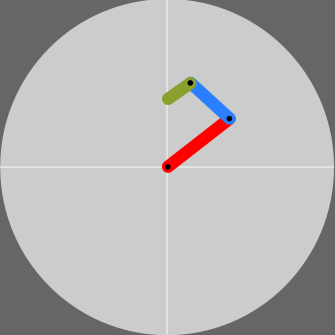
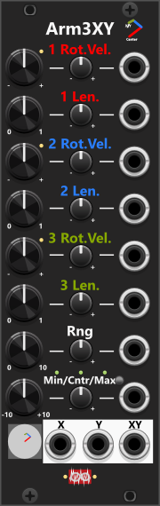

# Arm 3 XY(a)

 
The Arm3XY module generates 3 output values, labeled X, Y and XY which - based on settings and CV-input - tends to be smooth evovling curves (where XY is an averaging mix of X and Y). While these values are not strictly random, their behavior can appear unpredictable or dynamic, making them suitable for use in generative or evolving modulation. The module is based on the **motion of three interconnected rotating arms**, each defined by its length and rotational velocity (speed and direction of rotation). The first arm (red) is fixed at the center of an imaginary square, with the second arm (blue) attached to the end of the first, and the third arm (green) extending from the second. As each arm rotates and changes length, the movement cascades through the system, influencing the final position of the third arm’s endpoint, which determines the X/Y outputs. These outputs are then scaled according to the Range and Min/Cntr/Max settings, ensuring that the values fall within a specified range.

The diagram above illustrates the mechanics of the three arms: red (arm 1), blue (arm 2), and green (arm 3). The light-gray circle represents the maximum possible reach of the system, with a radius equal to the sum of all three arm lengths. This circle is centered within a dark-gray square, which represents the defined X/Y range. Any values falling outside the circle—corresponding to the visible dark-gray corners—are X/Y-positions that cannot be reached, as they are beyond the combined reach of the arms (outside of combined radius).

If you set the length of both the second and third arm to zero, they effectively become inactive, meaning only the first arm contributes to the output. The actual length of the first arm in this case is not critical, as all lengths are scaled relative to each other. The 1 Rot. setting controls the rotational speed of the first arm, which can reach up to 50 rotations per second in either direction when dialed-in to its maximum. By default, the rotation speed changes linearly, but using the context menu, this can be adjusted to exponential (indicated by a green light) or logarithmic (indicated by a red light).

With a fixed length and the 1 Rot. setting at its maximum, the X/Y outputs will form a 50 Hz sine wave, with Y phase-shifted relative to X, effectively producing a cosine wave. This can be observed using a VCV SCOPE module. Pressing the "1x2" button in the SCOPE module will reveal that the X/Y outputs create a perfect circular motion. Experimenting with different lengths and rotation velocities for arms 2 and 3 will show how they influence the generated output. For instance, setting a low rotation speed for the first arm while giving the second arm a short length but a high rotational speed creates more intricate movement patterns in the X/Y outputs.

Basically the 3 arms will function like 3 sines (with individual frequency and amplitude) which are added. Therefore, unless you input CV to dynamical change arm-length and/or rotatation velocity, the X/Y outputs tends to be "repetetive". As an alternative to CV (or perhaps as an addition) **rotational chaos and length chaos** can be applied individually to each arm via the context menu. Both default to 0% (disabled) and can be set in 5% steps, up to 100%. When rotational chaos is in use, each time an arm finishes a rotation (crosses 0°) a new factor is calculated and applied to the rotational velocity until the arm again crosses 0°. Length chaos works the same way: a new length multiplier is calculated at each 0° crossing, but it is angle-weighted (full effect at 180°, fading to zero at each 0° crossing) so the outputs produce smooth curves. *Applying chaos to both rotational velocity and length of an arm is equivalent to change frequency and amplitude of one of the "3 sines added together". For more info on rate chaos see the description in the [main manual](manual.md#rate-chaos).*

Using VCV's **Random** (via the context menu) on this module randomizes arm rotation/length knobs, and also picks rot/length chaos per arm independently: each has a 30% chance of being enabled, and when enabled the level is chosen randomly between 5% and 50%. This should increase the chance, that a randomized patch will generate interesting/usable output.

Activating all three arms (ensure lenght > 0) and assigning different rotational speeds and lengths makes the X/Y output appear far less predictable and more dynamic. This effect becomes even more pronounced when the rotation and length settings are modulated by external CV sources such as LFOs, Sample & Hold modules, or other control signals (and/or applying rotational and length chaos via the context menu). When the settings and external modulations are subtle, the outputs create smooth, evolving curves, whereas more erratic modulations result in sharper, unpredictable changes in the X/Y movement.

[Go back to modules overview](manual.md#modules)