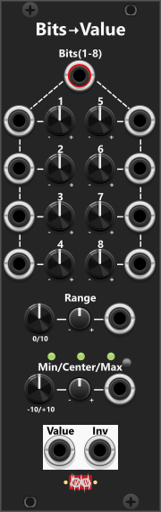
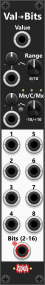

# Bits-to-Value
 
This module features individual gate inputs for 8 bits, which, combined with individually adjustable weights for each bit, generate a CV output within a specified range, along with an inverted output. The 8 bits can be supplied either as a single polyphonic input, where the first up to 8 channels represent the bit values, or through individual monophonic inputs for each bit. Each bit is processed as a gate signal, meaning a high gate (by default 1V or more) is interpreted as a bit value of "1", while a low gate (below 1V) is interpreted as "0". If needed, you can modify the high gate threshold via the context menu. If both a polyphonic signal and individual monophonic inputs are supplied, the individual inputs take priority. For example, if you provide a polyphonic input with 8 channels but also supply separate values for bits 3 and 5, those two bits will use the individually supplied values, while the remaining bits will derive their values from the polyphonic input. Inputs that are neither supplied via the individual inputs or the polyphonic input, will default to 0. All 8 bits are used to generate the output value.

Each of the 8 bits has a dedicated weight knob, allowing you to manually define the influence of that bit on the output value, within a range of 0 to 1. By default, these weights are pre-assigned as: 1/128, 1/64, 1/32, 1/16, 1/8, 1/4, 1/2, 1/1. Through the context menu, you can quickly set the weights to: Predefined weight sets, Randomized values or manually adjusted values dialed in by the knobs. 

The range in which the bit-generated values operate is determined by the Range and Min/Center/Max knobs and their associated CV inputs. For example, setting: Range = 10V, Center = 0V, will cause the bits to generate values within a -5V to +5V range.

**TIP**: You can use the polyphonic "Pulses" output from a [Turing Machine](TuringMachine.md#turing-machine) as an input for this module. The first 8 channels (corresponding to bits 1 through 8) will be utilized, while the remaining 8 channels from the Turing Machine's output are ignored. By default, this module assigns the same weights to each bit as the Turing Machine, meaning it will output identical values. To make it truly useful, you should assign different weights to the bits, either manually or via the context menu. This allows you to use a single Turing Machine to generate multiple distinct values from the same 8 lowest bits of its 32-bit pattern. 

**TIP**: The Turing Machine is not the only module that can generate a polyphonic signal suitable for this module. For example, in the context menu of the [Random-4](Random.md#random-4) module, you can specify the polyphony (i.e., the number of output channels, each with its own random value). Setting the polyphony to 8 channels allows you to connect a single output from the Random-4 module directly to the polyphonic "Bits" input of this module. Additionally, keep in mind that this module also has individual monophonic inputs, which can be used on their own or in combination with a polyphonic input.

# Value-to-Bits
 
This module functions as the inverse of the Bits-To-Value module, taking a single CV input and converting it into 8 separate bit outputs. These bits are then output as individual monophonic gates. Beside the the 8 individual bit outputs, the device also have a single combined polyphonic output. This output defaults to 8 channels, where each channel corresponding to one of the 8 monophonic bit outputs. However, through the context menu, you can adjust the number of output channels anywhere between 2 and 16. If this setting is changed from the default 8 channels, a small red indicator light next to the polyphonic output will turn on. The monophonic outputs always represent the CV value as an 8-bit signal, regardless of the polyphonic setting.

Below the Value input in the top, you’ll find controls for setting the input range, which by default is a bipolar range of -5V to +5V. The incoming CV signal is clamped to the defined range, then converted into binary, and output as individual bits. The lower half of the module contains the 8 monophonic bit outputs alongside the polyphonic "Bits" output, which includes a channel for each active bit (2–16 channels). A bit value of "1" is output as a high gate (default 10V), while a bit value of "0" is output as a low gate (default 0V). These output levels can be customized via the context menu.

**TIP**: The 8 monophonic bit outputs always represent the input value using 8-bit resolution (essentially "sampling" the input to 8 bits). The polyphonic Bits output, however, defaults to 8 channels, but you can change this to anywhere between 2 and 16 bits via the context menu. For example, if you set the polyphonic bit depth to 12 bits, the module will effectively "sample" the input at 12-bit resolution. You can use a [Sample-and-Hold module](Shth.md) before this module to control "when" the input changes, and thereby "when" the bit output might change. If you need to access individual bits, you can route the polyphonic Bits output into a [Poly-Split](PolyTools.md#poly-split) module, which will separate the polyphonic signal into individual monophonic outputs, each representing a single bit.

**TIP**: Typically bit outputs do not toggle at the same frequency — lower-order bits change state far more frequently than higher-order bits. Statistically, bit-1 will toggle between high and low much more often than bit-8, though the exact behavior depends on the input signal. For example, if you feed in a rising saw wave within the specified input range, the bit outputs will behave similarly to a clock divider: Bit-1 toggles twice as often as Bit-2, and Bit-2 toggles twice as often as Bit-3, and so on. This means you can route these bit outputs to various modules to trigger different actions at different time intervals, and different frequency (some bits toggle more than others). As mentioned above, passing the input-signal through a S&H module you can effect how often/when outputs will update.

The screenshot below shows an inverted saw waveform routed into a **Value-to-Bits** module. Its 8-bit output is then sent via the **Polyphonic Bits** output through a **Tweak** module (to reduce the amplitude) and a **Poly-Offset** module (to offset the channels), allowing all eight channels of the same polyphonic signal to be displayed simultaneously on a **VCV Scope** module. As explained above, the eight channels behave as clock dividers: **channel 1** toggles between high and low twice as fast as **channel 2**, **channel 2** twice as fast as **channel 3**, and so on. In this configuration, **channel 1** can be regarded as the **base clock**, with its frequency determined by the frequency of the inverted saw wave generated by the LFO. *Bit 1 toggles high **128 times** during one complete cycle of the saw wave, so its frequency is **128 times** the frequency of the saw. Each successive bit divides that frequency by two, meaning **bit 8** toggles high once per saw cycle and therefore has the **same frequency** as the original saw wave.*

 

[Go back to modules overview](manual.md#modules)