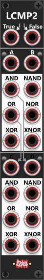
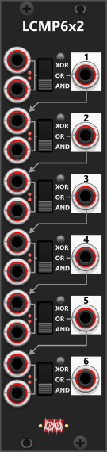
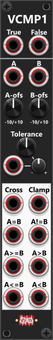
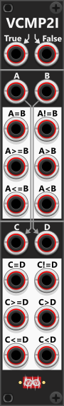

# Compare modules
In the Infinite-Noise plugin, there are two types of compare modules: logical compare modules, which evaluate binary (true/false) logic, and value compare modules, which compare continuous voltage values. The logical compare modules treat incoming signals as "True/False" or "High/Low" gates. By default, any input signal at or above 1V is recognized as True/High, while values below 1V are treated as False/Low. These modules allow you to perform Boolean operations such as AND, OR, XOR, NAND, NOR, and XNOR. The result of these operations determines the module’s output, which defaults to 10V for "True" and 0V for "False". However, both the input detection threshold and the output voltage levels can be adjusted via the context menu. Additionally, each input signal in the logical compare modules can be individually inverted, either through push buttons on the panel or via the context menu.

*None of the Logical compare modules contains a **Binary NOT** output (which will basically invert a high gate to a low gate and vice versa). However either inverting the input while using the OR-operation or not inverting input and in stead using the XNOR-operation you are able to NOT a signal (invert a gate). How to do this is described further down as a TIP for the Logic Comparator-6x2 module. Alternative you can simply use the **!Gt** output of a [Sign4 Mk I](Sign.md#sign4-mk-i) module to invert (binary NOT) gates.*

By default, the compare modules output 10V for a True result (e.g., if "A = B" or "A AND B" evaluates to True), and 0V for a False result. These output values can be modified using the context menu. Some compare modules include "True" and "False" inputs, allowing you to route alternative signals that will be switched in and out based on the comparison result. In this way, the module can function as a **switch module**, switching between the "True" or "False" inputs based on the evaluation result of a comparison. These modules can also function as a **conditional mute**. If you connect a signal to the True input but leave the False input unconnected, the module will then either output the True signal (when the condition is met) or 0V (when the condition is not met). In effect, the condition determines whether the signal is passed through or "muted" (output as 0V).

When comparing two continuous voltage values (e.g., checking if "A = B"), it is often unlikely that the two inputs will ever be precisely identical, even if they theoretically should be (due to precision- and rounding-issues). To address this, the module applies a default comparison threshold of **1/24** of a volt (~0.0416V). This means that for an "A = B" comparison to return True, the two values must be within ±0.0416V of each other. Similarly, for a "A > B" comparison, "A" must be at least 1/24 of a volt greater than B before the module outputs True/High. The reason for using 1/24V as the default threshold is rooted in quantization theory—in most quantizers, values within 1/24V of each other are typically mapped to the same note value *(not entirely true)*. However, this threshold is either adjustable via a dedicated knob or through the context menu, allowing for greater precision control if necessary.

For best results, when comparing multiple **polyphonic signals** they should ideally have the same number of channels. If one input signal has 8 channels and the other has 4 channels, the module will output 8 channels, but the last 4 channels of the larger input-count will be compared against a default value of 0V (since the smaller input-count lacks those last channels). However, **comparing a polyphonic signal against a monophonic signal works seamlessly**, every channel of the polyphonic input will be compared individually against the same monophonic value. Within the Poly-Tools modules, you’ll find dedicated comparison modules that analyze all channels within the same/single polyphonic signal. *These Poly-Tools modules can perform operations like logical AND across all channels (e.g., checking if all channels in a 4-channel polyphonic signal are True) or output the lowest value across all channels in an 8-channel signal.* If you are using the "True/False" inputs in a polyphonic comparison, it is recommended that these inputs have at least the same number of channels as the signals being compared. Otherwise, they should be monophonic, ensuring a consistent value is applied across all channels.

## Tiny Logic Comparator-2
 
This compact 2 HP module consists of two identical sections, each featuring four inputs and a single output. At the top of each section, a three-way switch allows you to select between the three most common logic operations: AND, OR, or XOR. Adjacent to this switch is a small button that toggles between normal and inverted logic. When this button is lit red, inverted logic is enabled, effectively transforming AND into NAND, OR into NOR, and XOR into XNOR. Below the three-way switch, there are four input ports, each of which can be individually inverted via the context menu. When an input is inverted, a small red light next to the corresponding input port will illuminate. However, if an input is not connected, it is simply ignored, meaning inverting a non-connected input has no effect. At the bottom of each section, a single output port produces a high gate (default 10V) when the logical operation evaluates as true or a low gate (default 0V) when false. These output voltage levels can be adjusted in the context menu. *Some general info regarding the Compare-modules are listed in the top.*

The OR and XOR operations essentially function as a **"count of high inputs"**. By default, the OR operation outputs a high gate when one or more inputs are high, while the XOR operation produces a high gate when exactly one input is high. However, the context menu allows you to adjust this count, changing how many inputs must be high before the module outputs True/High. For example, increasing the count to 2 means that:

+ The OR operation will only output high when two or more inputs are high.
+ The XOR operation will only output high when exactly two inputs are high (no more, no less).

When the count is changed from its default value of 1, a small red indicator light above the XOR label will turn on, signaling that a non-default count has been set. However, you will need to open the context menu to see the exact count value that is selected. Since OR and XOR cannot be selected simultaneously, there is only one count setting in the menu, which applies to both operations. If the module is set to AND mode, this count setting is ignored, and the indicator light remains dimmed, even if a custom count has been selected.

**TIP**: Since the number of high inputs is counted, the logical operation is applied based on the selected count. When set to OR mode, the module outputs high when the number of high inputs is equal to or greater than the selected count. In XOR mode, the module only outputs high if the number of high inputs exactly matches the selected count. Enabling inverted logic (NOR mode) while using OR reverses this behavior—the module will only output high when fewer than the specified number of inputs are high. For example, if the count is set to 3 in NOR-mode, the module will output high only when fewer than three of the inputs are high.

## Logic Comparator-2
 
Similar to the TinyLCMP2 module, the LCMP2 consists of two sections, but instead of having four inputs per section, each section has two inputs. Rather than selecting a single logic operation, each section features dedicated outputs for all six Boolean operations: AND, OR, XOR, NAND, NOR, and XNOR. Each of the four inputs (A, B, C, and D) can be individually inverted using the small push-buttons next to them. If no cable is inserted into the C-input (lower section), it normalizes to the OR output of the upper section. Likewise, if the D-input is left unconnected, it normalizes to the AND output of the upper section. *Some general info regarding the Compare-modules are listed in the top.*

Like the TinyLCMP2, the module outputs 10V when a logical operation evaluates as True and 0V when it evaluates as False. These default output levels can be customized via the context menu. However, the LCMP2 has an additional feature that significantly expands its functionality. At the top of the module, there are **two extra inputs labeled "True" and "False"**. If signals are supplied to these inputs, the logical outputs no longer produce fixed voltage levels (e.g., 10V for True and 0V for False). Instead, they output the corresponding True or False signal. Any logical output that evaluates as True will output the True-signal, while those evaluating as False will output the False-signal.

**TIP**: Because the LCMP2 allows you to assign custom signals for True and False, it can **function as a switching module**. For example, if you send a gate signal (by default, ≥ 1V) into input A, the OR output will pass the True signal while the gate is high. When the gate drops below 1V, the OR output will switch to the False signal. To apply this behavior to the lower section, make sure to pass the gate signal into input C. Otherwise, C will default to the OR output of the upper section (A OR B). If only supplying a True-input and leave the False-input un-connected, the OR-output in the top section will output the True signal while the A input is high, and 0V when it's low, basically functioning as a **mute-device**.

## Logic Comparator-6x2
 
The LCMP6x2 module consists of six independent compare sections, each with two inputs. Each section includes a three-way switch that allows you to choose between AND, OR, or XOR operations. Additionally, a toggle button lets you invert the operation, converting AND into NAND, OR into NOR, and XOR into XNOR. By default, the first input in each section is normalized to the output of the previous section, allowing for sequential logical operations without requiring additional patching. The module fully supports polyphonic signals and will output as many channels as the input with the highest number of channels. Through the context menu, all inputs can be individually inverted, flipping high values to low and vice versa. If an input is inverted, a small red light next to the corresponding input port will illuminate. *Some general info regarding the Compare-modules are listed in the top.*

**TIP**: If you need to perform a **NOT** operation (e.g. to invert a gate), you can simply attach your gate signal to the 1st input in any section (while leaving the 2nd input non-connected), set the 3-way switch in the "OR" posistion and via the context-menu you choose to invert the 1st input. This way, when you input a high-gate whichs is then inverted and then OR'ed with nothing, it outputs as a low-gate (basically converting a high-gate to a low -gate). Similiar, when you input a low-gate which is then inverted and then OR'ed with nothing, it outputs as a high-gate (basically converting a low-gate to a high-gate). 

*Alternative without inverting any input via the context-menu, you can input your gate (to be NOT'ed) into the 1st input, leave the 2nd input non-connected and then set the operation to XNOR (inverted OR). This will give the same effect, where the gate will be NOT'ed, i.e a high input-gate will output as low gate, and a low input-gate will output as a high gate.*

**TIP**: If you need to perform the same logical operation on more than two signals at once, the TLC2 module may be a better option, as it provides two sections, each capable of processing up to four inputs. If you need to perform multiple different logical operations on the same two signals, the LCMP2 module might be a better fit, as it has dedicated outputs for all six Boolean operations (AND, OR, XOR, NAND, NOR, XNOR). However, if you need to apply different logical operations across multiple signals, where each operation involves only two signals, then LCMP6x2 is the ideal choice.

The **LCMP6x2** also pairs well with the [Turing Machine](TuringMachine.md#turing-machine) module. The Turing Machine provides 16 outputs: the first 8 represent the lower 8 bits of its internal sequence pattern, while the next 8 outputs combine pairs of those bits (for example, output 9 is **Bit 1 AND Bit 2**). If you want to combine bit outputs in other ways — such as **Bit 1 OR Bit 4** — the **LCMP6x2** is a great tool. It offers 6 sections with 2 inputs each, and thanks to its normalization (or by using patch cables), you can chain multiple sections together to create more complex combinations.

**Example**: Let’s say you have four signals (A, B, C, and D) and want to compute the logical operation: "(A OR B) AND (C OR D)". To achieve this, you would:

+ Feed A and B into section 1, setting the logic operation to OR.
+ Feed C and D into section 2, also setting the logic operation to OR.
+ Combine the results from sections 1 and 2 using an AND operation in section 3.

Since the first input of section 3 is normalized to the output of section 2 (as indicated by the arrows on the panel), you only need to manually patch the output of section 1 into the second input of section 3 and set its three-way toggle switch to AND. This effectively creates the desired logical chain: "(A OR B) AND (C OR D)".

## Value Comparator-1
 
The Value Comparator 1 module (VCMP1) features a single comparison section with two inputs labeled "A" and "B". Below each input, an offset knob allows you to apply a manual offset to the incoming signal. If no input signal is connected, the inputs default to 0V, allowing the offset knobs to set a fixed manual value instead (e.g. to compare A to a fixed value of 3V, simply set the B-offset knob to 3V). *Some general info regarding the Compare-modules are listed in the top.*

Beneath the offset knobs, a tolerance adjustment knob, CV-input and trim determines the comparison sensitivity. This tolerance defines the range within which two values are considered equal. By default, the knob is set to **1/24** of a volt (~0.0416V), but it can be adjusted anywhere from 0V to 10V for broader tolerance. The tolerance-input both accepts monophonic- and polyphonic signals, hence both allow a single- and individual tolerance for each channel.

The lower section of the module provides 8 outputs, including an A/B-cross trigger output, a Clamp output and six comparison outputs. These comparison outputs produce a high gate signal (default 10V) whenever the selected comparison condition is met. The A/B-cross output is the only output that produces a trigger signal rather than a gate. Like the other comparisons, it respects the tolerance setting, meaning that the A/B-cross trigger will only fire when signal A crosses signal B and moves beyond the tolerance range. The Clamp-output will Clamp the A signal within +/- tolerance of B. E.g. if you set the tolerance to 1V, then A will be clamped between B-1V and B+1V. Like the other outputs this output also supports polyphonic signals.

Similar to the LCMP2 module, the VCMP1 includes **True/False inputs** at the top of the module, which enables you to use it as a **switch module**. When cables are connected to these inputs, the 6 lower comparison outputs will no longer output fixed voltage values (e.g., 10V for True and 0V for False). Instead, any output that evaluates as True will pass the True input signal, while those that evaluate as False will output the False input signal. 

**Example**: of the A/B-cross trigger fireing. Consider a scenario where:

+ Input A is connected to an LFO output.
+ Input B is unconnected, meaning it defaults to 0V, and the B offset-knob is manually set to 0V.
+ Tolerance is set to 0.5V.

If the A signal is currently at 2V, it is detected as being greater than B. As a result, the "A > B" output will produce a high gate. For the A/B-cross trigger to activate, the A signal must drop below -0.5V (A must cross B, and be "outside" of the tolerance). At this point, it crosses the B value (0V) while exceeding the tolerance, triggering the A/B-cross output (a 10V pulse lasting 1ms). Now, since A is below B and outside the tolerance, the "A < B" output will activate instead. The next A/B-cross trigger will only fire when the A signal rises above 0.5V, crossing B and "outside" of the tolerance again in the opposite direction.

## Value Comparator-2 Mk I
 
This module is very similar to the Value Comparator 1 (VCMP1) module, with a few key differences. Instead of a single section, this module features two independent sections, each containing all six comparison outputs. However, it does not include an A/B-cross trigger output nor the clamp-output. Additionally, there are no offset knobs for setting manual input values when inputs are unconnected, and the **comparison tolerance** must be adjusted via the context menu, though it still defaults to 1/24 of a volt (~0.0416V). *Some general info regarding the Compare-modules are listed in the top.*

As indicated by the arrows on the panel, if no cables are connected to the C and D inputs in the lower section, these inputs will automatically normalize to the signals fed into the A and B inputs in the upper section. E.g. if you only connects cables to the A-, B- and D-inputs (so C will normalize to the A-input) you can use the module to both compare A with B, and A(C) with D.

Like the VCMP1, this module also includes True/False inputs at the top. If these inputs are connected, their signals will be passed to the comparison outputs—meaning that when a comparison evaluates as True, the corresponding output will pass the True input signal, and when it evaluates as False, it will pass the False input signal. If no cables are connected to the True/False inputs, the module defaults to outputting 10V for "True" and 0V for "False", though these values can be modified via the context menu.

## Value Comparator-2 Mk II
 
The VCMP2II module consists of two sections, with distinct functionalities. The top section performs comparisons, while the bottom section carries out mathematical operations on the input signals. *Some general info regarding the Compare-modules are listed in the top.* In the top section, the module provides the following outputs based on the comparison of input signals A and B:

+ MIN: Outputs the lower of the two values.
+ MAX: Outputs the higher of the two values.
+ NtZ (Nearest to Zero): Outputs the value "Nearest to Zero", regardless of whether it's positive or negative.
+ FfZ (Farthest from Zero): Outputs the value "Farthest from Zero", whether positive or negative.
+ Abs(df) (Absolute Difference): Outputs the absolute difference between A and B.
+ AVG (Average): Outputs the average of A and B (an average mix of the two values).

The bottom section performs basic arithmetic operations on input signals C and D, outputting the results of addition, subtraction, multiplication, and division. The first 2 outputs in this section outputs the integer- and fraction-parts of the C-input. By default these two outpouts are signed (if C is negative so will these outputs). However if you click the small button between the output ports, these will toggle to instead output these as absolute values in stead. Since addition (C + D) and multiplication (C × D) are order-independent, each has a single output. However, for subtraction and division, the module provides two separate outputs, one for each order of operation (C - D and D - C, as well as C ÷ D and D ÷ C). 

Multiplication and especially division **can result in extremely large values**, even simple addition or subtraction can push signals beyond an expected voltage range. Like most Infinite-Noise modules, this module clips output values by default to the range -12V to +12V. However, this clipping can be disabled via the context menu. Additionally, division operations may encounter **division-by-zero errors**. By default, when this occurs, the module holds the last valid output value rather than producing an undefined result. However, you can change this behavior in the context menu, allowing the module to output 0V instead when division by zero is detected.

**TIP**: If you simply needs to add 2 (or up to 7) signals, you can use the [Merge2x4](MergeMult.md#merge2x4) module instead, as it simple works like a pricision adder (adding the signals you input). This module will also by default clip outputs to the range -12V to +12V, so if you expect/needs outputs exceeding this range, you needs to change/disable the clipping-range using the context-menu.

**TIP**: The NtZ (Nearest to Zero) output can be useful in quantization scenarios where you want to favor notes closer to a defined reference point (e.g., a specific root note). For example, if you feed random values between -1V and +1V into A and B, the NtZ output will tend to produce values closer to 0V more frequently than those further away. By passing this output through a Tweak module, you can scale and offset it to align with your desired root note and range. Once processed, the signal can be sent into a quantizer, ensuring that only musical notes within the defined range are selected. The result is a randomized note selection, but with a higher probability of picking notes near the central reference point.

A similar effect can be achieved by using the C + D (addition) output and reducing its scale to 0.5x (which can also be done using a Tweak module). This approach ensures the output follows a triangular distribution, increasing the likelihood of values clustering around 0V, rather than equally distributing them across the full range of -1V to +1V.

[Go back to modules overview](manual.md#modules)