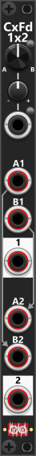
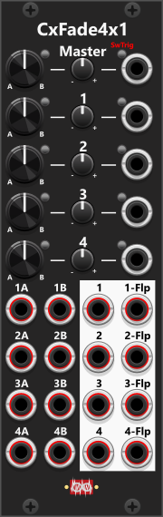

# Cross-fade modules
The Infinite-Noise plugin includes two dedicated cross-fade modules, both supporting polyphonic signals. The smaller module, CxFade1x2, features a single cross-fade knob and CV input, allowing you to blend between two separate sections—this can be used for two independent mono signals or the left/right channels of a stereo signal. The larger module, CxFade4x1, consists of four sections, each with its own cross-fade knob and CV input, but also influenced by a master cross-fade knob and CV input, which controls all four sections simultaneously.

Each cross-fade knob has an A/B-toggle button beside it. When no cross-fade CV input is connected, pressing this button instantly toggles the fade knob between full A (leftmost position) and full B (rightmost position), effectively turning the module into a manual switch. Next to each cross-fade CV input, there is a mode button that switches between CV mode (default) and Trigger mode. When set to Trigger mode (red), the input behaves as a trigger, where each received pulse toggles the cross-fade between fully counterclockwise (A) and fully clockwise (B). In this mode, the trim knob is ignored, and the associated section will function as a switch.

*In addition to these dedicated cross-fade modules, the Infinite-Noise plugin also includes two [Cross-fade/Switch modules](Switch.md), which can function as both cross-faders and signal switches, depending on how they are configured.*

**TIP**: Cross-fade modules have a wide range of applications. For instance, they can function as a "Dry/Wet" mixer, allowing for smooth transitions between a dry (unprocessed) signal and a wet (effect-processed) signal. Simply connect the dry signal(s) to the A input(s) and the wet signal(s) to the B input(s), then use the cross-fade knob or CV input to control the balance between them. This setup enables both manual and CV-controlled dry/wet blending for dynamic effect processing.

**TIP**: If you send a gate signal through a slew module and use the slewed output as the cross-fade CV input, you effectively create a "time-driven fade". The slew rate determines how long the fade lasts (time). A fast slew produces a quick fade, while a slow slew creates a gradual transition as the gate switches between its high and low states. If the slew module supports shape-controls (logarithmic/linear/exponential) this shape can control how the fade is performed (e.g. with a logarithmic shape, the fade will occur faster in the beginning and then slower in the end).

# Cross-fade 1x2(p)
The CxFade1x2 module provides a single cross-fade knob and CV input, allowing you to blend between two separate mono signals or a stereo signal. The inputs, labeled A1/B1 and A2/B2, are cross-faded to their respective outputs: A1/B1 is routed to output "1", and A2/B2 is routed to output "2". If no cable is inserted into B2, it normalizes to A1, and if no cable is inserted into A2, it normalizes to B1. This means that if you only connect inputs to A1 and B2, output "2" will produce a flipped version of the cross-fade at output "1". *Some general info regarding the Cross-fade modules are listed in the top.*

The cross-fade position is determined by the knob setting (A1/A2 at full counterclockwise, B1/B2 at full clockwise), combined with the CV input, which is scaled by a trim control. Both the knob and CV input default to linear cross-fading, but the context menu allows you to switch to exponential fade mode. Since both sections (1 and 2) operate independently, they can have different channel counts, but when processing polyphonic signals, it’s best if both inputs in the same section have the same number of channels. If a monophonic signal is cross-faded with a polyphonic signal, the single monophonic channel is applied to all polyphonic channels during the fade.

 

**TIP**: Although attenuation is not the module’s primary function, you can use it to attenuate signals by connecting only to B1. The A/B knob and CV input then act as an attenuation control—when fully counterclockwise, the signal is fully attenuated (0%), and when fully clockwise, it passes at full strength (100%). Since the module supports polyphony, all channels in B1 will be attenuated equally.

**TIP**: For more complex signal blending, you can cross-fade between four signals using two CxFade1x2 modules:

+ Feed the first two signals into the first section of the first CxFade1x2 module.
+ Feed the next two signals into the second section of the same/first module.
+ Route output "1" of the first CxFade1x2 into A1 of a second CxFade1x2 module.
+ Route output "2" of the first CxFade1x2 into B1 of the second module.
+ Now, by controlling the cross-fade of the first/second module, you can blend between all four input signals at once.

This method allows you to modulate the blending of four signals dynamically, especially if you use two LFOs running at different frequencies to control the cross-fades. In this aspect you can regard the two cross-fade signals as X and Y.

# Cross-fade 4x1(p)
The CxFade4x1 module features four independent cross-fade sections (labeled 1, 2, 3, and 4), allowing for seamless blending between four mono signals (or two stereo pairs). Each section provides an individual cross-fade control, which can be adjusted using a knob (counterclockwise for "A" and clockwise for "B") and/or a CV input. A trim control scales the CV input between -1x and +1x, and the knob position and attenuated CV input are combined to determine the final fade amount. By default, the cross-fade operates in a linear mode, but you can switch to exponential mode via the context menu. Next to each CV input, there is a small button that enables Trigger mode (red when active). When engaged, the CV input behaves as a trigger, toggling the cross-fade between full A (left) and full B (right) with each incoming pulse. In this mode, the trim control is ignored. Similarly, next to each cross-fade knob, there is a manual toggle button that functions the same way, allowing you to switch between A and B manually—but only when no CV input is connected. *Some general info regarding the Cross-fade modules are listed in the top.*

In addition to the individual controls, the CxFade4x1 features a Master cross-fade knob and CV input at the top of the module. This Master control is added to all four sections, allowing you to fade multiple sections simultaneously using a single knob or CV input. To use only the Master cross-fade, set the individual section knobs to their middle position and ensure no CV inputs are connected. This allows the Master control to fully control all four sections at once. If using Trigger mode, it is recommended to enable it either on the Master control OR the individual sections—not both at the same time.

Each section provides both a normal and flipped output:

+ Turning the cross-fade knob towards A increases the A-signal in the normal output, while decreasing the B-signal.
+ The flipped output, however, does the opposite—when A is dominant in the normal output, B is dominant in the flipped output.

This dual-output feature gives you flexibility when routing signals.

 

Like the CxFade1x2, the CxFade4x1 supports polyphonic inputs and outputs. The number of channels is determined by the input with the highest channel count. For example If you connect an 8-channel signal to "1A" and a 4-channel signal to "1B", the "1" and "1-Flp" outputs will carry 8 channels. Each section is fully independent, meaning you can mix different polyphony counts across sections—for example, section 1 could have 1 channel, section 2 could have 2 channels, section 3 could have 4 channels, and section 4 could have 8 channels. For best results, signals connected to the same section should ideally have the same number of channels. If you cross-fade between a monophonic and a polyphonic signal, the single monophonic channel will be applied to all channels of the polyphonic signal.

[Go back to modules overview](manual.md#modules)