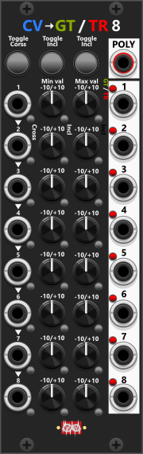
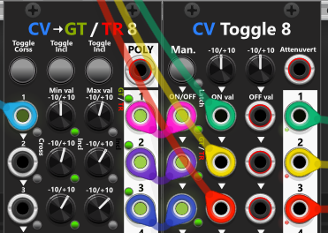

# CV to Gate/Trigger 8
This module features eight identical sections, each designed to convert a CV input into either a gate or a trigger based on a defined range. Each section consists of:

+ A CV input (leftmost column, normalized to the previous section).
+ Two knobs for setting minimum and maximum values of the range (each with mall buttons next to them to specify whether the dial-in value is included in the range).
+ A gate/trigger output (rightmost column), where a green toggle-button indicate gate mode and a red toggle-button indicate trigger mode.

If the CV input falls within the defined range (considering whether the min/max values are included), the output will activate. In Gate mode, the output remains high while the CV is within the range. In Trigger mode, the output fires only when the CV enters the range. By default, for all eight sections, the minimum value is included, while the maximum value is not.

In the top you find 3 buttons to toggle all 8 cross-buttons, all 8 min include-buttons and all 8 max include-buttons (in the context-menu there are items to set all 8 to ON/OFF). Also in the top you find a polyphonic output which compounds the (up to) 8 monophonic section-outputs into the same polyphonic signal. This polyphonic signal defaults to 8 channels (1 for each section), however using the context menu you can reduce the number of channels (e.g. set it to 4 channels, if you only need to compound the first 4 section outputs).

Each of the eight sections can operate independently, with unique CV inputs assigned to each. Alternatively, a single CV input can be connected to the first section, and its signal will be normalized across all eight sections, allowing you to define up to eight different ranges based on a single CV source.

If multiple ranges overlap, and the CV input falls within those overlapping ranges, multiple gate/trigger outputs will activate simultaneously. Using the min/max include buttons helps prevent unintended overlaps. For instance, to ensure that only one output is active at a time, you could configure:

+ Section 1: Min = 0V (included), Max = 1V (not included)
+ Section 2: Min = 1V (included), Max = 2V (not included)
+ Section 3: Min = 2V (included), Max = 3V (not included)

This setup ensures each section responds to a distinct CV range, avoiding simultaneous activations. For precise value detection, such as triggering at exactly 1V, set both min and max to 1V and include both values. However, since CV signals from other modules are rarely "perfectly exact" (due to pricision and rounding), it’s recommended to define a small threshold around the desired value (e.g., setting Min to 0.99V and Max to 1.01V) to ensure consistent detection.

## Range-crossing for trigger-outputs
By default, in trigger-mode a trigger output is activated when the CV input falls within the defined min-max range. This works well for slowly changing signals, but for signals that jump between values, a different approach is needed. Each CV input has a small "Cross" button next to it, which enables range-crossing detection. When this feature is active, triggers will fire when the input crosses the specified range rather than when it simply enters it.

For example, if an LFO is generating a bipolar square wave that only outputs -5V and +5V, and you set both Min and Max to 0V with crossing enabled, the module will detect when the value jumps from -5V to +5V or vice versa—even though 0V is never actually received as input. In this case, a trigger is generated each time the square wave transitions between its two states. If the output is set to Gate mode, the "Cross" setting is ignored, as gates remain active only while the input remains within the defined range.

**TIP**: When the outputs are set to generate triggers, each section produces a trigger when the input enters the specified range (e.g., 0V to 2V). However, it does **not** generate a trigger when the input leaves that range. If you need to detect both entering and leaving a range, you can define three separate ranges:
* One for **below** (e.g., −10V to 0V)
* One for **in range** (e.g., 0V to 2V)
* One for **above** (e.g., 2V to 10V)

Make sure to configure the include/exclude settings correctly so boundary values (e.g., exactly 0V or 2V) belong to only one range. If you only need to detect when a value is **outside** the range (rather than distinguishing above vs. below), you can route both the “below” and “above” triggers into the same input of another module.

Alternatively, you can configure a section (e.g., 0V to 2V) to output a **high gate** while the input is within range. You can then invert this gate using other modules to detect when the signal is **outside** the range. For example: * Use the **!Gate** output of a [Sign or Sign4I](Sign.md) module, or route the gate into a [Manual Push2](ManCV.md#manuel-push-2p) module and invert it via the context menu (output 0V on high gate and 10V on low gate). There are, of course, many other ways to achieve the same result.

**TIP**: Combining this module with a CV Toggle module allows you to generate multiple gates from a single CV input and use them to control distinct ON/OFF inputs of the CV Toggle module. To achieve this:

+ Define multiple non-overlapping CV ranges in the CV to Gate/Trigger module.
+ Connect each gate output to a different ON input of the CV Toggle module.
+ Set the OFF knob to 0V and leave the OFF input unconnected.
+ Assign different signals to each ON input of the CV Toggle module.

Now, the CV Toggle module acts as a multi-channel switch where only one of its outputs will be active at a time. If multiple CV to Gate/Trigger outputs are fed into a Merge/Mult module, they can be combined into a single output signal.

## Polyphonic signals not supported
The CV to Gate/Trigger module only processes monophonic signals—if a polyphonic signal is provided, only the first channel is used, and all output signals remain monophonic. This design choice was made to keep the internal algorithm simple and reduce CPU load. If polyphonic input was supported, with 8 sections processing up to 16 channels each, the module would need to potentially track up to 128 (8*16) triggers simultaneously. Additionally, in most cases, a module like this is unlikely to be needed for polyphonic processing. If needed you can however use a [Poly-Split](PolyTools.md#poly-splitp) to split a polyphonic signal into (up to) 8 monophonic signals, which you can then pass into the 8 sections of this module.

[Go back to Manual](manual.md)