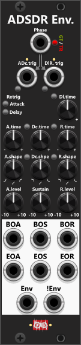

# ADR Envelope

 
The ADR Envelope is a three-phase **Attack/Delay/Release envelope generator** (or simply a two-phase Attack/Release envelope when the delay time is 0). It ramps the Envelope output between an attack end-level (**A.level**) and a release end-level (**R.level**), with independent time and shape for each phase. It is driven by a shared **Phase input** (gate or trigger-mode) or **dedicated A.trig / DR.trig inputs**, and small manual buttons beside those ports to manually fire them. At the bottom of the module you find 6 outputs: the first 4 fire a trigger when the attack/release phases begin/end, **Env** outputs the envelope as it transitions between A.level and R.level, and **!Env** outputs that same envelope inverted between those two levels.

As indicated by the grey arrows in the top, the A.trig and DR.trig inputs are normalized (in a special way) to the Phase-input. If you input a phase signal in gate mode, the high-edge of the gate is routed to the A.trig input and the low-edge of the gate is routed to the DR.trig input. If the phase input is trigger mode, each odd-trigger is routed to A.trig and every even-trigger is routed to DR.trig. *You should EITHER use the Phase input or the A./DR.trig inputs. However if using both, the A./DR.Trig inputs take priority over the Phase input.*

*Technically the module is an **ASDR envelope generator (Attack, Sustain, Delay, Release)**, or an **ASR envelope** when no delay is dialed in. Attack, Delay, and Release are timed stages; Sustain is the held level (**A.level**) while waiting for Delay/Release to be triggered — so the **A.level knob is effectively the sustain level**. However "ASDR" would probably confuse users into thinking it was an **ADSR** generator, so the "S" (Sustain) is deliberately left out of the name.*

Unlike a classic ADSR that always returns to 0 V, both phase end-levels are set by knobs in the range −10V to +10V. Defaults are A.level = 10V and R.level = 0V, which covers the usual unipolar envelope case, but you can set any levels you might need. Initialized (before any inputs are supplied) the module will be at the end of/after of a release phase (waiting for an attack phase to begin), hence the Envelope will be default output R.level. Using an ADR envelope, there are three phases (only two if delay time is 0):
+ **Attack**: Envelope transitions toward **A.level** (over **A.time**, with **A.shape**), which is then held (**sustain**).
+ **Delay**: Holds current envelope output level till **D.time** has elapsed.
+ **Release**: Envelope transitions toward **R.level** (over **R.time**, with **R.shape**), which is then held.

If a phase is interrupted mid-ramp (for example the phase gate falls before attack finishes), the module starts the new phase from the current Envelope voltage, not from the previous target (e.g. A.level). Likewise if an attack trigger is detected while the release phase is active, the attack will by default begin at the curren Envelope voltage - unless Attack retrig is enabled, in which case a full new Attack-phase (envelope rising from R.level to A.level) will begin. **Attrack/Delay retrig is only possible when using dedicated A.trig and/or DR.trig inputs** as the Phase input will always switch between Attack or Delay/Release whether it is gate- or trigger-mode.

Using the context menu you can setup **Rate Chaos** individually for Attack-, Delay- and Relase-time. If the time (e.g. Attack time) is non-zero and the Rate Chaos is higher than 0% each time a phase begins it will internally change the "time" of the phase subtle or not so subtle (e.g. randomly alter between slow and fast attacks). General use of Rate Chaos is described in the [main manual](manual.md#rate-chaos).

It's worth noting that the **A.time/R.time knobs basically dial in a Rate** and not a fixed time (how "quickly" will the envelope rise/fall its full transition). Lets say A.level is 10V, R.level is 0V, and both A.time and R.time have been set to 1 second. This means both the rise-rate and fall-rate will be set to "10V per 1 second" (as the difference between A.level and R.level is 10V). If the attack phase is interupted at 6V (before ending its phase at 10V), the release phase only needs to transition from 6V to 0V. With the fall-rate specified as "10V per 1 second", the release phase will only last 0.6 seconds. Likewise if a new A.trig signal is being input before the release phase have finished, it will by default begin from the current envelope level. Hence if the Envelope had reached 3V, the attack phase would only need to transition from 3V to 10V (lasting 0.7 seconds). If/when **Attack retrig is enabled, the Attack will always begin from R.level** (in this example, and by default 0V, hence it would always last the full second).

After attack completes while the phase-gate is still high, the envelope output holds at A.level until delay/release begins *(basically sustaining)*. After release completes, the envelope output holds at R.level until the next attack. While the module is in the attack phase it will normally ignore the A.Trig input, however if **Attack retrig** is set to **Enabled**, each A.Trig input will start a new attack phase, where the Envelope output will jump to the R.level and begin its transition to the A.level again.

A **DR.trig** (dedicated or via Phase) starts **Delay → Release** when the module is not already in Delay or Release — or whenever **Delay retrig** is enabled, and delay time is non-zero. During Delay the Envelope holds its last output. If D.time is 0 it goes straight into Release. **BOR (Begin Of Release)** fires only after Delay ends (immediately if D.time is 0). With Delay retrig off or 0 Delay time, DR.trig is ignored while Delay or Release is already active. This means with Delay retrig enabled, and a non-zero delay time, the module can **fire multiple BOR triggers** (one after each delay), and the envelope output can generate a **"stepped release"** where level is hold at each delay-phase until the envelope reach R.level or a new attack is triggered.

**TIP**: By connecting the **EOA (End Of Attack)** output to the **DR.trig** input you can put the module into an **automatic mode**. Where you only need to trigger the A.Trig to have it perform a whole cycle of Attack->Delay->Release (where the delay can function as a **fixed length sustain**). If you at the same time connect a cable between **EOR (End Of Release)** into the **A.Trig** input you only have to start it once (with an A.Trig input or button press) to have it keep running: Attack->Delay->Release-> ... continuously.

The lights next to A.trig and DR.trig indicate the active phase, and the color indicates "the position within that phase" (only one light is illuminated at any one time).
+ **A.trig light is green** while the attack is running (Envelope output is transitioning to A.level).
+ **A.trig light is red** when A.level has been reached (Envelope output is held at A.level - Sustain).
+ **DR.trig light is yellow** while delay is active (previous Envelope output is held).
+ **DR.trig light is green** while release is active (Envelope is transitioning to R.level)
+ **DR.trig light is red** when R.level has been reached (Envelope output is held at R.level)

Between the A./R. time/shape-knobs you find a small latched **Link-button**. When pressed (green) the release-knob will be linked to the attack-knob (e.g. linking R.time to A.time). When linked, the release-knob is rendered inactive, and instead it will take its value directly from the attack-knob. The shape link-button have two modes, so pressed a 2nd time it turns **red where R.shape is linked to A.shape reversed** (the more counter clockwise you turn A.shape the more R.shape will turn clockwise - and vice versa). These link buttons makes it easy for you to dial-in the exact same values for both the attack- and release knobs (e.g. if you want to ensure that attack and release have the same time- and/or shape-setting).

For the attack/release phases you both find a begin-trigger output (e.g. **BOA=Begin Of Attack**) and an end-trigger output (e.g. **EOA=End Of Attack**). These will fire whenever a phase begins and ends. If Attack retrig is enabled, the BOA trigger will fire each time you trigger the A.trig input, whether that phase is currently active or not. If you have dialed in a non-zero delay, the **BOR (Begin Of Release)** won't fire till the delay has finished. The end-trigger outputs ("EOA" and "EOR") will only fire if the phase runs to the end. E.g. if you input a trigger into A.Trig before the previous release finishes, EOR will not fire. *There are no begin/end phase trigger-outputs for the delay phase. However, if you have a non-zero delay, a pulse into the DR.trig is basically the same as a begin-delay trigger, and the BOR (Begin Of Release) is basically the same as an end of delay.*

**TIP**: An ADR envelope has many uses. For example, you can patch the **Envelope** output into a VCA or a crossfade module. Each time a trigger is received on the **Phase** input (in Trigger mode), the envelope can make a crossfade module smoothly transition between two of its inputs. The **A.time**, **R.time**, **A.shape**, and **R.shape** settings determine "how fast-" and "how" the fade is performed, while **A.level** and **R.level** define the output range of the fade-signal (basically "how wide/deep" the cross-fader should fade).

**TIP**: Although this is not the intended purpose of the module, it can be used as a trigger delay. Patch a trigger into **A.trig** and enable **Attack retrig** if each new trigger should restart the delay. Set **A.time** to the desired delay — for example, 1 second — and use the **EOA (End Of Attack)** trigger output as the delayed trigger. **EOA** fires when the attack stage completes, one "attack time" after an accepted trigger starts the attack. If you also connect EOA into DR.Trig, dial in a delay time, you can use the **BOR (Begin Of Release)** as a 2nd further delayed trigger output (BOR will fire once the delay have ellapsed). In this configuration the module will fire 2 delayed triggers for each A.trig input, where A.Time controls the 1st "delay" (before EOA fires), a D.time controls the 2nd/additional "delay" (before BOR fires). *Actually a 3rd futher delayed trigger can be generated if you dial in R.Time and use the EOR (End Of Release) output. In the screenshot below the red trigger is the original, and the 3 yellow are each delayed 0.2s in relation to the previous one.*

**TIP**: The module can also be used to "delay gates", although the delay is less precisely controlled than a "delayed trigger". Infinite Noise modules normally detect signals of 1V or higher to be high gates. By adding an attack time, the output rises gradually and is not considered high until the envelope passes 1V. Selecting an exponential attack shape delays this crossing even further. Likewise, adding a release time delay, when the output falls below 1 V after the input gate goes low. An exponential release shape can extend this delay further. Alternatively you can pass the envelope output through a [Tweak-2 Mk I](Tweak.md#tweak-2-mk-i) to offset the signal in the negaive direction, which will also delay when the signal crosses 1V where the Infinite-Noise modules will detect it as a high gate. *Beside delaying the gate, you can increase the gate-length by the time dialed in by the D.time knob.*

**TIP**: The module can also be used transform triggers into fixed length gates. Set both A.time and R.time to 0, however set D.time (Delay) to a non-zero value where it basically controls the length/duration of the output. Now connect the EOA (End Of Attack) output to the DR.Trig input, and finally connect your external trigger signal to the A.Trig input. When the module recieves an A.Trig from an external source, the "Attack phase will begin", however as A.Time is 0, the evenvelope will instantly jump to A.level (default 10V) and EOA will fire as the Attack phase have ended. Since EOA is connected to DR.Trig the delay will begin, while holding the envelope at the current value (A.level). Once the delay have ended, it will go into the Release phase, however as R.Time is 0, the Envelope will jump to R.level (default 0V), and the module will be ready to react to the next A.Trig (to again "convert a trigger into a fixed length gate").

# ADSDR Envelope

 

The **ADSDR Envelope (Attack, Decay, Sustain, Delay, Release)** is very similar to the **ADR Envelope** (described above), but as it can be used as a traditional **ADSR Envelope** (when Delay time is set to 0) it does include "S" (Sustain) in its name. Since there are two D's in the name, some of the inputs/knobs are labeled with 2 letters to distinguish them from each other ("Dc" = Decay, "Dl" = Delay) - however the tooltips will hold the full names ("Decay" or "Delay"). The trigger inputs are likewise named **ADc.trig** (starts Attack, then Decay) and **DlR.trig** (starts Delay, then Release), so the "D" is not mistaken for Decay when it means Delay.

Beside the module being wider, the top of the module is identical to the top of the ADR Envelope, so scroll up to read how the **Phase**, **ADc.trig** and **DlR.trig** inputs are used. The only difference being that ADSDR Envelope uses the labels **ADc.trig** instead of **A.trig**, and **DlR.trig** instead of **DR.trig**. With Phase in gate mode this is a classic ADSR: gate high runs Attack → Decay → hold at Sustain; the falling edge starts Delay → Release (straight to Release if Dl.time is 0).

I've kept the same light-colors near the two labels as the ADR Envelope, but as it have an extra phase, the left-most light now also introduce a yellow light for the Decay-phase:
+ **ADc.trig light is green** while the attack is running (Envelope output is transitioning to A.level).
+ **ADc.trig light is yellow** while the decay is running (Envelope output is transitioning to Sustain).
+ **ADc.trig light is red** when sustain has been reached (Envelope output is held).
+ **DlR.trig light is yellow** while delay is active (previous Envelope output is held).
+ **DlR.trig light is green** while release is active (Envelope is transitioning to R.level)
+ **DlR.trig light is red** when R.level has been reached (Envelope output is held at R.level)

While a traditional ADSR envelope only needs you to specify the Sustain level, the ADSDR Envelope also lets you specify A.level and R.level. By default **A.level** is set as 10V, **Sustain** as 5V and **R.level** as 0V. When inserted into the rack (or after initialize) the **Envelope (Env)** output holds R.level (0V) until the attack phase is triggered. Next to **Env** output, you'll find a **!Env** which will output an **inverted Envelope** (inverted between A.level and R.level). All 3 levels can be specified in the range between -10 and +10.

The 4 time knobs lets you specify a time between 0 and 10 seconds. However as explained for the ADR Envelope (see above) you are basically specifying **a rate** instead of a fixed time. Typical A.level and R.level will be your extremes, and their default span is 10V (default: A.level=10V, R.level=0V). So if you set A.time to 1 second the rate will be 10V per 1 second. Decay uses the same rate but only has to travel from A.level to Sustain, so with the defaults (10V → 5V) a Dc.time of 1 second lasts 0.5 seconds.

Normally triggering an already active phase is ignored unless you enable Attack and/or Delay retrig. Triggering **ADc.trig** starts the Attack phase, and when finished it will automatically proceed to Decay and then Sustain. Likewise triggering **DlR.trig** starts the Delay phase and when finished it will automatically proceed to Release. *See more in-depth description above for the ADR Envelope, to read how retrig is working.*

Among the outputs you'll find the same 4 triggers as the ADR Envelope: **BOA** (Begin Of Attack), **EOA** (End Of Attack), **BOR** (Begin Of Release) and **EOR** (End Of Release). The ADSDR Envelope also has trigger output for **EOS** (End Of Sustain), however you will note that it does not have an BOS (Begin Of Sustain) output. This is because an BOS would fire at the same time as EOA, hence this output in not necessary. Like the ADR Envelope you don't find named trigger-outputs for begin/end of Delay, but basically (if delay time is non-zero) **EOS = Begin of Delay**, and **BOR = End of Delay**.

To assist dialing in the same times/shapes you'll find **2 sets of link buttons**. The left-most 2 let you link Decay-time/shape to Attack-time/shape, and the right-most 2 let you link Release-time/shape to Attack-time/shape (including the same reverse-shape mode as on the ADR Envelope). Like the ADR Envelope you can use the context menu to set up **Rate Chaos** for A.time, Dc.time, Dl.time and R.time. *For further info see the description above.*

**TIP**: You can generate a full ADSR-envelope from a single external trigger-signal, however we have to "cheat" and use the Delay as a fixed sustain time (since a single trigger can't hold a sustain). Feed your external trigger into the **ADc.trig** input, and set **A.time**, **Dc.time** along with **A.level**, **Sustain**, **R.level** and **R.time**. After Decay ends the envelope would otherwise hold at Sustain until Delay/Release is started, so connect **BOS** to **DlR.trig** (same idea as EOA → DR.trig on the ADR Envelope). Use the **Dl.time** knob for how long Sustain should be held before Release begins. With that patch, **BOS** and **EOS** fire at the same time, and starts the Delay. If you want it to keep going, connect **EOR** into **ADc.trig**.

[Go back to modules overview](manual.md#modules)
