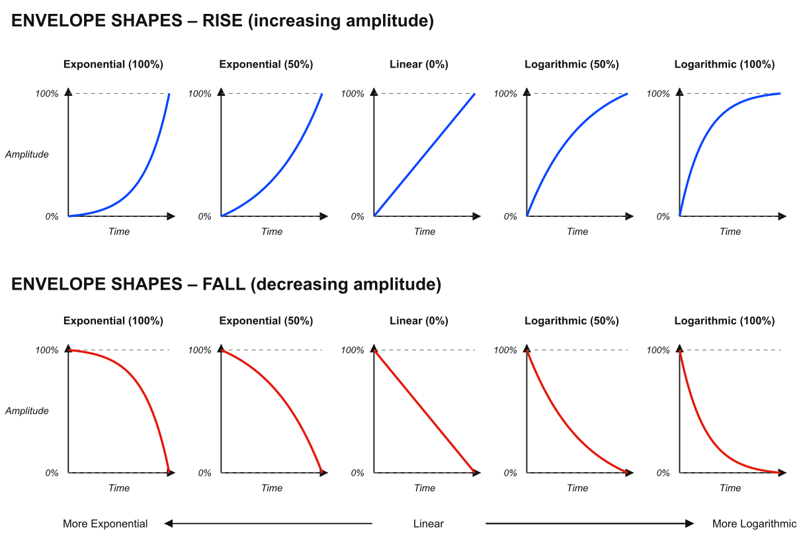
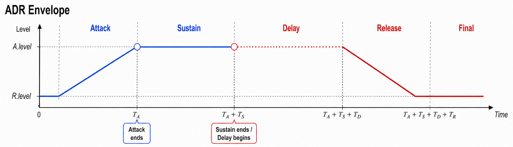
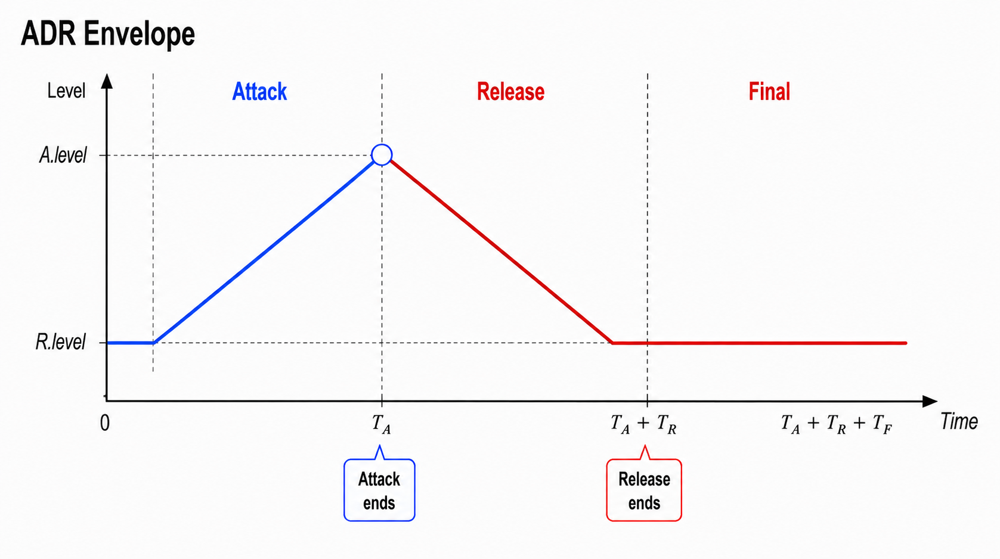
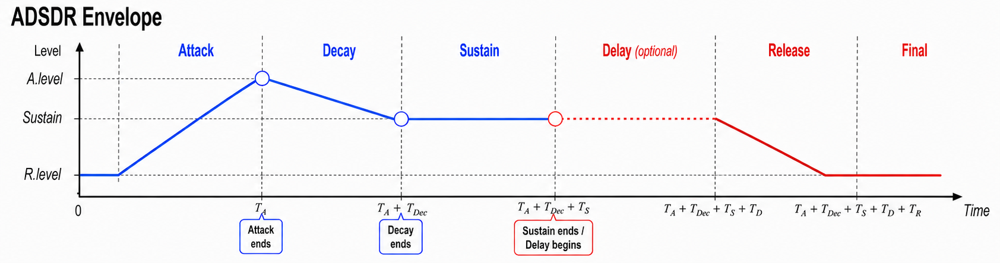
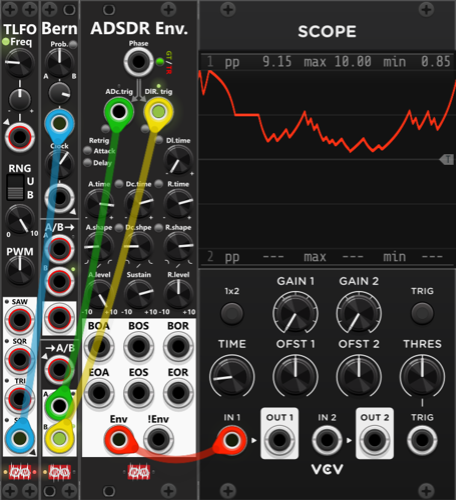

# Envelopes
The Infinite-Noise plugin includes two envelope generators: **ADR Envelope** (Attack / Delay / Release) and **ADSDR Envelope** (Attack / Decay / Sustain / Delay / Release). They share the same unusual stage order: a **Delay phase sits after Sustain and before Release**. That is not where a delay is normally placed — if an envelope has a delay at all, it typically comes before Attack. The placement is deliberate. It lets you generate a full envelope even when the input is not sustained: **a "missing" sustain phase can be "replaced" by the Delay**, which holds the current level for a fixed length before Release begins. Because of this setup you only need an **A.trig** / **ADc.trig** input to start the envelope. Pass **EOA** / **BOS** into **DR.trig** / **DlR.trig** and the module generates a full envelope, with Delay functioning as Sustain. Patch **EOR** into **A.trig** / **ADc.trig** as well and it keeps cycling until you disconnect that loop.

Both modules are driven by a shared **Phase input** (gate or trigger mode) or **dedicated A.trig / ADc.trig and DR.trig / DlR.trig inputs**, plus small buttons beside those ports to fire them by hand. As indicated by the grey arrows at the top of each panel, the dedicated trigs are normalized to Phase. In **gate mode**, the rising edge is routed to A.trig / ADc.trig and the falling edge to DR.trig / DlR.trig. In **trigger mode**, odd triggers go to A.trig / ADc.trig and even triggers to DR.trig / DlR.trig. *You should EITHER use the Phase input or the dedicated trig inputs. If you use both, the dedicated inputs take priority over Phase.*

**TIP**: Neither the ADR nor the ADSDR Envelope module offers a delay phase at the beginning (before the Attack phase). The tips for the ADR Envelope describe how an ADR Envelope can be used to delay trigger and, although less precisely, gate signals. Hence, if you need a **pre-Attack delay**, you can pass your trigger/gate signal through a second ADR Envelope before passing it to another ADR/ADSDR Envelope.

**Env** outputs the envelope as it moves between **A.level** and **R.level**. **!Env** is that same envelope inverted between those two levels. Unlike a classic ADSR that always returns to 0V, both end-levels (and ADSDR's Sustain) can be set anywhere from −10V to +10V. After initialize, and after Release completes, the output holds **R.level** until the next Attack.

The **time knobs dial in a duration** for each phase. If Attack, Decay, or Release is allowed to run to the end, it lasts the time you set. That duration can be cut short if the Attack (or Decay) phase is interrupted by Delay/Release, or if Delay/Release is interrupted by a new Attack — the current ramp stops immediately and the new phase takes over. **Attack retrig** restarts Attack from R.level, so that new Attack again lasts the full A.time (unless it is itself interrupted).

If a phase is interrupted mid-ramp (for example the phase-gate falls before Attack finishes), the new phase starts from the **current envelope voltage**, not from the previous target. An already-active phase is ignored unless you enable Attack and/or Delay retrig. **Attack/Delay retrig is only possible on the dedicated trig inputs** — Phase always switches between Attack and Delay/Release, whether it is in gate or trigger mode. With Attack retrig enabled, each A.trig / ADc.trig jumps to R.level and starts a new Attack. With Delay retrig enabled and a non-zero Delay time, DR.trig / DlR.trig can restart Delay while Delay or Release is already active.

Both modules can apply **Rate Chaos** per time knob from the context menu. If that phase's time is non-zero and Rate Chaos is above 0%, each time the phase begins its duration is varied slightly — or wildly (e.g. randomly slow vs fast attacks). General use of Rate Chaos is described in the [main manual](manual.md#rate-chaos).

Each ramping phase (Attack, Decay, and Release) has a **shape** knob from −1 to +1. Center (0) is **linear**. Turn counterclockwise for **exponential**, clockwise for **logarithmic** (Delay has no shape — it simply holds). An exponential **rise** starts slow and steepens toward the target, while an exponential **fall** drops quickly and then eases in (the usual analog-style release). A logarithmic rise does the opposite (fast then slow), and a logarithmic fall stays near the start-level before dropping late. The illustration below shows 100% / 50% exponential, linear, and 50% / 100% logarithmic in both directions.

## ADR Envelope

 
The ADR Envelope is a three-phase **Attack/Delay/Release envelope generator** (or simply a two-phase Attack/Release envelope when the delay time is 0). It ramps the Envelope output between an attack end-level (**A.level**) and a release end-level (**R.level**), with independent time and shape for each phase. Defaults are A.level = 10V and R.level = 0V, which covers the usual unipolar envelope case, but you can set any levels you might need. At the bottom of the module you find 6 outputs: the first 4 fire a trigger when the attack/release phases begin/end, plus **Env** and **!Env** which outputs the envelope and an inverted envelope. *Some general info regarding the Envelopes are listed at the top.*

*Technically the module is an **ASDR envelope generator (Attack, Sustain, Delay, Release)**, or an **ASR envelope** when no delay is dialed in. Attack, Delay, and Release are timed stages; Sustain is the held level (**A.level**) while waiting for Delay/Release to be triggered — so the **A.level knob effectively dails-in the sustain level**. However "ASDR" would probably confuse users into thinking it was an **ADSR** generator, so the "S" (Sustain) is deliberately left out of the name.*

Using an ADR envelope, there are three phases (only two if delay time is 0):
+ **Attack**: Envelope transitions toward **A.level** (over **A.time**, with **A.shape**), which is then held (**sustain**).
+ **Delay**: Holds current envelope output level till **D.time** has elapsed.
+ **Release**: Envelope transitions toward **R.level** (over **R.time**, with **R.shape**), which is then held.

After attack completes while the phase-gate is still high, the envelope output holds at A.level until delay/release begins *(basically sustaining)*.

A **DR.trig** starts **Delay → Release**. During Delay the Envelope holds its last output. If D.time is 0 it goes straight into Release. **BOR (Begin Of Release)** fires only after Delay ends (immediately if D.time is 0). With Delay retrig enabled and a non-zero delay time, the module can **fire multiple BOR triggers** (one after each delay), and the envelope output can generate a **"stepped release"** where level is hold at each delay-phase until the envelope reach R.level or a new attack is triggered.

The lights next to A.trig and DR.trig indicate the active phase, and the color indicates "the position within that phase" (only one light is illuminated at any one time).
+ **A.trig light is green** while the attack is running (Envelope output is transitioning to A.level).
+ **A.trig light is red** when A.level has been reached (Envelope output is held at A.level - Sustain).
+ **DR.trig light is yellow** while delay is active (previous Envelope output is held).
+ **DR.trig light is green** while release is active (Envelope is transitioning to R.level)
+ **DR.trig light is red** when R.level has been reached (Envelope output is held at R.level)

Between the A./R. time/shape-knobs you find a small latched **Link-button**. When pressed (green) the release-knob will be linked to the attack-knob (e.g. linking R.time to A.time). When linked, the release-knob is rendered inactive, and instead it will take its value directly from the attack-knob. The shape link-button have two modes, so pressed a 2nd time it turns **red where R.shape is linked to A.shape reversed** (the more counter clockwise you turn A.shape the more R.shape will turn clockwise - and vice versa). These link buttons makes it easy for you to dial-in the exact same values for both the attack- and release knobs (e.g. if you want to ensure that attack and release have the same time- and/or shape-setting).

For the attack/release phases you both find a begin-trigger output (e.g. **BOA=Begin Of Attack**) and an end-trigger output (e.g. **EOA=End Of Attack**). These will fire whenever a phase begins and ends. If Attack retrig is enabled, the BOA trigger will fire each time you trigger the A.trig input, whether that phase is currently active or not. If you have dialed in a non-zero delay, the **BOR (Begin Of Release)** won't fire till the delay has finished. The end-trigger outputs ("EOA" and "EOR") will only fire if the phase runs to the end. E.g. if you input a trigger into A.Trig before the previous release finishes, EOR will not fire. *There are no begin/end phase trigger-outputs for the delay phase. However, if you have a non-zero delay, a pulse into the DR.trig is basically the same as a begin-delay trigger, and the BOR (Begin Of Release) is basically the same as an end of delay.*

**TIP**: An ADR envelope has many uses. For example, you can patch the **Envelope** output into a crossfade module. Each time a trigger is received on the **Phase** input (in Trigger mode), the envelope can make a crossfade module smoothly transition between two of its inputs. The **A.time**, **R.time**, **A.shape**, and **R.shape** settings determine "how fast-" and "how" the fade is performed, while **A.level** and **R.level** define the output range of the fade-signal (basically "how wide/deep" the cross-fader should fade).

**TIP**: Although this is not the intended purpose of the module, it can be used as a **trigger delay**. Patch a trigger into **A.trig** and enable **Attack retrig** if each new trigger should restart the delay. Set **A.time** to the desired delay — for example, 1 second — and use the **EOA (End Of Attack)** trigger output as the delayed trigger. **EOA** fires when the attack stage completes, one "attack time" after an accepted trigger starts the attack. If you also connect EOA into DR.Trig, dial in a delay time, you can use the **BOR (Begin Of Release)** as a 2nd further delayed trigger output (BOR will fire once the delay have ellapsed). In this configuration the module will fire 2 delayed triggers for each A.trig input, where A.Time controls the 1st "delay" (before EOA fires), a D.time controls the 2nd/additional "delay" (before BOR fires). *Actually a 3rd futher delayed trigger can be generated if you dial in R.Time and use the EOR (End Of Release) output. In the screenshot below the red trigger is the original, and the 3 yellow are each delayed 0.2s in relation to the previous one.*

**TIP**: The module can also be used to "delay gates", although the delay is less precisely controlled than a "delayed trigger". Infinite Noise modules normally detect signals of 1V or higher to be high gates. By adding an attack time, the output rises gradually and is not considered high until the envelope passes 1V. Selecting an exponential attack shape delays this crossing even further. Likewise, adding a release time delay, when the output falls below 1 V after the input gate goes low. An exponential release shape can extend this delay further. In addition you can pass the envelope output through a [Tweak-2 Mk I](Tweak.md#tweak-2-mk-i) to offset the signal in the negaive direction, which will also delay when the signal crosses 1V where the Infinite-Noise modules will detect it as a high gate. *Beside delaying the gate, you can increase the gate-length by the time dialed in by the D.time knob.*

**TIP**: The module can also be used transform triggers into fixed length gates. Set both A.time and R.time to 0, however set D.time (Delay) to a non-zero value where it basically controls the length/duration of the output. Now connect the EOA (End Of Attack) output to the DR.Trig input, and finally connect your external trigger signal to the A.Trig input. When the module recieves an A.Trig from an external source, the "Attack phase will begin", however as A.Time is 0, the evenvelope will instantly jump to A.level (default 10V) and EOA will fire as the Attack phase have ended. Since EOA is connected to DR.Trig the delay will begin, while holding the envelope at the current value (A.level). Once the delay have ended, it will go into the Release phase, however as R.Time is 0, the Envelope will jump to R.level (default 0V), and the module will be ready to react to the next A.Trig (to again "convert a trigger into a fixed length gate"). *Since the external signal is passed into the A.Trig input, you can also use a gate-signal as input (the length of the gate is ignored, as only the rising edge will be detected). Hence this tip works as well for changing gate-lengths, where the output-envelope can be used as a gate that is shorter/longer than the input gate.*

## ADSDR Envelope

 
The **ADSDR Envelope (Attack, Decay, Sustain, Delay, Release)** is very similar to the **ADR Envelope** (described above), but as it can be used as a traditional **ADSR Envelope** (when Delay time is set to 0) it does include "S" (Sustain) in its name. Since there are two D's in the name, some of the inputs/knobs are labeled with 2 letters to distinguish them from each other ("Dc" = Decay, "Dl" = Delay) - however the tooltips will hold the full names ("Decay" or "Delay"). The trigger inputs are likewise named **ADc.trig** (starts Attack, then Decay) and **DlR.trig** (starts Delay, then Release), so the "D" is not mistaken for Decay when it means Delay. *Some general info regarding the Envelopes are listed at the top.*

The top of the module is the same as the ADR Envelope except the dedicated inputs are labeled **ADc.trig** instead of **A.trig**, and **DlR.trig** instead of **DR.trig**. With Phase in gate mode this is a classic ADSR: gate high runs Attack → Decay → hold at Sustain; the falling edge starts Delay → Release (straight to Release if Dl.time is 0).

I've kept the same light-colors near the two labels as the ADR Envelope, but as it have an extra phase, the left-most light now also introduce a yellow light for the Decay-phase:
+ **ADc.trig light is green** while the attack is running (Envelope output is transitioning to A.level).
+ **ADc.trig light is yellow** while the decay is running (Envelope output is transitioning to Sustain).
+ **ADc.trig light is red** when sustain has been reached (Envelope output is held).
+ **DlR.trig light is yellow** while delay is active (previous Envelope output is held).
+ **DlR.trig light is green** while release is active (Envelope is transitioning to R.level)
+ **DlR.trig light is red** when R.level has been reached (Envelope output is held at R.level)

While a traditional ADSR envelope only needs you to specify the Sustain level, the ADSDR Envelope also lets you specify A.level and R.level. By default **A.level** is set as 10V, **Sustain** as 5V and **R.level** as 0V.

The 4 time knobs let you specify a duration between 0 and 10 seconds. Each phase takes that time to reach its target if it is allowed to finish. Typical A.level and R.level will be your extremes, and their default span is 10V (default: A.level=10V, R.level=0V). With A.time = 1 second, Attack covers that 10V in one second. Decay only has to travel from A.level to Sustain, so with the defaults (10V → 5V) a Dc.time of 1 second covers 5V in one second. Likewise Release only has to travel from Sustain to R.level, so with the defaults (5V → 0V) a R.time of 1 second also covers 5V in one second.

*So with the default levels (A.level=10V, Sustain=5V and R.level=0V), if you want the slope of the envelope to be similar for Attack, Decay and Release, you would need to dial in an A.time that is double of Dc.time and R.time, since the attack has to transition 10V (0V to 10V), whereas decay and release only have to transition 5V (decay from 10V to 5V, and release from 5V to 0V). If you instead set the same time for A.time, Dc.time and R.time, each of these phases will have the same duration (if allowed to run uninterrupted), however the slope of attack will be steeper than the slope of decay and release.*

Triggering **ADc.trig** starts the Attack phase, and when finished it will automatically proceed to Decay and then Sustain. Likewise triggering **DlR.trig** starts the Delay phase and when finished it will automatically proceed to Release.

Among the outputs you'll find the same 4 triggers as the ADR Envelope: **BOA** (Begin Of Attack), **EOA** (End Of Attack), **BOR** (Begin Of Release) and **EOR** (End Of Release). The ADSDR Envelope also has trigger output for **EOS** (End Of Sustain), however you will note that it does not have an BOS (Begin Of Sustain) output. This is because an BOS would fire at the same time as EOA, hence this output in not necessary. Like the ADR Envelope you don't find named trigger-outputs for begin/end of Delay, but basically (if delay time is non-zero) **EOS = Begin of Delay**, and **BOR = End of Delay**.

To assist dialing in the same times/shapes you'll find **2 sets of link buttons**. The left-most 2 let you link Decay-time/shape to Attack-time/shape, and the right-most 2 let you link Release-time/shape to Attack-time/shape (including the same reverse-shape mode as on the ADR Envelope).

**TIP**: For a random jagged signal (envelope basically switching between Attack and Release) you can use the A- and B-outputs of a [Bernoulli Switch](Switch.md#bernoulli-switch) as inputs to ADc.trig and DlR.trig. Using the Clock knob of the Bernoully Switch you can set the rate at which Adc.Trig and DlR.trig can trigger a change. If you center the Probabillity switch of the Bernoully knob, and input a slow moving bipolar waveform (e.g. Sine) into it's Probabillity CV-input you can change the probablility of the Bernoulli Switch either triggering an Attack or a Release.

[Go back to modules overview](manual.md#modules)
