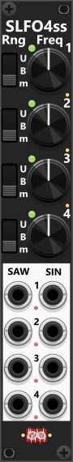
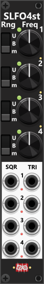
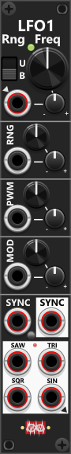
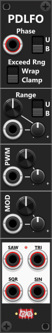

# LFO's
The frequency/rate is the most crucial parameter of any LFO, along with the output-range and waveform. All of the LFO modules allow you to adjust the frequency, covering a wide range from approximately 0.003 Hz to 1024 Hz, hence extending well into the audio rate. Both TLFO and LFO1 also support CV modulation of frequency, essentially enabling frequency modulation (FM), whereas SLFO4ss and SLFO4st only lets you set the rate with a knob (don't have CV-input to modulate frequency). All of the LFO's have controls (or context-menu) to change output range, and use the same frequency-rate to output multiple basic waveforms, which in some cases can be further modulated.

Each LFO have a green indicator light next to the frequency knob that flashes at the start of a new phase, providing a visual cue of the LFO speed. The light remains on for the first half of the phase, but at frequencies above 60 Hz, it stays illuminated continuously. *However, these lights only function when the LFO is actively in use (i.e., an output cable is connected to one of the waveform-outputs or the LFO is synchronizing another LFO)*. 

All LFOs (except the Phase-Driven LFO) also support **Rate Chaos** via the context menu, which randomizes the speed of each individual cycle so the LFO runs slightly - or wildly - irregularly instead of at a perfectly steady rate. Since this same option appears on several other modules too, it is described in the [main manual](manual.md#rate-chaos).

By default, all LFOs are free-running, meaning they operate independently. The TLFO does not support any synchronization, while the LFO1 features both external sync inputs and outputs, and the SLFO4ss/SLFO4st include multiple sync modes, allowing internal synchronization between their 4 LFOs (e.g. syncing LFO-2 to LFO-1 and LFO-4 to LFO-3). When syncing, the default behavior is **hard sync**, which resets the phase. However, this can be changed via the context menu to **soft sync**, where the phase direction reverses instead of resetting. When switching between sync modes or disabling sync, the phase direction returns to its *default* increasing state.

Output range can be controlled differently across the LFO modules. On TLFO and LFO1, a two-way toggle switch allows selection between bipolar (**B**) and unipolar (**U**) modes. Alongside this switch, a range knob adjusts the voltage span from 0V to 10V. In bipolar mode (B) with the range set to 10V, the LFO outputs waveforms between -5V and +5V. In unipolar mode (U), the range starts at 0V, so with a range at 10V, the output spans from 0V to +10V. While TLFO only allows manual range adjustment, LFO1 supports CV modulation of range.

For SLFO4ss and SLFO4st, a three-way toggle switch sets the output range. Options include Unipolar (**U**) for a fixed 0V to 10V range, Bipolar (**B**) for a fixed -5V to +5V range, and Manual (**m**), which allows custom ranges set via the context menu. **Clicking the switch toggles only between unipolar and bipolar**, while the "manual" setting activates automatically when a custom range is selected via the context menu (e.g., -1V to +1V). If you need an output range beyond the available settings, the signal can be processed through one of the [Tweak modules](Tweak.md) for manual scaling and offset adjustments or an [Auto-scale module](Tweak.md) module. Additionally, the context menu allows inversion of any LFO output, "flipping" the waveform according to the selected range.

Most Infinite-Noise modules process signals at audio rate (e.g., 48,000 times per second at a 48 kHz sample rate). However, the LFO modules default to **"Auto" mode**, where the internal processing rate dynamically adjusts based on the fastest LFO and the connected inputs/outputs. E.g. setting an LFO to use a very low frequency, the Process-quality might drop to "Very low"-rate (where the module will only change output values every 256th cycle, and then "sleep" for the next 255 cycles). If necessary, the process quality can be manually set via the context menu, but the "Auto" mode must be disabled first before making manual changes.

**Warning**: Lowering processing quality (whether auto or manual) reduces CPU usage, which is mostly a good thing, but in a few/edge cases it may have unintended side effects. If a slow-moving LFO is set to update every 16 cycles, it means that for 15 cycles, the module holds the same value, outputting an unchanged signal. While this is not an issue for most modules, it can interfere with detection-based modules, such as the [Slope Detector 2](SlopeDetector2.md#slope-detector-2), which may cause false state detections. If the LFO output is intended for use with a Slope Detector or similar modules, it is recommended to disable Auto mode and manually set the process quality to "Audio", ensuring small updates occur every cycle. 

## Simple LFO4-ss(a)
This 4HP quad-LFO generates both Saw and Sine waveforms for each of its four independent LFOs. The frequency knobs allow precise rate control, while the three-way toggles determine the output range. As detailed earlier, the context menu provides additional output range options (defaulting to Bipolar: -5V to +5V) and lets you configure sync modes (disabled by default, but indicated by small red/green lights when active). Likewise the waveforms can be inverted using the context menu, and indicated by small lights near the output ports. *Some general info regarding the LFOs are listed in the top.*

 

## Simple LFO4-st(a)
This 4HP quad-LFO generates both Square and Triangle waveforms for each of its four independent LFOs. The frequency knobs set the LFO rates, while the three-way toggles determine the output range. As with the SLFO4ss, the context menu offers additional output range options (defaulting to Bipolar: -5V to +5V) and lets you configure sync modes (off by default, but indicated via red/green lights when enabled). Likewise the waveforms can be inverted using the context menu, and indicated by small lights near the output ports. *Some general info regarding the LFOs are listed in the top.*

 

*When I need multiple LFOs with fixed frequencies (not affected by CV), the SLFO4st is my go-to quad-LFO. Each of its four LFOs operates at an independently set rate, and internal sync can be enabled via the context menu if/when needed. The combination of Square and Triangle waveforms makes it a highly versatile modulation source as Square waves can function as clocks, gates, or triggers, while Triangle waves provide smooth modulation curves for various parameters. If you need a little "chaos" the context-menu enables you to dial in chaos-rate individually for all 4 LFOs.*

## Tiny LFO(pa)
This compact 2HP module is the smallest LFO in the plugin. It allows frequency adjustments via knob and CV modulation (chaos-rate can be enabled/set via the context menu). Due to its small size, both range and PWM settings can only be adjusted using knobs, whereas the LFO1 supports both knob and CV control for PWM and modulation. Additionally, the TLFO does not support external synchronization with other LFOs. The module generates four waveforms — Saw, Square, Triangle, and Sine — which which can be output simultaneously, all running at the same frequency and phase, though each waveform can be individually inverted via the context menu. When fed a polyphonic frequency CV-input, the output waveforms will also be polyphonic, where each channel can be running at a different rate. *Some general info regarding the LFOs are listed in the top.*

 

By default, **PWM (Pulse Width Modulation)** affects the phase of all waveforms, but through the context menu, you can configure it to apply only to the Square waveform. This allows for more controlled modulation when using multiple waveform outputs simultaneously. The context menu also provides an option to limit the PWM range, which by default spans from 1% to 99%, but can be reduced to cover the range from 25% to 75% for finer control over modulation depth.

As indicated by the arrow-heads, the frequency CV-input is normalized to the Sine waveform-output, however as the frequency trim-knob defaults to 0% it will have no effect until you start dialing in a none-zero trim-value.

*Among the Infinite-Noise LFOs, TLFO is a personal favorite. Despite its compact 2HP size, it offers great versatility. It supports CV frequency input, enabling polyphonic outputs, and allows manual PWM adjustments. The ability to manually set the output range ensures it can be directly connected to other modules, even if they lack a trim knob. If offset adjustments are needed, the output can be processed through one of the Tweak modules for further refinement.*

## LFO1(pa)
This 4HP single-LFO module generates four waveforms (Square, Triangle, Saw, and Sine) which can all be output simultaneously. When a polyphonic signal is fed into the frequency CV-input, the waveform-outputs will also be polyphonic, maintaining the same number of channels as the input (though the rate-indicator light will only reflect channel 1). The Bipolar/Unipolar switch works in conjunction with the range knob/input to define the output range of the waveforms. PWM can be adjusted via a knob and CV modulation (1% to 99%), and by default, it affects all four waveform types. However, the context menu allows PWM to be applied exclusively to the Square waveform, and it can decrease the PVM range in steps, down to 25%/75%. *Some general info regarding the LFOs are listed in the top.*

Like TLFO, as indicated by the arrow-heads, the frequency CV-input is normalized to the Sine waveform-output, however as the trim-knob defaults to 0% it will have no effect until you start dialing in a none-zero trim-value.

A key feature of this module is the **MOD** knob/input, which alters the waveform shape (wave-shaping). When turned counterclockwise, waveforms become "sharper/thinner" at their "peaks", while turning it clockwise makes them "rounder/fatter". Since this type of modulation does not work directly on the Square waveform, the Square waveform in stead transitions into a Triangle (counterclockwise) or a Saw wave (clockwise). Essentially, this allows the Square waveform to morph into different shapes, behaving like a **wavetable transition** between Triangle, Square, and Saw. *Combining the MOD and PWM controls—especially with CV modulation—can create a wide variety of waveform variations*.

This module supports both **sync-in** and **sync-out**, allowing it to synchronize with- or control other external LFOs. Whether the module outputs monophonic or polyphonic waveforms is determined by the frequency input. If a polyphonic signal (e.g., 4 channels) is fed into the frequency input, all waveform outputs will also be polyphonic with the same number of channels. When polyphonic outputs are enabled, the sync-input can either be monophonic (in which case all channels sync simultaneously) or polyphonic (allowing sync to occur independently per channel). If the frequency input is monophonic, only the first channel of the sync-input is used, and additional channels will be ignored. The sync-output will always have as many channels as the frequency input, regardless of whether the sync-input is mono or poly.

By default, the sync-out trigger fires both when the device receives a sync-in signal and when the LFO completes a full cycle. However, the context menu allows changing this behavior so that the sync-out trigger fires only when: a sync-in signal is received, or the LFO completes a full cycle. If the second option is selected, the **sync-out may never trigger** if the LFO continuously receives sync-in pulses before completing a cycle.

A small push-button near sync-in allows the LFO to be switched into **1-shot mode** (when the button is green). In this mode, upon receiving a sync signal, the module outputs only a single full waveform cycle. Actually this feature is more a **n-shot mode**, as you via the context menu can select the number of full cycles to perform: 1-16, 17, 19, 23, 24, 29 or 32. Each time a new sync-in signal is received, the count resets, even if the previous waveform sequence is still running. Once the preset number of cycles is completed, all phase outputs reset, and the outputs hold at 0V (though this default value can be modified via the context menu).

The n-shot mode can be used to generate a **burst of multiple clocks/triggers**. E.g. using the square-output with a relative fast frequency (determening the speed/duration of each generated square), the module will generate the selected number of square-waveforms each time the module receives a sync-in signal. If you at the same time have dialed in a non-zero chaos-rate each of the generated waveform output will run at different rates.

 

## Phase-Driven LFO(p)
Technically, this module is not a traditional LFO since it does not contain an oscillator or use a frequency parameter. Instead, it directly takes a phase input within a 10V range (either bipolar or unipolar) to determine the waveform-phase, and thereby its output. However, due to its similarities with the LFO1 module, it is still categorized as an LFO, and its functionality is described in this section of the documentation. Due to the fact that the Phase-input accepts polyphonic input, **it's easy to generate multiple phase-shifted waveforms** (described as a TIP further down).

At the top of the module, there is a phase input, which supports polyphonic signals (the four waveform outputs will match the number of channels in the phase input). A two-way switch next to the input determines whether the phase range is bipolar (-5V to +5V) or unipolar (0V to 10V). To cover the full waveform cycle, the input signal must span the entire selected range. This input signal will by default be clamped to the selected phase-range, but setting the "Exceed Rng" switch to the "Wrap" position, the incomming signal will be "wrapped" if exceeding the phase-range.

*Since the phase can be "set" directly via the phase-input the waveform-outputs are not limited to typical LFO-range. Hence even though not intended for that purpose, the module can generate waveform-output in the entire audioable range*.

Below the phase input, there are knobs and CV inputs to control the output range of the four waveforms generated by the module. As with the LFO1 module, the PWM and MOD controls function similarly and are described in more detail in the LFO1 section above. At the bottom of the module, there are four waveform outputs (Saw, Square, Triangle, and Sine). Using the context menu the waveform-outputs can be inverted, in which case the small light near the outputs will illuminate.

**TIP**: If you use an inverted saw-waveform (e.g., from another LFO module) as the phase input, the PDLFO will output "standard waveforms" (e.g. a simple sine wave), where the phase will follow the phase of the inverted saw-input. However, the true power of this module comes from feeding the phase input with more complex or dynamic signals. Since the phase input can be set to bipolar (-5V to +5V) or unipolar (0V to 10V), you may need to scale or offset external signals to match the required range. If the signal you want to use as phase is in a different range (e.g., 0V to 1V), you can use a [Tweak](Tweak.md) module to scale and offset it accordingly. For instance, if the signal is 0V to 1V, you can scale it by 10x and set the PDLFO to unipolar mode. Alternatively you can let the phase-signal go through an [Auto-scale 4](Tweak.md#auto-scale-4p), where you scale its output to the range -5 to +5 for a bipolar phase, or 0V to 10V for a unipolar phase.

**TIP**: Inputting a polyphonic signal into the phase-input, the module will output as many waveforms (channels for each waveform), as the input-signal have channels. If you feed a monoponic signal into a [Poly-Offset](PolyTools.md#poly-offsetp) module where you force it to output a fixed number of channels (via its context menu) and use its "increment"-knob, each of those channel-output will have the same incrementing (phase) interval between them. E.g. setting the Poly-Offset module to output a fixed number of 8 channels and set the interval to 1.25V (1/8 of 10V), and feed this signal into the PDLFO, each waveform-output of the PDLFO will output 8 waveforms, each phase shifted exactly 45° (1/8 of 360°) of eachother. However to achive this, you **should disable the default output clipping** of the Poly-offset module to allow it to output values exceeding the default clipping-range from -12V to +12V, and the Exeed Range setting of the PDLFO must be set to "Wrap", as it will otherwise clamp the input-phase.

[Go back to modules overview](manual.md#modules)