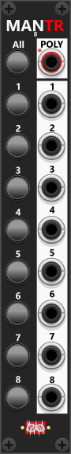
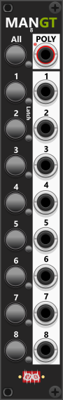
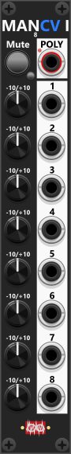
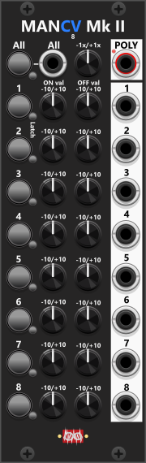
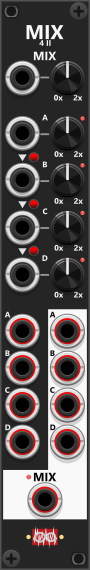
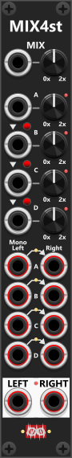
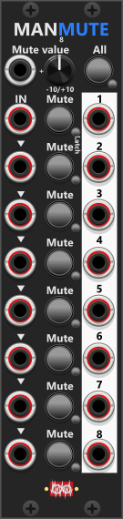
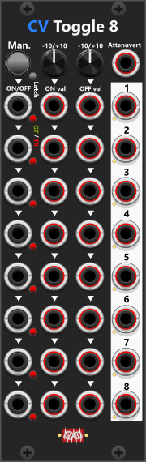

# Manual operated modules / Controlers
These modules are designed primarily as performance and control tools, allowing you to manually dial in CV values, fire triggers and gates, and interact dynamically with other modules. Many of them provide up to eight unique outputs, each of which can be activated individually using dedicated push buttons or simultaneously via an "All" button. Generally the smaller 2HP modules feature fewer buttons and outputs, but retain the same core functionality. Several of these modules also support polyphonic outputs.

The design philosophy behind Infinite-Noise modules focuses on clarity and readability rather than decorative graphics. The interfaces are kept minimalistic, using a monochrome (black, white, and grayscale) color scheme to reduce visual clutter. However, the manual-operated modules belong to a family of performance and control modules, including Manual-CV, Manual-Trigger, and Manual-Gate, each with a color-coded label to distinguish their functionality. The CV (control voltage), TR (trigger), and GT (gate) sections of their names appear in specific colors, matching the on/off, trigger, and gate buttons for quick identification. Additionally, some modules feature small latch buttons beside the main push buttons, which determine whether the main button functions as a momentary switch or latching switch (when the latch button is illuminated, the latch mode is enabled).

## Manuel Trigger, Gate and CV(pq)
If you require a compact 2HP module that provides different types of outputs rather than a large number of outputs, this is the module for you. It features a single button to fire a trigger, two buttons to fire individual gates (each with its own latch button), and two knobs for dialing in separate CV outputs within a range of -10V to +10V. Like most Infinite-Noise modules, this module includes support for clipping and quantization, but these options only affect the CV outputs—not the gate or trigger outputs. The trigger and gate outputs default to 0V (low) and 10V (high), but these values can be adjusted via the context menu. *Some general info regarding these manual-CV modules are listed in the top.*

**TIP**: Even though this module has only a single dedicated trigger button/output, most modules that accept triggers (typically 10V for 1 ms) will also respond correctly to gate signals (typically 10V for as long as the gate is held). This means the two gate outputs can also function as triggers in many cases. Additionally, the same/one trigger output can be routed to multiple devices/inputs directly or through a [Mult module](MergeMult.md) if needed.

## Manuel Push 2(p)
This 2HP module contains two independent sections, each with a CV-input, a latchable push button, a gate-output, and two trigger outputs. When the push button is not engaged (or latched), the section responds to the CV input, allowing it to function as both a manual button control and a CV-reactive module. Becuase of the way this module is constructed and that the input both accecpt triggers and gates as intput, it can be used for many things such as **converting two triggers to a gate** (one tringger begins the gate, the next ends it), or **converting gates to triggers** (a trigger will fire when the gate begins, and another when it ends). By changing the default high/low-output value gate inputs can easy be inverted (set high-gate output to 0V, and set low-gate output to 10V). Hence the module can also be used to **invert gates**. *Some general info regarding these manual-CV modules are listed in the top.*

Each section features two distinct trigger outputs labeled "Hg." (High) and "Lw." (Low). The **High trigger** (Hg.) fires a trigger at the same time as the gate signal begins (or the button is pressed). The **Low trigger** (Lw.), however, activates when the input signal drops below the threshold (or the button is released). By default, a high state is detected at 1V or more, and a low state is detected when the input falls below 0.1V. These threshold values can be customized via the context menu. By default, all outputs are monophonic (single-channel), but polyphonic output can be enabled through the context menu to generate multiple channels.

*If you have an input-port in another module that needs to react to both edge-detections (when the input gate goes high and when it goes low), you can simply feed both the "Hg" and "Lw" outputs directly in to the same input-port, or if you prefer use a [Merge2x4](MergeMult.md#merge2x4pq). However remember that the trigger-outputs "Hg" and "Lw" will each generate a trigger-output that is high for 1 ms (48 cycles/samples at 48 kHz). This means that if the input gate-signal (which will generate the Hg/Lw triggers) is shorter than 1 ms, any module down-stream will not be able to detect 2 triggers. E.g. if the gate-input only last for 24 cycles/samples (half a ms at 48 kHz), the combined Hg/Lw-output will simply appear as a single trigger lasting for 1.5 ms.*

**TIP**: Many Infinite-Noise modules (including ManPush2 itself) can respond to either gate or trigger inputs. In trigger mode, each incoming trigger toggles the gate-output between high and low. If you need this behavior in other modules that accept only gate inputs, you can route on/off triggers into one of the ManPush2 sections set to trigger mode, and then use its gate output. Likewise, if you have a module that expects on/off triggers but your source signal is a gate, you can set the ManPush2 section to gate mode and feed the gate signal into its input. The resulting high/low trigger-outputs can then be routed to the same input or to two separate inputs, depending on the requirements of the receiving module. You could say that a ManPush2 section can effectively “convert” between on/off-triggers and gate signals.

## Manuel Trigger 8(p)
This compact 4HP module consists of 8 sections, each equipped with a momentary push-button and a corresponding output port. Pressing a button triggers a 10V pulse for 1 ms at the associated output. At the top of the module, you'll find an "All" button and an "Poly" output. Pressing the "All" button fires all 8 triggers simultaneously. The "Poly" output will (by default) output all 8 triggers compound in the same polyphonic signal (1 channel for each of the 8 sections). However using the context menu, the polyphony count can be reduced (e.g. only output the first 4 sections, as a 4 channel polyphonic signal). *Some general info regarding these manual-CV modules are listed in the top.*

*To be perfectly honest, I don't use the **Manual Trigger 8** very often, simply because it can only generate trigger outputs—that's exactly what it's designed to do. By default, each trigger is a 10V pulse that remains high for 1 ms before returning to 0V, regardless of how long you hold the button. However, most modules that respond to triggers work just as well with a gate signal that remains high for longer than 1 ms. In most cases, the duration of the high signal is not important; what matters is **when** the signal goes high—that is, detecting its rising edge. Because of this, these modules work equally well with the outputs from the **Manual Gate 8** module (described below). In other words, the same Manual Gate 8 module can often be used to generate signals that function as either gates or triggers. There are, however, situations where you specifically need a short pulse, regardless of how long the button is held. In those cases, I would choose the **Manual Trigger 8** instead.*

## Manuel Gate 8(p)
Similar in design to the Manual-Trigger 8 module, this 4HP module also contains 8 sections, but instead of 1ms triggers, it outputs gates. Each section features a push-button, a small latch-button, and an output port. While the button is held (or latched ON), the output sends a 10V gate (high) and returns to 0V (low) when released. At the top, the "All" button enables all 8 gates simultaneously, and the "Poly" output. By default, pressing the "All" button toggles the state of all 8 sections, but its functionality can be adjusted via the context menu (for example, to ensure all sections fire regardless of their current state). The "Poly" output will (by default) output all 8 gates compound in the same polyphonic signal (1 channel for each of the 8 sections). However using the context menu, the polyphony count can be reduced (e.g. only output the first 4 sections, as a 4 channel polyphonic signal). *Some general info regarding these manual-CV modules are listed in the top.*

Keep in mind that **a trigger is simply "a short gate"** (default: 1 ms). This means gate outputs from this module can in moste cases substitute for triggers when needed. For example, in the Toggle-CV module, each of its 8 sections can be configured to respond to either gates or triggers. If some sections are set to detect gates, while others detect triggers, you don't necessarily need separate Manual-Trigger and Manual-Gate modules—a single Manual-Gate module can be used to control both types of inputs simultaneously.

## Manuel CV 8 Mk I(pq)
This 4HP module features 8 sections, each with a dedicated knob for adjusting a CV level between -10V and +10V. Each section has an output port that transmits the voltage dialed in by its corresponding knob. The "Poly" output will (by default) output all 8 CV-outputs compound in the same polyphonic signal (1 channel for each of the 8 sections). However using the context menu, the polyphony count can be reduced (e.g. only output the first 4 sections, as a 4 channel polyphonic signal). *Some general info regarding these manual-CV modules are listed in the top.*

*At one point, I considered creating a module with multiple outputs, each generating a different fixed voltage (for example: −10V, −5V, −2V, -1V, 1V, 2V, 5V, and 10V). However, there is really no need for a dedicated module like that. Each of the 8 knobs can already be used to dial in any output voltage you need manually. In addition, the module’s context menu includes several predefined value sets—for example, a negative/positive set containing: −10V, −5V, −2V, -1V, 1V, 2V, 5V, and 10V.*

Next to the poly-ouput you'll find a latchable Mute-button. When the mute-button is pressed/latched, all channel outputs will by default switch to 0V no matter the volt-setting dialed in by the knobs. However using the context menu, this mute-level can be changed using the context menu (one mute-level affecting all 8 sections).

**TIP**: If you need precise voltage steps, you can use the context menu to enable quantization. This feature ensures that when you dial in a value (e.g., 3.3V), it rounds to the nearest predefined step—for example, 3V if quantization is set to 1V. The voltage only needs to be within half of the quantization value (e.g., within ±0.5V when rounding to 1V steps). Quantization options include: 1/12V (notes), 1/6V (2/12V), 1/4V (3/12V), 1/3V (4/12V), 1/2V (6/12V), 1V, 2V, 2.5V, 3.33V, and 5V.

**TIP**: Since the full range of the CV knobs is -10V to +10V, if you need a smaller range (e.g., 0V to 5V), you can route the output through one of the [Tweak modules](Tweak.md). Applying a 0.25x scale with a +2.5V offset effectively converts the range to 0V to 5V, allowing for more precise control.

## Manuel CV 8 Mk II(pq)
Similar to the Mk.I, the Mk.II version is featuring 8 sections in a 8HP module. However, unlike its predecessor, each section includes two CV knobs—one for setting an "On" level and another for an "Off" level"—along with a toggle button that switches between these two states. By default, all Off-values are set to 0V (as this is the most logical default for an "off" state), but these can be adjusted to any desired value. Essentially, each section functions as a two-state switch, where the toggle button allows switching between the "On" and "Off" values. At the top of the module, there is an "All" button. When pressed, it toggles all 8 sections between their On and Off states. However, the context menu provides additional control over its behavior, allowing it to be set to either "On", "Off", or "Toggle" mode. The "Poly" output will (by default) output all 8 CV-outputs compound in the same polyphonic signal (1 channel for each of the 8 sections). However using the context menu, the polyphony count can be reduced (e.g. only output the first 4 sections, as a 4 channel polyphonic signal). *Some general info regarding these manual-CV modules are listed in the top.*

The Mk.II features an Attenuate knob at the top. The knob allows attenuation from -1x to +1x (-100% to +100%), though it defaults to 1x, meaning the signal remains unaltered unless adjusted. A context menu setting allows you to specify whether the attenuation should affect only the On values, only the Off values, or both (default). 

**TIP**: The CV knobs cover a full range of -10V to +10V, but if you require a more restricted range (e.g., 0V to 5V), you can process the output through a [Tweak modules](Tweak.md). By applying a 0.25x scale and a +2.5V offset, you can effectively remap the output to the 0V–5V range for finer control over modulation signals.

## Manuel Mix 4 Mk I(p)
The Manual-Mix4 Mk I is a compact, 2HP 100% manually controlled mixer featuring four inputs and one mix output. Each input has an individual mix knob that allows amplification within a range of 0% to 200%, with the default setting at 100%. At the top of the module there is a master-mix knob, which controls the overall amplification of the mixed output, also adjustable between 0% and 200%. This module supports polyphonic signals, but if inputs contain different numbers of channels, the output will adopt the highest channel count among them. If mixing monophonic and polyphonic signals, the monophonic signal will be applied equally to each polyphonic channel. However, if multiple polyphonic signals are used, they should ideally contain the same number of channels for proper mixing.

The mixer can operate in two distinct modes (however defaults to averaging mix). Next to the "MIX" label at the bottom there is a light indicating the active mix mode (dim=Averaging mix, Red=Unity mix):
+ **Averaging mix**: All inputs are summed (according to mix-knobs) and then divided by the number of inputs in use. So if only connecting inputs 1-3 the output will be as follows (I#=Input #, M#=Mix-knob #, and MM = Master mix-knob): "Output = ((I1 x M1 + I2 x M2 + I3 x M3) / 3) x MM". The reason for the "/ 3" is because only 3 inputs are in use in this example. The benefit of the Averaging mix is that you typically don't need to make huge adjustments to master mix-level as you add/remove connections.
+ **Unity mix**: All inputs are simply summed (according to mix-knobs). So if only connecting inputs 1-3 the output will be as follows (I#=Input #, M#=Mix-knob #, and MM = Master mix-knob): "Output = (I1 x M1 + I2 x M2 + I3 x M3) x MM". As you add/remove connections you typically need to adjust the master mix-knob. However even if you only mix in a fraction of some of the inputs, you should be able to reach the desired final output level. *Remember to disable/change the default +/-12V clipping if you plan to exceed this range for some reason.*

Each of the four mix knobs can be set to **inverted** amplification via the context menu (a small red light beside the knob indicates inversion).

**TIP**: ManMix4 Mk I has manual knobs only—no amplification CV inputs. If you need CV-controlled mixing levels, use [Manuel Mix 4 Mk II](#manuel-mix-4-mk-iip) (mono) or [Manuel Mix 4 Stereo](#manuel-mix-4-stereop) (stereo). If you only need to amplify the mixed output using CV, you can feed the output to a [VCA-2](Tweak.md#vca-2p) module. For mixing up to 8 mono-signals or up to 4 stereo-signals with per-signal CV, consider a [Tweak-8](Tweak.md#tweak-8q) or [Tweak-4II](Tweak.md#tweak-4-mk-iiq) module instead.

## Manuel Mix 4 Mk II(p)
The 4HP Manual Mix 4 Mk II is similar to the Mk I, but adds amplification CV inputs and a separate output for each of the four sections (A–D) in addition to the mix output at the bottom. Mix-knob CV inputs are normalized to the previous section (A normalizes to 0V; B to A; C to B; D to C). Because there are no trim knobs, red/green toggle buttons beside the normalization arrows control whether each downstream input follows the previous one—green means enabled (default), red means disabled.

Since the amplification CV is without trim, it should be applied with the exact input range. The amplification knobs default to the center position (100%), so with the knob at that position a +5V input would be equivalent to the knob being set to 200%, or a −5V input would be equivalent to setting the knob to 0%. If you instead turn the knob fully counter-clockwise to 0%, a 5V amplification input would be the same as setting the knob to 100%, and a 10V amplification input would be the same as setting the knob to 200% (10V input range = full knob range).

The **individual section outputs** (A–D) carry each input multiplied by its own knob/CV gain only—they are not scaled by the master knob or mix-mode averaging/unity logic. The **mix output** sums all connected inputs (with per-section gain), applies averaging or unity scaling, then applies the master knob/CV gain.

Like Mk I, the module supports **averaging** and **unity** mix modes (context menu; light beside the mix output: dim=Averaging, Red=Unity—see Mk I above). Each mix knob can also be **inverted** via the context menu.

## Manuel Mix 4 Stereo(p)
The Manual-Mix4st is the stereo variant: four stereo input sections (A through D), each with left and right polyphonic inputs, and mixed left/right outputs at the bottom (no per-section outputs). It shares the Mk II amplification CV inputs and normalization buttons (B→A, C→B, D→C; see Mk II above for CV range and behavior).

By default—indicated by green lights between the left and right input columns—if you supply only a left input (e.g. a mono signal) and leave the right input unplugged, the right channel is normalized to the left. This **mono-to-stereo** behavior can be disabled in the context menu (lights turn red).

The module supports **averaging** and **unity** mix modes and per-section **inverted** amplification like Mk I (context menu). The mix-mode light is centered between the left and right mix outputs at the bottom.

## Manuel Mute 8(pq)
The Manual-Mute 8 is a 6HP module designed for muting up to eight separate signals, each with its own CV input, mute button, and output. Each CV input is normalized to the previous one, allowing a single input into multiple sections if needed. You can mute individual sections by pressing their dedicated mute button, or you can mute all eight sections simultaneously using the "All" button at the top. By default, both the individual mute buttons and the "All" button function as momentary switches, but they each have a latch button that allows them to toggle instead of momentarily holding the mute state. When a section is unmuted, the output simply passes through the corresponding input signal. However, when a section is muted, it outputs the voltage set by the "Mute Value" knob, which defaults to 0V. Additionally, there is a "Mute Value" CV input, allowing an external signal to define the mute-output value dynamically. If both a CV input and the Mute Value knob are used, the knob value acts as an offset, and the final mute-output will be a sum of the two values.

**TIP**: If you need to mute signals based on an external CV input (trigger or gate), consider using the **CV Toggle** module, which can function as a CV-controlled mute (see module description further down). Alternatively, the **Mute-2** module provides both manual and CV-controlled muting for two signals, allowing individual or collective muting through button presses or CV inputs (see below).

## Mute 2(p)
While the Manual-Mute 8 module is entirely knob-operated, the Mute-2 module (2HP) offers both manual and CV-controlled muting across two independent sections. Each section features a latchable mute button and a CV input for external control. Adjacent to the mute CV input, a mode selection button toggles between gate mode (green) and trigger mode (red). By default, in gate mode, the section will mute when a high gate signal is received. However, via the context menu, you can invert this behavior, making the section mute when receiving a low gate instead. In trigger mode, each incoming trigger pulse toggles the mute state on or off. Each section also has a small red LED next to the output port, which illuminates when that section is muted. 

In the top section of the module, a global mute button and CV input allow you to mute both sections simultaneously. This is useful when working with stereo signals, ensuring that both the left and right channels are muted at the same time. If no input signal is connected to the B-section, it will automatically normalize to the A-section’s input. This is useful when routing the same signal to two different destinations, while still allowing independent muting. Unlike the ManMute8, the Mute-2 module does not allow setting a custom mute-output value—muted outputs default to 0V, but this can be adjusted via the context menu.

When the mute CV input is set to trigger mode, the module internally tracks the current mute state. If a section has been toggled to the mute state, you can reset it back to unmuted by disconnecting and reconnecting the trigger input or by initializing the module. If the "Both" section has a trigger input connected, you may also need to disconnect/reconnect that cable as well.

If multiple mute buttons or CV signals are used, they will be logically OR’ed together. This means that whether a mute button is pressed manually or a mute signal is sent via CV, the section will mute. Similarly, if either the individual A/B mute control or the global "Both" mute control is activated, the section will mute. Since the "Both" section and the individual A/B sections operate independently, it's recommended to mute either at the global level or per section—not both at the same time, as this may cause confusion. If uncertain, refer to the small red LED next to the output port to check the mute state.

## CV-Toggle 8(pq)
Although the CV Toggle 8 module primarily functions as an 8-section switch, it shares similarities with the Manual-CV Mk.2 module, making it a useful addition to the manual control section. Each section is basically a switch which toggle between "ON" and "OFF" states, with ON/OFF signals derived from either CV inputs or the default ON/OFF values set using the knobs at the top.

Unlike Manual-CV modules, which rely on push buttons and knobs, CvToggle8 operates entirely via CV inputs. All inputs are normalized to the previous section, except for section 1 (in the top), which derives its default ON/OFF values from the knobs at the top. Similarly, section 1’s ON/OFF trigger input is normalized to the manual "All" button in the top section, while the remaining inputs are normalized to the previous section. If no ON/OFF gate/trigger inputs are connected, all sections respond to the "All" button.

Since the inputs normalize from top to bottom, you can have some sections use the default knob values while others rely on external ON/OFF signals. For example, if the top four sections have no ON/OFF cables connected, they will use the default ON/OFF knob values, while the bottom four sections will take values from any connected ON/OFF signals.

Each of the eight ON/OFF inputs (leftmost column) can be configured to respond to gates or triggers. A small button next to the input toggles between gate mode (green) and trigger mode (red). *This can be set for all sections simultaneously via the context menu.* In trigger mode, each trigger pulse toggles between ON and OFF states. In gate mode, the ON signal is output only while the gate is high (1V or more); otherwise, the OFF signal is output.

At the top, the Attenuate CV input allows external control over the output level, scaling from +1x (when fed +5V) to -1x (when fed -5V). The context menu allows you to specify whether attenuation applies to ON values, OFF values, or both. When no attenuate signal is connected, the output defaults to 1x scaling.

*Among the Infinite-Noise switch modules, the [ON/OFF Switch](Switch.md#onoff-switchp) can be considered a smaller version of this module, featuring only one ON/OFF section instead of eight.*

**TIP**: Leaving the OFF knob at 0V (default) and not connecting an OFF input allows you to use this module as an 8-section **CV-controlled mute**. When a section is ON, it outputs the ON-input; when OFF, it outputs 0V. This setup allows the module to function as a multi-section signal switch. *Important Note: Mutes apply to all signal types, including audio, clocks, triggers, gates and CV-modulation signals.*

**TIP**: This module can **invert multiple gate signals at once**. To do this, all ON/OFF inputs must be set to gate mode, the ON value knob must be set to 0V, and the OFF value knob must be set to 10V. This setup ensures that when a high gate is received, the module outputs 0V (low gate), and when a low gate is received, it outputs 10V (high gate)—effectively inverting the input gate signal. Using CV Toggle 8 to Convert Triggers into Alternating High/Low Gates If the ON/OFF inputs are set to trigger mode, the ON knob set to +10V, and the OFF knob set to 0V, each trigger will toggle the output between a high- and low-gate state. This setup allows the module to function as an 8-section trigger-driven gate toggle switch.

**TIP**: Combining CV Toggle 8 with Manual-CV 8 Mk.1 and a [Merge-4](MergeMult.md#mergemult-4pq) module allows you to perform gate/trigger-driven CV addition. Use Manual-CV 8 to manually set values for up to 8 sections, or use the ON knob in CV Toggle 8 to set a common value (e.g., 1V per octave step). Each section outputs either the ON value or 0V, and these outputs can be merged (summed) together, creating gate-controlled additive CV outputs.

### Polyphony
The ON/OFF gate/trigger inputs are monophonic (only the first channel is used when a polyphonic signal is connected). However, the ON and OFF CV-inputs support polyphonic signals, and the output will match the input with the most channels. For example, if an 8-channel polyphonic signal is fed into the ON input and a 4-channel signal into the OFF input, the output will be 8-channel polyphonic.

[Go back to modules overview](manual.md#modules)