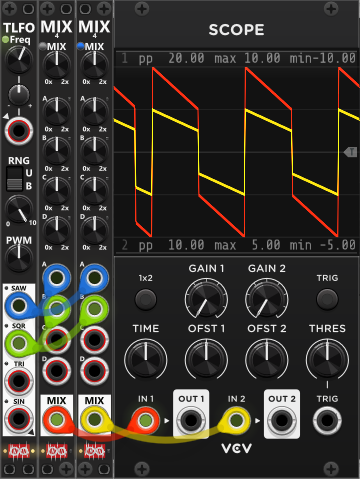
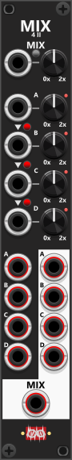
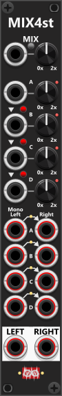
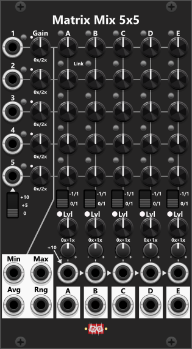
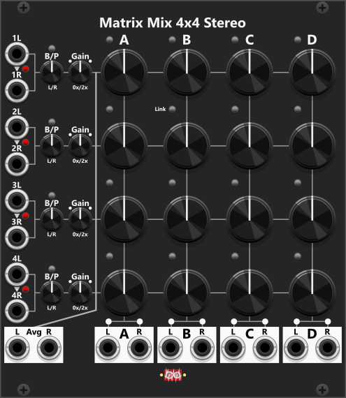

# Mixer modules
This section covers the dedicated mixer modules in Infinite-Noise—modules built for combining multiple signals into a mixed output. The Manual Mix 4 family currently provides mono and stereo four-input mixers with per-input gain, a master mix level, shared unity and averaging mix modes, and optional per-section inverted amplification. Mk I is fully manual; Mk II and Stereo add amplification CV inputs with chainable normalization. Further down you find the documentation for the 2 matrix mixers.

Beside these dedicated mixer modules described below, a few [Tweak modules](Tweak.md) also include averaging mix: [Tweak-2 Mk II](Tweak.md#tweak-2-mk-ii) (2 signals), [Tweak-4 Mk II](Tweak.md#tweak-4-mk-ii) (up to 4), and [Tweak-8](Tweak.md#tweak-8) (up to 8). *One big difference between the Tweak modules with mixing capabilities and the mixers mentioned here is that the Tweak modules generate an averaging mix, whereas the mixers mentioned here generate a unity mix by default. 

All of the the mixers mentioned below can operate in **two distinct mix-modes** (however **defaults to unity mix**). A small **mix-mode button** sets the active mode (unpressed/black = Unity mix, pressed/blue = Averaging mix):
+ **Unity mix** (default): All inputs are simply summed (according to mix-knobs). So if only connecting inputs 1-3 the output will be as follows (I#=Input #, M#=Mix-knob #, and MM = Master mix-knob): `Output = (I1 x M1 + I2 x M2 + I3 x M3) x MM`. As you add/remove connections you typically need to adjust the master mix-knob. However even if you only mix in a fraction of some of the inputs, you should be able to reach the desired final output level. *Remember to disable/change the default +/-12V clipping if you plan to exceed this range for some reason.*
+ **Averaging mix**: All inputs are summed (according to mix-knobs) and then divided by the number of active inputs in use. So if only connecting inputs 1-3 the output will be as follows (I#=Input #, M#=Mix-knob #, and MM = Master mix-knob): `Output = ((I1 x M1 + I2 x M2 + I3 x M3) / 3) x MM`. The reason for the ´/ 3´ is because only 3 inputs are in use in this example. The benefit of the Averaging mix is that you typically don't need to make huge adjustments to master mix-level as you add/remove connections, but on the other hand if some of the inputs are very low, it can be hard to reach the desired final output level.

The screen-shot below illustrates the difference between a Unity- (red) and Averaging mix (yellow). The exact same Saw- (blue) and Square-waveform (green) are passed into 2 "Manuel Mix 4 Mk I" modules. The left is configured for unity mix (dim button next to the "MIX" label) and the right is configured for averaging mix (blue button). As all of the mix knobs are at 100% the unity mix is simply adding the two waveforms (red). The avering mix is using the exact same addition, however as there are 2 active inputs, it divide the summed signal by 2 (yellow):

When it comes the **matrix mixer the avering mix-mode will behave a bit different** than when the Manual Mix modules are in averageing mix-mode. In averaging mix-mode the summed mix (basically the Unity mix) of the manual mix module is divided by the number of connected inputs. E.g. with 3 inputs connected and all mix knobs set to 1x, the avering mix will be the sum of the 3 inputs divided by 3. However for matrix mixers, the "count" (used for division) is based on inputs that actually are **included in each column mix**. Hence 3 things must be true for an input to "count":
+ The input port MUST have a cable connected.
+ The gain MUST be non-zero.
+ The send knob for that input, in that column MUST be non-zero.

If those 3 conditions are not true, the input row does not affect the mixed signal and therefore does not "count" as an active input. When you think about it, this distinction makes sense. The Manual Mix modules only produce a single mix, so if you connect 3 cables (input 3 signals), you do so because you want to mix those 3 signals. However, with a matrix mixer, you are producing multiple mixed outputs. So, you might connect 5 input signals on the left side of the module, but for the 1st column you might only mix 2 of those signals into its output. In the 2nd column, you might include 2 other inputs, while in the 3rd column you might mix in all 5 inputs.

## Manuel Mix 4 Mk I

 
The Manual-Mix4 Mk I is a compact, 2HP 100% manually controlled mixer featuring four inputs and one mix output. Each input has an individual mix knob that allows amplification within a range of 0% to 200%, with the default setting at 100%. At the top of the module there is a master-mix knob, which controls the overall amplification of the mixed output, also adjustable between 0% and 200%. This module supports polyphonic signals, but if inputs contain different numbers of channels, the output will adopt the highest channel count among them. If mixing monophonic and polyphonic signals, the monophonic signal will be applied equally to each polyphonic channel. However, if multiple polyphonic signals are used, they should ideally contain the same number of channels for proper mixing. *Some general info regarding the Mix modules are listed at the top.*

Each of the four mix knobs can be set to **inverted** amplification via the context menu (a small red light beside the knob indicates inversion). The module supports **unity** and **averaging** mix modes (mix-mode button: unpressed/black = Unity, pressed/blue = Averaging—see Mk I above). Each mix knob can also be **inverted** via the context menu.

**TIP**: ManMix4 Mk I has manual knobs only—no amplification CV inputs. If you need CV-controlled mixing levels, use [Manuel Mix 4 Mk II](#manuel-mix-4-mk-ii) (mono) or [Manuel Mix 4 Stereo](#manuel-mix-4-stereo) (stereo). If you only need to amplify the mixed output using CV, you can feed the output to a [VCA-2](Tweak.md#vca-2) module.

## Manuel Mix 4 Mk II

 
The 4HP Manual Mix 4 Mk II is similar to the Mk I, but adds amplification CV inputs and a separate output for each of the four sections (A–D) in addition to the mix output at the bottom. Mix-knob CV inputs are normalized to the previous section (A normalizes to 0V; B to A; C to B; D to C). Because there are no trim knobs, red/green toggle buttons beside the normalization arrows control whether each downstream input follows the previous one—green means enabled (default), red means disabled. *Some general info regarding the Mix modules are listed at the top.*

Since the amplification CV is without trim, it should be applied with the exact input range. The amplification knobs default to the center position (100%), so with the knob at that position a +5V input would be equivalent to the knob being set to 200%, or a −5V input would be equivalent to setting the knob to 0%. If you instead turn the knob fully counter-clockwise to 0%, a 5V amplification input would be the same as setting the knob to 100%, and a 10V amplification input would be the same as setting the knob to 200% (10V input range = full knob range).

The **individual section outputs** (A–D) carry each input multiplied by its own knob/CV gain only—they are not scaled by the master knob or mix-mode unity/averaging logic. The **mix output** sums all connected inputs (with per-section gain), applies unity or averaging scaling, then applies the master knob/CV gain.

Like Mk I, the module supports **unity** and **averaging** mix modes (mix-mode button: unpressed/black = Unity, pressed/blue = Averaging—see Mk I above). Each mix knob can also be **inverted** via the context menu.

## Manuel Mix 4 Stereo

 
The Manual-Mix4st is the stereo variant: four stereo input sections (A through D), each with left and right polyphonic inputs, and mixed left/right outputs at the bottom (no per-section outputs). It shares the Mk II amplification CV inputs and normalization buttons (B→A, C→B, D→C; see Mk II above for CV range and behavior). *Some general info regarding the Mix modules are listed at the top.*

By default—indicated by green lights between the left and right input columns—if you supply only a left input (e.g. a mono signal) and leave the right input unplugged, the right channel is normalized to the left. This **mono-to-stereo** behavior can be disabled in the context menu (lights turn red). *If you need to apply any balance/pan before/after the mix, the [Stereo Balance/Pan](StereoBalancePan.md#stereo-balance-pan) module can be used.*

The module supports **unity** and **averaging** mix modes (mix-mode button: unpressed/black = Unity, pressed/blue = Averaging—see Mk I above) and per-section **inverted** amplification via the context menu.

## Matrix Mix 5x5

 
The Matrix Mix 5x5 basically has 5 rows of inputs (with the input ports on the left) and 5 columns of mixed outputs (with the output ports at the bottom). The matrix itself consists of 25 (5x5) knobs, which allow you to set how much of each row's input is included in each column's output. *Some general info regarding the Mix modules are listed at the top.*

Each of the **5 input rows** (1 to 5) are (almost) identical. From the left, you first find an input port. In the upper-right "corner" of the input port, there is a small **invert button**. When pressed, the input is multiplied by −1 to invert a bipolar signal. To the right of the port/invert button, there is a Gain knob that lets you set the **gain** in the **range 0x to 2x (0% to 200%)**. The rest of the row contains the knobs that let you set how much of this particular row's input is included in each of the 5 column outputs.

The reason I said that these 5 rows are "almost" identical is because of the 5th row. By default, all row inputs are normalized to 0V, and while the first 4 rows can only be normalized to 0V, a 3-way switch below the 5th input lets you set its normalization value. Besides 0V, it can also be normalized to +5V or +10V. If you enable the Invert button, those last two normalization values become −5V or −10V. So, if you need to mix in a fixed voltage value for some reason, you can easily do so using the 5th row without connecting an input signal.

In the same manner, the **5 mix/output columns** (A to E) are identical. At the top of each column, just left of the column letter, a small **mix-mode button** sets Unity mix (unpressed/black, default) or Averaging mix (pressed/blue) for that column only. In each column (from the top), you then find the 5 knobs (one for each input row), where you can dial in how much of that input should be mixed into this particular column output. Between each knob in an output column, you find a Link button. By default, this **Link button** is dim (not enabled), but when pressed once, it turns green. When **green**, the knob below is linked to the knob above (and covered by an overlay). So, when the knob above is changed, the knob below is set to the same value. Pressing the Link button a second time turns it red. When **red**, the knob below is linked inversely to the knob above (also covered by an overlay). This reversed link makes it very easy to cross-fade between two adjacent row inputs.

+ **Unity mix** (default): Each column sums the row inputs scaled by their send knobs (then the column Level/CV).
+ **Averaging mix**: The same sum is divided by the number of rows that currently contribute to that column. A row counts only if its input has a cable, its Gain is not 0, and that column's send is not 0 (in bipolar range, the center of the knob is 0). Unpatched row 5 (including +5V/+10V normalize) does not count.

Below the 5 column knobs, you find a 2-way switch for setting the range of all 5 knobs in the same column. By default, all 5 knobs use the range 0x to 1x (0% to 100%). However, when toggled to the second range, −1x to 1x (−100% to 100%), you can attenuvert each row input. When you toggle the knob range, the knobs do not change their positions. However, since their range changes, so do the values dialed in by the knobs. Hence, it's a good idea to set the range switch to the range you want before you start setting the knob values. 

**TIP**: As explained above, changing the knob range of a column between "0/1" and "-1/1" will not affect the knob positions, but it will change the values dialed in by the knobs. This can be used as a creative effect during a performance, as simply toggling the knob range will instantly change the amplitude of the mixed output.

The context menu can set all 25 matrix knobs, the five diagonal knobs (1→A, 2→B, 3→C, 4→D, 5→E), or all five knobs in a chosen column (A–E), to 0%, 20%, 25%, 33.3%, 50%, 66.7%, 75% or 100%. Diagonal presets leave the other knobs unchanged, so you can set all knobs to 0% first and then the diagonal to 100% for a 1:1 route.

The **mix-mode buttons** (at the top of each mix column) and the **link buttons** in the matrix sit close to the send knobs. If you operate those knobs during a performance, it is easy to accidentally change a column’s mix-mode or a previously configured link. For that reason the context menu has independent items to **lock/unlock** the mix-mode buttons and the link buttons. When locked, an overlay is placed on each of those buttons so you can see they are locked and cannot press them from the panel.

Below the Range switch, you find the Level knob and its CV input. The Level knob lets you set the output level of the column mix and covers the range from 0x to 1x (0% to 100%). So, by itself, it cannot increase the level above 100%. However, each CV input is normalized to the CV input of the previous column, while the CV input in column A is normalized to +10V. So, if you don't connect any cables to these CV inputs, they will **all be normalized to +10V**. Since the Trim knob defaults to 0% (center position), this +10V has no effect. However, if you turn the Trim knob to its +100% position, the CV will increase the dialed-in level by 100%, allowing a level of up to 200% to be achieved. Finally, the column mix is sent through the output port (see description of lighs below).

In the lower-left corner, you find a **cluster of 4 outputs (Min, Max, Avg, and Rng)**. These 4 outputs take their input from each row after the Gain stage, as indicated by the thicker line. However, they **only use inputs with a connected cable**. So, if you only connect cables to rows 1, 2, and 4, only those 3 inputs will be included when calculating these outputs. The 5th input is also only included if a cable is connected, regardless of the normalization switch:

+ **Min**: The lowest value among all connected inputs.
+ **Max**: The highest value among all connected inputs.
+ **Avg**: The average of all connected inputs.
+ **Rng**: The absolute "range" of the connected inputs (`Max - Min`).

To make it easier to dial in the Gain you want for each row and the mixed output Level for each column, you find **Level lights**. The level light for each row is placed near the Gain knob, and its color (see below) is based on the **level after Gain** has been applied. Likewise, for each of the 5 columns, you find a level light next to the "Lvl" label. The color of this light is based on the **level after the Level knob + CV** have been applied (hence, the actual output level). *The column level lights only updates when outputs are connected*.

The colors described below are based on the absolute value of the signal (hence, negative values are treated as positive):

+ 0V to 5V: The light remains **green**, but its brightness increases from 0% (at 0V) to 100% at 5V.
+ \>5V to 10V: The light is **amber**.
+ \>10V: The light turns **red** as soon as the signal goes above 10V.

The colors have been chosen to make it easy to see when a signal goes beyond 5V (e.g., a bipolar signal) or beyond 10V (e.g., a unipolar signal). If you are mixing bipolar inputs and want your mixed output to remain within a **bipolar range**, you should try to keep the level light in the **green range**. As soon as you see amber, you know the signal has gone above ±5V. Likewise, if you are mixing unipolar signals and want to keep the output within a **unipolar range**, as soon as you see red, you know the signal has gone above 10V. *These colors are not affected by selected clipping mode (by default the modules will clip at -12 and +12).*

## Matrix Mix 4x4 Stereo

 
As the name implies, the Matrix Mix 4x4 Stereo is intended for mixing audio/stereo signals. Hence, all 16 level knobs only cover the positive range from 0x to 1x (0% to 100%), and there is no way to invert the inputs. *Some general info regarding the Mix modules are listed at the top.*

Each of the **4 input rows** consists of a Left/Right input pair, where the Right input is by default normalized to the Left input if you don't connect a Right signal. The small toggle button next to the arrowhead, however, lets you disable this normalization. *Perhaps you want to connect two left signal in row 1 and 2, and two right signals in row 3 and 4, and then use the send knobs to choose the amount of left signal (from row 1 and 2) and amount of right signal (from row 3 and 4) to mix together.*

Next, you find the Balance/Pan knob, which lets you adjust the balance/pan of the stereo input. By default, it is in **Balance mode**, where one of the signals (Left or Right) remains at 100% while you lower the level of the other as you turn the knob. When switched to **Pan mode**, it instead tries to maintain a constant signal level across the Left/Right outputs. With the knob centered, the levels of the Left and Right signals are reduced to 70.7% (`1/sqrt(2)`). As you turn the B/P knob, one of the signals is gradually increased to 100%, while the other is gradually reduced to 0%.

Next to the Balance/Pan knob, you find the Gain knob. This knob has a range from 0x to 2x (0% to 200%). However, it defaults to 100%, so it does not affect the input level. To the left and right of this knob, you find two level lights (one for the Left and one for the Right input). The colors of these level lights indicate the levels of the Left/Right signals **after the Gain stage** (see the description above for the Matrix Mix 5x5).

Each of the **4 output columns** has a 0x to 1x (0% to 100%) attenuation knob for each of the 4 inputs. At the top of each column, just left of the column letter, a small **mix-mode button** sets **Unity mix** (**unpressed/black**, default) or **Averaging mix** (**pressed/blue**) for that column only. Between each of the 4 knobs in the same column, you find a Link button. By default, this **Link button** is dim (not enabled), but when pressed once, it turns green. When **green**, the knob below is linked to the knob above. So, when the knob above is changed, the knob below is set to the same value. Pressing the Link button a second time turns it red. When **red**, the knob below is linked inversely to the knob above. This reversed link makes it very easy to cross-fade between two adjacent row inputs. 

The context menu can set all 16 matrix knobs, the four diagonal knobs (1→A, 2→B, 3→C, 4→D), or all four knobs in a chosen column (A–D), to 0%, 20%, 25%, 33.3%, 50%, 66.7%, 75% or 100%. Diagonal presets leave the other knobs unchanged, so you can set all knobs to 0% first and then the diagonal to 100% for a 1:1 route.

The **mix-mode buttons** (at the top of each mix column) and the **link buttons** in the matrix sit close to the send knobs. If you operate those knobs during a performance, it is easy to accidentally change a column’s mix-mode or a previously configured link. For that reason the context menu has independent items to **lock/unlock** the mix-mode buttons and the link buttons. When locked, an overlay is placed on each of those buttons so you can see they are locked and cannot press them from the panel.

+ **Unity mix** (default): Each column sums the row inputs scaled by their send knobs.
+ **Averaging mix**: The same sum is divided by the number of rows that currently contribute to that column. A row counts only if Left and/or Right has a cable, its Gain is not 0, and that column's send is not 0. 

At the bottom of each of the 4 output columns, you find the Left/Right outputs, which output the column mix. Above each output port, you find a level light whose color indicates the output level (see the description above for the Matrix Mix 5x5). In the lower-left corner, you find the Avg (Average) Left/Right outputs. These output an average mix of all connected inputs, taken after the Gain stage.

**TIP**: To change the overall level of a column mix you must adjust the (up to) 4 level knobs in relation to each other, to ensure the combined output level is within your desired range. This means if you have dialed in the desired mix of the (up to) 4 input signals in relation to each other, but would like the mix to be a little lauder, you would have to increase the level of all (up to) 4 level knobs. As an alternative you can route the stereo output to a [Stereo Balance/Pan](StereoBalancePan.md#stereo-balance-pan) module instead. This module both lets you change the balance/pan of a single column output and change the gain (0% to 200%). Both the balance/pan and the gain can be set using both knobs and CV input.

[Go back to modules overview](manual.md#modules)
