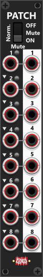
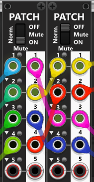

# Patch(p)
The Patch module is a specialized utility that I don’t use very often, but it’s extremely useful when experimenting or testing specific modules. When I do use it, I typically place two of them side-by-side as a **patchbay**—but first, let’s look at a single module on its own.

The module consists of 8 pairs of internally connected input and output ports. By default, each input is directly connected to its corresponding output. Next to each input, there is a **Mute** switch which, when activated (red), breaks this connection and effectively disables the routing. The module supports polyphonic signals, so each output will match the number of channels of its corresponding input. By default, outputs are hard-clipped to the range −12V to +12V, though this behavior can be adjusted or disabled via the context menu.

By default, each input is normalized to the previous input. At the top of the module, a 3-way toggle switch control the **normalization mode**:

+ **ON** (default): Normalization is active across all ports.
+ **OFF**: Disables normalization, making each input independent.
+ **Mute** (middle position): Normalization remains ON until a muted port is encountered, which interrupts the normalization chain (muted ports defaults to 0V until an unmuted port receives an input signal). However mute-voltage can be changed using the context menu.

 

**TIP**: A single Patch module can be used to mute up to 8 separate inputs. Via the context menu you'll find menu items to set all 8 mute buttons to either "on" or "off". Thanks to normalization, it can also function as a mult. For example, if you connect a signal to input 1, you can use outputs 2-8 to send that same signal to multiple destinations. As the normalization is broken as soon as you add a new input (e.g. to port 4), its a flexible mult which can have multiple mult-sections (e.g inputting a signal to input-4 and using outputs-4 and -5 you will have a 2-mult "section").

## Using two Patch modules as a patchbay
You can place two **Patch** modules side-by-side to create a simple patchbay setup. The way I personally use this configuration, the inputs of the left Patch module are connected to outputs from other modules in the rack, while the outputs of the right Patch module are connected to modules I want to send signals to. I then patch from the outputs of the left Patch module into the inputs of the right Patch module. This setup lets you keep all external input/output connections fixed, so you don’t need to constantly rewire your main patch. Instead, you can quickly "experiment" by repatching between the two Patch modules, effectively choosing which source is routed to which destination (e.g. in the screenshot below Input-1 of the 1st Patch is routed to Ouput-3 of the 2nd Patch).

 

**Important**: When using two Patch modules this way, it’s recommended to set the normalization switch to **OFF** on the module whose outputs connect to external modules. This ensures each output only carries its own corresponding input signal, rather than inheriting signals from earlier inputs. If an input is unplugged in this mode, the output will simply be 0V (monophonic) instead of an unintended signal.

[Go back to modules overview](manual.md#modules)