# Poly-tools
Simply looking at a Port in an Infinite-Noise module you can quickly distinguish monophonic- and polyphonic-ports, as polyphonic ports are displayed with a **thin red cicle** within the port. Hence ports without this red cicle are monophonic. It is however only possible to see the thin red circle when the port is not connected. As soon as you connect a cable to the port, the red cicle will be "hidden" behind the connected cable. For the same reason, hints for all monophonic/polyphonic-ports will be prefixed by either "**(m)**" or "**(p)**" to indicate whether the port is monophonic or polyphonic. *Whether this prefix should be shown or hidden can be controled via the "Global" context-menu.*

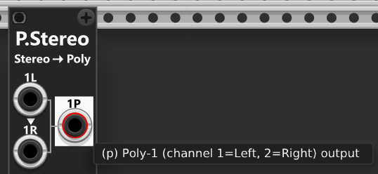

Most Infinite-Noise modules support polyphonic signals, however, some modules neither support nor generate polyphonic signals, which may require converting signals between polyphonic (multi-channel) and monophonic (single-channel) formats. To address this, the [Poly-Shuffle](PolyTools.md#poly-shufflep) module allows you to change the number of channels in a mono- or polyphonic signal. In addition, the [Poly-Split](PolyTools.md#poly-splitp) and [Poly-Merge](PolyTools.md#poly-mergep) modules can be used to split and merge polyphonic/monophonic signals, or together function as a polyphonic patchbay—for example, by first splitting a polyphonic signal into individual monophonic/polyphonic signals and then reconstructing a new/differently arranged polyphonic signal. These tools provide seamless control over polyphonic signals, making it easy to split, merge, and manage multi-channel audio and CV data in your modular environment. Each module’s functionality is explained in detail below. 

**TIP**: Many modules are not specifically designed to handle stereo signals (separate left/right audio signals). For example, most of the [Switch-modules](Switch.md) do not provide separate left/right inputs and outputs. However, since most Infinite-Noise modules support polyphonic signals, you can instead "encode" (merge) separate left/right audio signals into a 2 channel polyponic signal, and then pass on this signal to the intended module. Once processed you most likely will need to "decode" (split) this 2 channel polyphonic signal stereo signal into two separate (monophonic) left/right signals. [Poly-Stereo](PolyTools.md#poly-stereop) (described below) is build for this exact purpose, and can at the same time encode (top section) and decode (bottom section) 2 separate stereo signals *(what would otherwise require two Poly-Merge- and two Poly-Split modules to do the same)*.

Typically, a polyphonic splitter divides a polyphonic signal into multiple monophonic signals. Likewise, a polyphonic merger usually combines multiple monophonic signals into a single polyphonic signal. Out of the box, this is how Poly-Split and Poly-Merge operate in **Mono mode**. However, when switched to **Poly mode**, Poly-Split can split a polyphonic signal into multiple polyphonic signals—for example, splitting a 16-channel signal into two distinct 8-channel polyphonic signals. Similarly, in “Poly” mode, Poly-Merge can merge multiple polyphonic (and monophonic) signals into a single polyphonic signal—for example, combining two 8-channel polyphonic signals into one 16-channel polyphonic signal, where the first 8 channels come from the first signal and the remaining 8 channels come from the second signal.

## Poly-Merge(p)
The Poly-Merge module is designed to be flexible enough to merge both monophonic and polyphonic signals into a single polyphonic output. It can merge up to 16 monophonic signals. The lights next to the ports will illumuniate to indicate the number of channels that have been selected using the channels-knob (1-16). This light will be **green** when an input-signal for that port is available, and **red** when its not (meaning the output will be set as 0V). *Some general info regarding the Poly-tools are listed in the top.*

The module defaults to **Mono** input-mode, where all inputs are treated as single-channel monophonic signals (if a polyphonic signal is connected, only its first channel is used). Input ports without a connected cable will normalize to 0V. Hence dialing in a channel count of 4, and only inputting a signal into port 1 and 3, port 2 and 4 will normalize to 0V.

Switching to **Poly** input-mode, will allow multiple polyphonic signals to be merged into a new polyphonic signal. If you in poly-mode connect a 4-channel polyphonic signal to input port 1, and another-4 channel polyphonic signal to port 5, then port 1-4 of the 1st signal will populate port 1-4 of the output, and port 1-4 of the 2nd signal will populate port 5-8 of the output. Had you in stead connected the 2nd signal to input 3, then only port 1-2 of the first signal would be used to populate port 1-2 of the output, and port 1-4 of the 2nd signal would populate output ports 3-6 (ports 3-4 of the 1st signal would be replaced by ports 1-2 from the 2nd signal). In either case the channel knob is used to determine the number of channels to output.

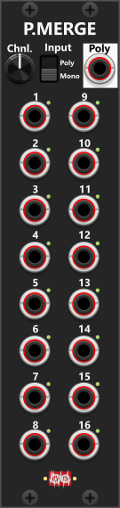 

## Poly-Split(p)
Like the Poly-Merge module, the Poly-Split module will default to **Mono** output mode, where you can split a polyphonic signal into (up to) 16 monophonic outputs. In Mono output mode, each output port always produces a monophonic signal, regardless of which ports have cables connected. For example, output port 5 will output a monophonic signal containing the value of channel 5 of the input signal (or 0V if no input cable is connected, or if the input signal has fewer than 5 channels). The lights next to the ports show channel status: **green** if that channel exists in the poly input, **red** if it is beyond the input but still in use (a cable on that port in Mono mode, or included in a connected poly slice in Poly mode—those channels output 0V), and **dim** otherwise. *Some general info regarding the Poly-tools are listed in the top.*

If you instead switch the module to **Poly** output mode, the module will output monophonic or polyphonic signals depending on which output ports have cables connected. For example, suppose you feed a 16-channel polyphonic signal into the input “Poly” port. All 16 indicator lights (one next to each output port) will illuminate, indicating that the input signal contains 16 channels. Now, if you connect cables only to output ports 8 and 16, port 8 will output an 8-channel polyphonic signal containing channels 1–8 of the input signal, while port 16 will output another 8-channel polyphonic signal containing channels 9–16 of the input signal. This allows you to easily split a single polyphonic signal into multiple subsets of monophonic or polyphonic signals, simply by how you connect the output cables.

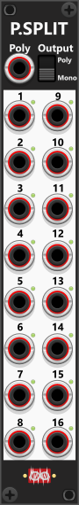 

## Poly-Stereo(p)
PolyStereo is a highly specialized module designed for a single purpose: **encoding** (merging) separate monophonic left/right signals into 2-channel polyphonic stereo signals, and **decoding** (splitting) 2-channel polyphonic stereo signals back into separate monophonic left/right signals. When encoding or decoding, **channel-1** is used for the **left** signal and **channel-2** for the **right** signal. *Some general info regarding the Poly-tools are listed in the top.*

At the top of the module, two separate left/right signal pairs can be encoded into two independent 2-channel polyphonic stereo signals. As indicated by the arrowheads, if only a left input is connected (i.e. a mono signal), the right input is normalized to the left input, resulting in a centered stereo signal.

At the bottom of the module, two polyphonic stereo inputs can be decoded into separate left and right monophonic outputs. If an input contains more than two channels, only channels 1 and 2 are used; all additional channels are ignored. If an input is monophonic (only a single channel), the signal is duplicated so that both the left and right outputs carry the same signal. *As a result, while not its intended purpose, the lower two sections can also be used as two independent monophonic mults, each providing two identical monophonic outputs.*

 

**TIP**: Suppose you have two separate stereo signals and want to switch between them using a [Bernoulli Switch](Switch.md#bernoulli-switchp). While the Bernoulli Switch does not directly support stereo signals, it does support polyphonic signals. In this case, connect the first stereo signal to 1L and 1R, then route the resulting 1P output to the A input of the Bernoulli Switch. Likewise, connect the second stereo signal to 2L and 2R, and route the 2P output to the B input. Next, connect the output of the Bernoulli Switch to the 4P (or 3P) input of the PolyStereo module. This will decode the selected stereo signal back into separate 4L and 4R outputs. *Using a single PolyStereo module, this setup accomplishes what would otherwise require two Poly-Merge modules and one Poly-Split module.*

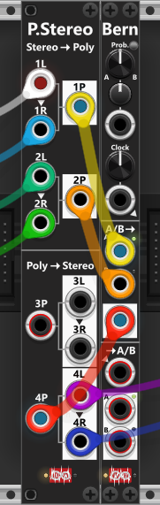

Linkewise a Bernoulli Switch can also be used to route a single signal to one of two destinations. In this configuration, use one of the upper sections of the PolyStereo module (for example, **1L/1R**) to encode the stereo signal into a 2-channel polyphonic signal, and feed the resulting **1P** output into the lower section of the Bernoulli Switch. Then connect the **A** output of the Bernoulli Switch to the **3P** input of the PolyStereo module, which will decode it back into separate **3L** and **3R** outputs. Similarly, connect the **B** output of the Bernoulli Switch to the **4P** input, which will decode it into **4L** and **4R** outputs. This effectively allows the Bernoulli Switch to route a stereo signal to either of two stereo destinations while preserving the left/right channel information.

## Poly-Quad(p)
Similar to the Poly-Stereo (see above) the purpose of the Poly-Quad (in the top) is to "encode" (merge) up to 4 separate/monophonic signal into a single/compound polyphonic signal, and to (in the bottom) "decode" (split) a single/compound polyphonic signal into (up to) 4 separate/monophonic signals. So basically it is an (up to) **4 channel merger/splitter**. 

As mentioned previously many modules (like switch modules) are not build to process (e.g. switch) multiple signals at once, however if they can switch polyphonic signals they can. The Poly-Stereo is build explicitly to handle stereo audio-signals (with special handling of solo signals), whereas the Poly-Quad can encode/decode (merge/split) up 4 signals. E.g. the output of a sequencer typically have at least 2 signals (trig and V/Oct), but often you have more CV-signals used for things like: amplification, panning, filter-control, and various other modulation. This is where the Poly-quad enters the equation, as it can encode/decode up to 4 monophonic signals wich can then be switched at the same time (when merged into a single 4-channel polyphonic signal). *E.g. VCV's own **SEQ 3** sequencer have 3 CV outputs (CV 1, CV 2 and CV 3) which along with the TRIG-output can be "encoded" into a combined 4-channel polyphonic signal using the Poly-Quad*.

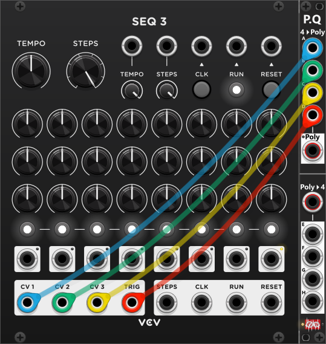

By default, the **4>Poly** output uses **Auto** channel mode (set via the context menu): it compounds as many channels as you have connected to inputs A–D, packing only connected ports in order (gaps are skipped). So if you only connect inputs to ports A, B, and D, the "4>Poly" output will generate a 3-channel signal. With no inputs connected it will simply output a monophonic 0V signal. 

Using the context menu **4>Poly output channels**, you can instead select a fixed count of 1–4 channels. When a fixed count is selected, the **red light** next to the Poly output illuminates. Inputs are mapped positionally: A→channel 1, B→channel 2, C→channel 3, D→channel 4. Disconnected inputs output 0V on their channel. For example, with a fixed 4-channel output and only A and C connected, the result is channel 1 = A, channel 2 = 0V, channel 3 = C, channel 4 = 0V. 

The 4 outputs in the bottom section (E, F, G and H) will output the first 4 channels of the polyphonoic input you provide in the "Poly>4" input. Hence if the input have more than 4 channels, only channel 1-4 are used, and if the input have fewer than 4 channels the corresponding output will simply output 0V (e.g. inputting a 3-channel signal, channel E-G will output these 3 channels as monophonic signals, while H will simply output 0V).

**TIP**: If you need to encode/decore more than 4 monophonic signals you should consider using [Poly-Merge](PolyTools.md#poly-mergep) and [Poly-Split](PolyTools.md#poly-splitp) wich both can handle up to 16 channels, and thanks to their Mono/Poly-mode switchs they can merge/split both monophonic and polyphonic signals.

## MAN-TR, MAN-GT, & MAN-CV8I/II
All 3 of these modules are described elsewhere ([Manual Controllers](ManCV.md)) but I want to mention them in this section of the documentation as well, as they can be used to construct Polyphonic signals. All 3 of these modules have 8 separate sections with buttons or knobs that allows you to generate 8 district/monophonic signals each with either a fixed CV-signal (set by knobs in the range -10V to +10V), a gate or a trigger. However beside these 8 individual/monophonic outputs, these modules also feature a single **Poly** output in the top of the module. By default this polyphonic output will be an 8 channel signal, where each channel correspond to each of the 8 individual/monophonic outputs. However using the context menu, the number of channels can be reduced (e.g. only include the first 4 sections as a 4 channel polyphonic signal).

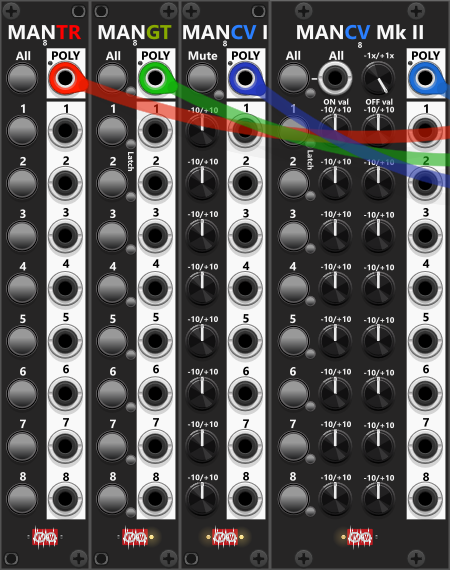 

**TIP**: If you need to construct a signal with more than 8 channels, you can use 2 of the modules (e.g. 2 Man-CV8I modules), which each can output a 8-channel polyphonic signal. You then feed the first 8-channel signal into port-1 of a Poly-Merge in **Poly-mode**, and the other 8-channel signal into port-9 of the same Poly-merge, and set the Poly-merge to output 16 channels.

## Poly-Shuffle(p)
This module has two sections, each serving a different purpose. The top section allows you to set the number of output channels (either **removing** channels from the signal or **adding** additional ones), while the lower section lets you change the order of the channels (for example, **shuffle** them). *Some general info regarding the Poly-tools are listed in the top.*

At the top of the module, you’ll see 16 indicator lights—one for each possible output channel. When a polyphonic signal is connected to the **Poly** input and the channel knob is set to more than one channel, multiple lights will illuminate. These lights will transition from **green** (representing the first input channel) to **red** (representing the last output channel). Channels that are not included in the output remain dim. *These lights are described in more detail below.*

 

### Channel count
By default, the **channel mode** button above the channel knob is **pressed (green)**, indicating **Automatic mode**. In this mode, the channel knob automatically follows the number of channels in the input signal. As a result, the module outputs the same number of channels as the input (or a single channel if no input is connected).

When the channel mode button is toggled to its **released (dim)** state, the module switches to **Manual mode**. In this mode, you can freely set the number of output channels using the knob. If you select a lower channel count than the input, the last channels are removed (for example, reducing an 8-channel signal to 4 channels by removing channels 5–8). If you instead select a higher channel count than the input, additional channels are added to the output. For example, if you input a 4-channel signal and set the output to 8 channels, channels 1–4 will match the input, while channels 5–8 will be generated.

When increasing the channel count, the module defaults to **Value mode**, where added channels take the value set by the value knob (default is 0 V). Pressing the small button next to the **Vl/Rp** (Value/Repeat) indicator-light switches to **Repeat mode**. In Repeat mode, the input channels are repeated (cloned) as needed. For example, with a 4-channel input and 8-channel output, channel 1 and 5 will both output input channel 1, channel 2 and 6 will output input channel 2, and so on. If a monophonic signal is used in Repeat mode, it will simply be repeated across all output channels. *If no input signal is provided, all output channels will take the value dialed-in by the value-knob, no matter if value mode or repeat mode is selected.*

Regarding the 16 channel indicator lights: their **brightness indicates which channels are available** from the input. If the channel knob is set to match (or be lower than) the number of input channels, all active lights will display **full brightness**. If the knob is set higher than the number of input channels, the additional channels will be shown at **reduced brightness (50%)**, still fading from green to red according to channel order *(see below)*.

### Channel order
The label-numbers **1–16** shown at the top of the module represent the **output channels**, while the color of each light indicates which **input channel** is mapped to that output. By default (and after a **Reset**), the channel order matches the input signal. The light next to channel 1 will be fully **green**, indicating that input channel 1 is mapped to output channel 1. The light next to the last active output channel (for example, channel 4 if the channel knob is set to 4) will be fully **red**, indicating the last input channel. The colors in between will gradually transition from green to red. As mentioned above, if you set a higher channel count than the number of channels available in the input signal, the lights corresponding to the added channels will be shown at reduced brightness (50%).

Hovering the mouse over these lights will display which input channel is assigned to each output channel. For example, the label “3” refers to output channel 3, and if the tooltip of the light shows “channel 1,” it means that output channel 3 is currently using the value from input channel 1.

At the bottom of the module, you’ll find a 3-way **order switch** (for selecting the order mode), along with its associated trigger input and button. When a trigger is received (or the small button is pressed), the channel order changes according to the selected mode:
* **Next**: Channels shift in an upward direction. For example, channel 1 outputs what was previously on channel 2, channel 2 outputs what was previously on channel 3, and so on.
* **Prev**: Channels shift in a downward direction. For example, channel 3 outputs what was previously on channel 2, channel 2 outputs what was previously on channel 1, and so on.
* **Shuffle**: Channels are rearranged in a random order each time a trigger is received.

**TIP**: If a downstream module (connected to the Poly output of **Poly-Shuffle**) only uses channel 1, **Poly-Shuffle** can be used as a probability switch. The probability is determined by the number of input channels and the selected number of output channels. For example, if you input a 2-channel signal and set the module to output 8 channels, then shuffle the channels, there is a **1/8 chance** that output channel 1 contains input channel 1. There is a **1/4 chance** that it contains either input channel 1 or 2, and a **3/4 chance** that it contains neither (e.g. 0V by default). 

**TIP**: Similar to the previous tip, you can use two Poly-Shuffle modules in series to both reorder channels and introduce a probability that individual channels will pass through. For example, start with a 4-channel signal and feed it into the first Poly-Shuffle. Set its output channel count to a fixed 16 channels and enable channel shuffling. Then route this 16-channel output into a second Poly-Shuffle, but set its output channel count to 4 channels. In this configuration, each of the original four channels has a 25% chance of being included in the final output, while the "surviving channels" are also randomly reordered. The result is a signal where channels are both randomly selected and randomly shuffled.

## Poly-Tweak Mk I(p)
The Poly-Tweak Mk I module allows you to invert individual channel values, and enables you to mute/remove channels from an output. By default, before making any adjustments, the module simply outputs a copy of the input signal since none of the channels are inverted, and all channels are enabled. *Some general info regarding the Poly-tools are listed in the top.*

By default, the module outputs the same number of channels as the input (unless channels are disabled in **Exclude mode**, described later). However, you can override this behavior via the context menu by selecting a specific polyphonic count (it defaults to **Auto**). If you choose a polyphonic count lower than the number of input channels, the remaining channels will be removed. If you select a higher count, additional channels will be added and set to 0V. Regardless of the settings, the module will always output at least one channel.

Both sections include 16 buttons. In the top section, these invert individual channels; in the bottom section, they disable individual channels. Each section also has an **All** button. By default, this button toggles all 16 channel buttons. However, the context menu provides options to change its behavior so it can instead set all 16 buttons either **On** or **Off**. The context menu also includes separate commands to set all buttons to **On** or **Off** without changing the current behavior of the **All** button.

At the top of the module, you will find inversion controls for each channel. Pressing a button will invert the associated channel, turning the button red. However, for inversion to work, the module must understand the range of incoming values. A three-way switch below the inversion buttons defines the inversion range:

+ **Bipolar** (-5V to +5V): Values are inverted symmetrically around 0V (e.g. inverting 3 to -3).
+ **Unipolar** (0V to +10V): Values are inverted symmetrically around 5V (e.g. inverting 3 to 7).
+ **Gate Mode**: Inputs are treated as high/low gates, where values ≥1V (by default) are considered high and values below 1V are low. In this mode, inversion flips high gates to low (default: 0V) and low gates to high (default: 10V). The threshold for detecting high gates and output levels for high/low gates can be adjusted via the context menu.

When in gate mode, inverted channels always output inverted gates. Non-inverted channels, by default, also output as gates (for example, an input of 2V will produce a 10V output, since any signal ≥ 1V is treated as a high gate). However, the context menu allows you to change this behavior so that non-inverted channels pass the signal through unchanged (for example, 2V will remain 2V as long as the channel is not inverted).

Below the inversion section, you find the the Disable section, which allows you to disable or enable individual channels. By default, all channels are enabled (buttons appear dim). Pressing a button toggles it red, which indicate that channel is disabled. The context menu also includes options to enable or disable all 16 channels simultaneously. When disabling a channel, two different behaviors can be selected via a two-way switch:

+ **Val** Mode (Default): Disabled channels output a fixed voltage set by the "Dis. Value" knob, which ranges from -10V to +10V (default: 0V). *Hence this can also be regarded as a mute-option, where disabled channels are "muted" (set to 0V).*
+ **Excl** Mode: Disabled channels are completely removed from the output. For example, if you input a 16-channel signal and disable every odd-numbered channel, the output will only contain the 8 non-disabled channels (hence output as an 8-channel polyphonic signal). *If you exclude all channels, the module with output a monophonic 0V signal.*

 

**TIP**: PolyTweak can be used before the [Poly-Logical Compare](PolyTools.md#poly-logical-comparep) or [Poly-Value Compare](PolyTools.md#poly-value-comparep) modules (described below) to exclude or invert channel values before sending the signal for logical- or value comparisons.

**TIP**: Even without an input signal, the module can be used to generate a polyphonic gate signal. Using the context menu, you can define a fixed number of channels (e.g. 16). All channels default to 0V (low gate). In **Gate mode**, pressing the buttons to invert specific channels will turn those channels into high gates (10V by default). *If needed, you can also use the **Disable** section to introduce a third possible value. In **Value mode**, the value knob determines the voltage assigned to disabled channels, allowing more flexible signal states beyond simple high/low gates.*

**TIP**: Similar to the previous tip, this module can also ge used to geneate a polyphonic signal where all channels have the same *(custom defined)* fixed value. Via the context menu you select a fixed polyphony (e.g. 8 channels), next you press the "All" button in the Disable section (in value mode)  to "disable" all channels. Finally you use the Dis.value knob to dial-in the desired fixed value (e.g. 5V). *Using this example the "Poly" output will output an 8-channel polyphonic signal, where all channels have the value 5V.*

## Poly-Tweak Mk II(p)
The Poly-Tweak Mk II is very similar to the Mk I (see description above), but with a few key differences. Instead of using buttons to select which channels to invert or disable, the Mk II uses **polyphonic gate inputs** for this purpose. Also, while the Mk I sets the number of output channels via the context menu, the Mk II provides a dedicated **channel knob**. *Some general info regarding the Poly-tools are listed in the top.*

By default, the module operates in **Auto mode**, where it outputs the same number of channels as the input. Pressing the small toggle button next to the channel knob switches it to **Manual mode**, allowing you to set a fixed number of output channels directly. If you select fewer channels than the "Poly" input provides, the remaining channels are removed. If you select more, additional channels are added using values from the (polyphonic) **Value input**, or 0V if no "Value" input is connected.

Below the channel/value section is the **Invert section**, which includes a polyphonic **Inv. Channel** gate input. A high gate indicates that the corresponding channel should be inverted. If you supply a monophonic signal, all channels will be inverted when the gate is high. Beneath this input is a 3-way **invert mode** switch (see the Mk I description for details).

Next is the **Disable section**, which works similarly. A polyphonic gate input determines which channels are disabled. If a monophonic signal is used, a high gate disables all channels (a simple way to "mute" all channels). A 2-way switch defines what it means to disable a channel (see the Mk I description). In **Value mode**, disabled channels are assigned a value from the knob or the polyphonic input. If both are used at the same time, the knob value is added to the input signal, effectively acting as an offset.

 

**Warning**: It is generally **not recommended** to dynamically disable channels while using **Exclude** mode, as not all modules handle frequently changing polyphonic channel counts gracefully. For example, most Infinite-Noise modules only check the number of connected input channels every 256th processing cycle to reduce CPU usage. If the channel count on an input changes frequently, there may be a short delay before the module detects the change, which can lead to unexpected or inconsistent behavior. For this reason, rapidly changing the channel count of a polyphonic signal may not produce reliable results.

**TIP**: When the **Disable mode** is set to **Value** and the **Disable value** knob is set to 0V, the module effectively acts as a gate-controlled mute module. High gates will "mute" individual channels—or all channels at once if a monophonic disable signal is used.

**TIP**:  While the [ON/OFF Switch](Switch.md#onoff-switchp) can accept- and output polyphonic signals, its switch operatation is monophonic (all channels switch in unison between the ON- and OFF-stages). The Poly-Tweak Mk II can however function as a polyphonic version of the ON/OFF Switch where individual channels can be "switched". To do this, first input the signal you consider the **ON stage** into the **Poly** input in the top, and then input the signal you consider the **OFF stage** into the **Dis. Value** input near the bottom. You can now input a polyphoinc gate signal into the **Disable**, and you are able to switch individual channels between the "Poly" (ON) and "Dis.Value" (OFF) signals.

**TIP**: Similar to the tip above the Poly-Tweak Mk II can be used to combine two polyphonic signals (taking some channels from one polyphonic signal and the other channels from the other polyphonic signal). For example, if you input an 8-channel polyphonic signal into the "Poly" input and another 8-channel input into the "Dis. value" input, then each channel-output will either be taken from the "Poly" input (when the channel is not disabled) or the "Dis. value" input (when the channel is disabled). E.g. with 8 channels, if you disable channels 1, 5 and 8, then channel 1, 5 and 8 of the output will take their values (channel 1, 5 and 8) from the disable value-input, whereas channel 2, 3, 4, 6 and 7 of the output will take their values from (channel 2, 3, 4, 6 and 7) from the Poly-input. If the disable value-input is monophonic the same value would be used for channel 1, 5 and 8.

*To generate the polyphoinc Disable input you can use a **Poly-Tweak Mk I**. Use its context menu to dial in a fixed polyphony (e.g. 8 chanenls), and set its **invert-mode to Gate**. In this configuration all it's inverted channels will output as a high-gates, and non-inverted channels will output as low-gates.*

## Poly-Logical Compare(p)
Unlike the "standard" [Logical compare modules](Compare.md), which compare channels between multiple inputs, the Poly-Logical Compare module compares all channels within the same/single polyphonic signal. If you input a polyphonic signal with up to 16 channels, this module evaluates logical conditions across all active channels. For example, if a 4-channel polyphonic signal is provided, the outputs behave as follows:

+ AND Output: High only if all 4 channels are detected as high-gates.
+ OR Output: High if at least one channel is high.
+ XOR Output: High only if exactly one channel is high.
+ NAND Output: High when all inputs are "not high at the same time".
+ NOR Output: High if no input are high (all low).
+ XNOR: Output: High when none, or more than 1 input is high.

At the top of the module, 16 indicator lights display the status of each channel. A green light indicates a high-gate detection, while a red light means the channel is low-gate. By default, a channel is detected as high when its voltage is ≥1V, but this threshold can be adjusted via the context menu. Likewise, output voltages default to 10V for high and 0V for low, but these values can also be customized. *Some general info regarding the Poly-tools are listed in the top.*

 

By default, the OR output activates when one or more channels are high, and XOR activates when exactly one channel is high. However, these conditions can be customized using the context menu.

+ The OR output can be set to trigger only when a specific number of channels (1-16) are high (e.g., if at least 3 channels are high).
+ The XOR output can be configured to activate when exactly a specified number of channels are high (e.g., precisely 3 channels - no less, no more).

If these defaults are modified, a small red indicator light next to the OR or XOR labels will illuminate, signaling non-standard behavior. However, the exact settings will only be visible in the context menu. The NOR and XNOR outputs always provide negated versions of the OR and XOR outputs. This means that if you modify the OR condition, NOR will follow the inverse rule, and the same applies to XOR and XNOR. For example, if OR is set to activate when 3 or more channels are high, then NOR will activate when fewer than 3 channels are high.

**TIP**: If you pass the signal through one of the PolyTweak modules before feeding it into this module, you can invert selected channels (when in "Gate" mode) and use the Excl/Val switch to either remove channels from the logical comparison or overwrite specific channel values. For instance, setting channels values to 0V ensures they are detected as low-gates, while setting them to 10V guarantees they are read as high-gates. 

## Poly-Value Compare(p)
Similar to the Poly-Logical Compare module, Poly-Value Compare by default compares the values of all channels within a single polyphonic input-signal. It features 6 outputs, which by default are clamped within -12V to +12V, but this setting can be adjusted or disabled via the context menu. *Some general info regarding the Poly-tools are listed in the top.*

Outputs:
+ **MIN**: The lowest value among all channels.
+ **MAX**: The highest value among all channels.
+ **NtZ**: The value closest to 0V, whether positive or negative.
+ **FfZ**: The value farthest from 0V, whether positive or negative.
+ **AVG**: The average of all channel values (basically a "mix").
+ **R/S**: Range/Sum output. By default this outputs the range between min and max ("max-min"). Via the context menu you can switch this output to Sum mode, where all channel values are added.

The small button next to the reset-input controls the **reset-mode**, By default the button is released (dim) in which case the reset-mode will be set to **Each cycle**. In this mode all internal values are reset in each cycle, hence e.g. the Min-output will output the lowest detected channel-value in this/current cycle. Pressing the reset-button (red) it will toggle the reset-mode to **Trigger-only**. In this mode, the internal values are only reset whenever the module receives a reset-trigger. Hence in trigger-only mode the module can be used to monitor the lowest/highest/average value over time (since last reset).

By default, the module operates in **Monophonic Output mode**, where each output is monophonic. For example, the **MIN** output will produce a single value representing the lowest value across all input channels. Using the 2-way output switch, the module can be set to **Polyphonic Output mode**. This mode should only be used when the reset mode is set to **Trigger-only**. In this configuration, all outputs become polyphonic, with each output containing the same number of channels as the input signal. For example, if you input a 4-channel signal, the **MIN** output will also have 4 channels. Each channel will hold the lowest value recorded for its corresponding input channel since the last reset (e.g. channel-1 of the Min-output will indicate the lowest value recorded from the channel-1 input - since the last reset - channel-2 will hold the lowest value recorded from channel-2 ... and so on).

 

**TIP**: If you want to exclude some of the channels from the compare operation, simply pass the signal through one of the Poly-Tweak modules before this module, and use it to exclude any unwanted channels. If you want to exclude the last n channels (e.g. only use the first 4 channels of a signal), many of the other poly-tool modules can be used (e.g. a Poly-Shuffle module with it's channel knob set to 4, will exclude all channels after 4, hence only output channel 1-4).

**TIP**: If you need to find the lowest/highest value from multiple monophonic signals, instead of chaining multiple [VMCP2 Mk. II](Compare.md#value-comparator-2-mk-iip) modules, merge those signals into a polyphonic signal using Poly-Merge, then send its Poly output into PolyVCmp to extract the MIN/MAX outputs.

## Poly-Offset(p)
This module lets you offset individual channels (in **PRImary mode**) or groups of channels (in **SECondary mode**). It is primarily aimed at polyphonic signals with up to 8 channels, as it provides individual knobs for offsetting those first 8 channels. However, it supports polyphonic signals with up to 16 channels and will, by default, output the same number of channels as it receives at the input. *Some general info regarding the Poly-tools are listed in the top.*

At the top of the module (below the Poly-input and mode-selector), you’ll find a knob and CV-input for applying a global offset to all channels of the input signal. For example, if you input a 3–5 channel polyphonic signal where each channel containing individual note values for a chord, you can transpose the entire chord by one octave simply by setting the "All offset" knob to −1 or +1. If this offset is static, you set it using the knob (−10 V to +10 V). If the offset needs to be dynamic, you can instead (or additionally) apply a CV-input, which is added to the value set by the knob. This CV both accepts monophonic and polyphonic signals. When fed a monophonic signal, the same (CV)-offset is added to all channels, however if fed a Polyphonic signal you can apply a different (CV)-offset for each channel. *If you do supply a polyphonic CV-offset, it should ideally have as many channel as the the Poly-input in the top of the module*.

Beside the knob/CV-input for the All offset, you find a knob/CV-input for setting an incremental offset. This incremental offset is not added to the 1st channel, however is added to the following using an offset that is incremented for each succesive channel. For example, if you input a 4-channel polyphonic signal, and set the incremental offset to 0.5V, then 0V is added to the 1st channel, 0.5V is added to the 2nd, 1.0V is added to the 3rd, and 1.5V is added to the 4th. The incremental offset also acccept a (monophonic) CV-input for applying a dynamic incremental offset if needed.

Further down are the 8 individual offset knobs, which behave differently depending on whether the module is set to PRImary (default) or SECondary mode. In **PRImary mode**, the 8 knobs (channels 1–4 on the left, channels 5–8 on the right) allow you to offset channels 1–8 individually by values from −10V to +10V. If the input signal has more than 8 channels, channels 9–16 are not affected by these individual knobs. However, all input channels (including channels 9–16) are still affected by the global all offset and incremental offset set above.

When switching to **SECondary mode**, the same 8 knobs instead affect groups of channels, with groups also applying to channels 9–16:
+ The 1st knob affects all odd-numbered channels (1, 3, 5, …, 15).
+ The 2nd knob affects all even-numbered channels (2, 4, 6, …, 16).
+ The 3rd knob affects channels 1-4 (groups of 4).
+ The 4th knob affects channels 5-8.
+ The 5th knob affects channels 9-12.
+ The 6th knob affects channels 13-16.
+ The 7th knob affects channels 1-8 (groups of 8).
+ The 8th knob affects channels 9-16.

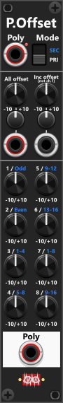 

By default, the module outputs the same number of channels as it receives at the input. However, the context menu includes an option that allows you to set a fixed polyphony count (number of output channels). This option is primarily intended for removing channels. For example, if you input a 16-channel signal, you can configure the module to output only 8 channels, effectively discarding channels 9–16.

However, you can also input a monophonic (single-channel) signal and use the context menu to generate a polyphonic signal. For example, you can input a monophonic base note (1V/Oct), set the output channel count to 3, and then use offset knobs 2 and 3 to dial in intervals. In this way, the module effectively outputs a 3-channel chord (such as a minor or major chord) based on the single input base note. *As described previously you can use the "All offset" to transpose this chord up/down*.

**TIP**: If you only plan to use the "All offset" you could as well be using a [Tweak-2I](Tweak.md#tweak-2-mk-ipq) module. It both have knob and CV-input for both scale and offset, and both inputs accepts polyphonic input, so individual scale and offset can be abllied to each channels if needed.

**TIP**: If you need to, you can generate a polyphonic signal from nothing (no input). E.g. to generate a 3 note chord from nothing (no input), using the context-menu you set a fixed polyphony of 3 channels. Using the offset-knobs 2 and -3, you can set the interval of the 2nd, and 3rd note of the chord in relation to the 1st note. Finally you can use the All offset to offset the entire chord (basically dialing in the base-note of the chord). If you at the same time supply a (monophonic) CV-input to the All offset, the chord can be dynamically transposed up/down (e.g. from a single/monophonic CV-signal from a sequencer). In this context you could have multiple PolyOffset modules (each generating different chords), and then use a [Cross-fade/Switch 4to1](Switch.md#cross-fade-switch-4to1p) to switch between these chords.

**TIP**: The default VCV scope module lets you monitor two separate signals at any one time (where each graph take its color of the input cable). The Scope module can also "graph" a polyphonic signal, but as all channels are graphed on top of each other its more or less impossible to see what goes on. However Poly-offset can **separate the channel graphs** by offsetting them individually or incrementally. In this screen-shot a saw-waveform is fed into a [Value-to-Bits](Bits.md#value-to-bits) which generates a polyphonic 8-channels signal (1 channel for each bit). This signal is then passed through a [Tweak-2I](Tweak.md#tweak-2-mk-ipq) which attenuate the signal. Finally the signals are passed through a Poly-offset, using both its all- and incremental (channel) offset, before finally being passed into the VCV scope, where we can clearly see all 8 channels at once:

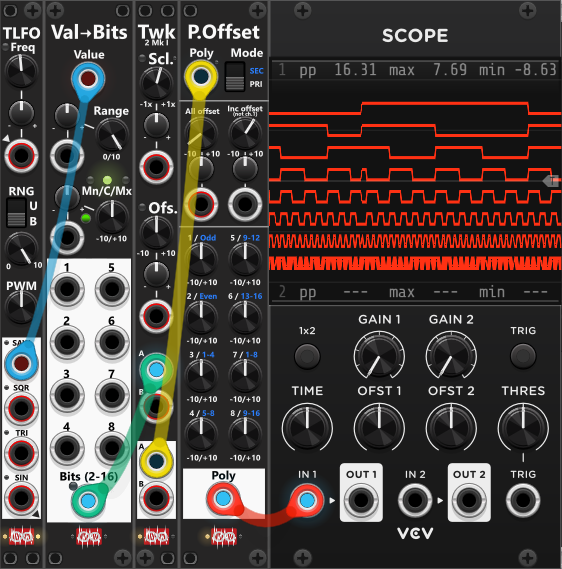 

*In the screenshot above, the channels are displayed in reverse order, meaning channel 1 is shown at the bottom, with each successive channel displayed above it. As a result, the top trace represents channel 8. If you prefer the channels to be displayed in the opposite order (with channel 1 at the top), simply set a **positive "All Offset"** and a **negative "Inc Offset"**.*

Above you see all 8 channels (all 8 bits). However in stead you might want to see only a single channel. In that case you dial the "Inc. Offset" knob back to 0, and instead use for the 1-8 knobs to only offset that specific channel. Here in the next screen-shot you will see another 8 channel polyphonic signal, where only channel 4 (sine) have been offset from the other 7 channels. As we only need to see 2 graphs at the same time (one with only the sine, and one with all the other 7 signals), we don't need to attenuate the signals as much as we did in the previous example:

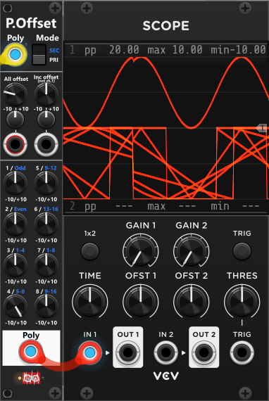 

*If you find you often have to monitor a single/few channel(s) of a polyphonic signal like this. You could wire up a preconfigured Tweak-2I, Poly-offset and Scope somewhere in your rack. When you need to monitor a single/few channel(s), you simply pass your polyphonic signal into the Tweak-2I (for scaling), and then use the offset-knobs of the poly-offset as needed to offset individual channels. Alternatively you could also pass the signal through a Poly-Tweak (in exclude mode), where you can disabled individual channels, so there will be less channels to monitor. In this configuration I would place the Poly-tweak before the Tweak-2I/Poly-offset, as it will potentially exclude (remove) channels, so the modules "after" will have less channels to process (less data to process). As these modules are only used to monitor signals, you could further reduce CPU-workload by reducing the "Process-Quality" (e.g. at "Balanced/every 16th cycle" you shouldn't see any changes in the visualized graphs).*

**TIP**: If you need to individually offset more than 8 channels from the same polyphonic signal, you can use a Poly-Split (in Poly-mode) to split the first 8 channels (1-8) of 16-channel signal, and the remaining channels (9-16) into another 8-channel signal. You can then route these two 8-channel polyphonic signals into two separate PolyOffset modules to offset individual channels independently. Once offset the two 8-channel signals can be merged into a 16-channel polyphonic signal using a Poly-Merge module (also in "Poly"-mode).

Especially in **SECondary** mode, multiple offsets can be applied to the same channel(s), which may result in relatively high output values. Like most other Infinite-Noise modules, the outputs are clipped by default to the range −12 V to +12 V. Depending on how much offset you apply, and on what the downstream modules are capable of handling, you may want to change/disable this clipping. This can be done via the module’s context menu.

## Poly-Scale(p)
PolyScale is very similar to PolyOffset (**see above**), but instead of offsetting signals, it scales (attenuverts) individual channels or groups of channels. The most noticeable visual difference is that PolyScale does not include an incremental section. Instead, it features a scale-mode button that cycles through different scaling ranges. By default, all knobs scale (attenuvert) within the range −1x to +1x. Each press of the scale-mode button cycles through the available ranges: 1×, 2×, 5×, and 10×, with an indicator light showing the active mode. The All-scale CV-input supports a polyphonic signal, hence it can be used to apply individual/different scaling to each channel. If supplied a monophonic input, all channels will be scaled according to this input. *Some general info regarding the Poly-tools are listed in the top.*

In most cases, you would not want to apply multiple scaling factors to the same channel (for example, using both the All scale and an individual channel scale at the same time). To help with this, there is a red warning light next to the Poly label at the bottom of the module. This light illuminates if a channel is affected by multiple scaling controls. For example, if you set an All-scale of 0.75 and a channel-1 scale of 0.65, then channel-1 will be scaled by 0.4875 (0.75 × 0.65). The module will still apply both scalings, but the warning light alerts you that this may not be intentional.

For more details about the Primary and Secondary modes, as well as the individual knobs, refer to the PolyOffset module description above.

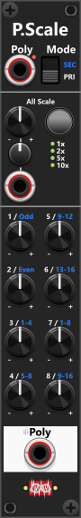 

**TIP**: If you only plan to use the "All scale" you could as well be using a [Tweak-2I](Tweak.md#tweak-2-mk-ipq) module. It both have knob and CV-input for both scale and offset, and both inputs accepts polyphonic input, so individual scale and offset can be abllied to the channels if needed.

**TIP**: As explained earlier, you can pass a polyphonic signal through a Tweak-2I and a PolyOffset module before feeding it into a VCV Scope to view multiple channels simultaneously. As an alternative, you can route a polyphonic signal (up to 8 channels) through a *PolyScale* module before sending it to the scope. In this setup, you would turn all individual scale knobs (channels 1–8) down to 0 (can be done in one go via the context menu). While this approach does not let you view multiple channels at the same time, it allows you to isolate a single channel by turning up its scale (for example, setting channel 8 to 1× while keeping all others at 0×).

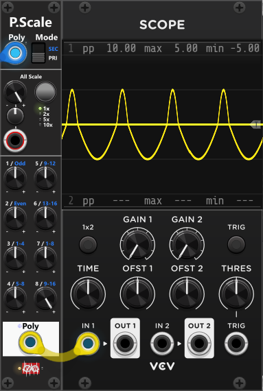 

[Go back to modules overview](manual.md#modules)