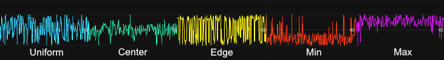
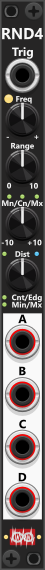
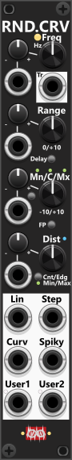
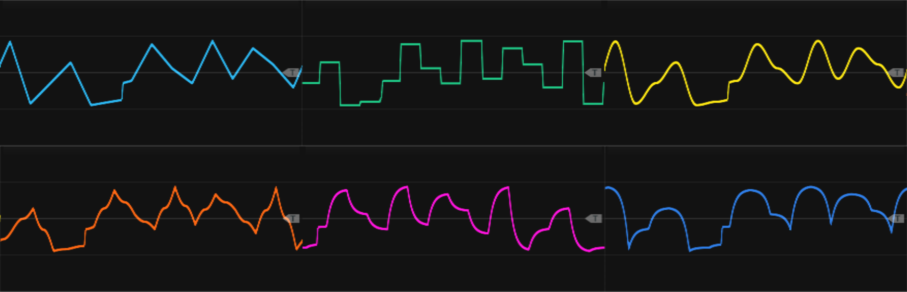

# Random modules
The Infinite-Noise plugin includes several modules capable of generating random outputs or using internal randomization. If you need a simple bipolar/unipolar random value, the [S&H, T&H and H&T modules](Shth.md) are ideal choices, especially the SHTH2 module, which has a built-in LFO that generates a random value from an internal noise source each time its phase restarts. Similarly, the [Bernoulli Switch](Switch.md#bernoulli-switch) allows you to set a probability for routing signals between two inputs and one output ("A/B->") or one input and two outputs ("->A/B"). If no input is used, the "A/B->" section can even be used to generate random gates (high=10V, low=0V) based on the probability setting.

However, there are cases where more advanced randomization is needed. The Random-4 and Random-Curve modules allow for customizable random values with defined ranges and distributions. Random-4 outputs four random values at once when triggered, while Random-Curve continuously generates smooth curves that transition between random values.

### Frequency (how often random-values are generated)
Both Random-4 and Random-Curve can generate random values based on:

+ An internal LFO (interval set by a frequency knob, affected by Rate Chaos)
+ External modulation (CV-input for frequency in Random-Curve, trigger input in Random-4)

When using the internal LFO, the context menu offers a **Rate Chaos** setting that randomizes the speed of each individual cycle, so new random values are generated at slightly - or wildly - irregular intervals instead of at a perfectly steady rate. This option appears on several other modules too and is described in the [main manual](manual.md#rate-chaos).

### Range in which random values are being generate
The range of random values is set by a range-size knob and an offset point (anchor). The range can be adjusted from 0V to 10V. The offset point determines whether the range is centered (default) or defined from a minimum- or maximum-value. On Random-Curve, you can toggle the offset point using a button. On Random-4, it must be set via the context menu. Random-Curve also has a CV input for dynamic range adjustments.

**TIP**: Although the range knob is limited to 0V-10V, Random-Curve allows external CV control of the range, e.g. adding another 10V. This means the effective range can extend to 20V, e.g. covering values from -10V to +10V if needed. As an alternative you can use a [Tweak-2 Mk I](Tweak.md#tweak-2-mk-i) to scale the output all the way up to 10x (or simply 2x to expand a ±5V range to a ±10V range).

### Distribution of generated values
By default, the generated random values are uniformly distributed (white noise), meaning any value within the range has an equal probability of occurring. However, you can modify this distribution to favor certain values using the distribution knob. The modules offers two distribution modes:

**Center/Edge Mode** (Default)
+ Counterclockwise: Increases the probability of values appearing near the center of the range.
+ Clockwise: Increases the probability of values appearing near the edges (both min and max).

**Min/Max Mode**
+ Counterclockwise: Increases the probability of values being closer to the minimum.
+ Clockwise: Increases the probability of values being closer to the maximum.

A green indicator light will show which mode is active. The distribution knob ranges from -1 to +1, where the range starts to "collaps" when going beyond ±0.6. If turned fully to -1 or +1, the entire range fully collapses to a value at the minimum, center, or maximum.

The Distribution knob ("+ CV input / 5") operate within a range of -1 to +1. However, with the default scaling, significant changes in distribution become noticeable when the knob is turned beyond -0.6 or +0.6. If the knob is fully rotated to -1 or +1, it effectively fully collapses the range of random values into a single fixed value—either the minimum, center, or maximum, depending on the selected settings. To maintain a full range of random values, it is **recommended to keep the knob within the -0.6 to +0.6 range**. 

However, instead of requiring manual precision, the context menu provides an option to adjust the internal scaling of the knob in 5% increments, from 60% to 100%. This allows the knob to be rotated fully without unintentionally limiting the generated values. For instance, setting the scaling to 60% enables full-range knob movement while still preserving the full range of random values. A small blue indicator light next to the "Dist" label provides a visual cue when scaling is below 100%. The lower the scaling, the brighter the light appears. At 60% scaling, the light is fully illuminated, while at 100%, it remains dimmed. This provides an intuitive way to check whether scaling has been reduced and by how much.

The illustration below shows 5 different sets of distributions (each using a different graph-color). The 1st (left-most) graph shows a default uniform distribution where there is equal change of all generate values between min and max. The remaining 4 graphs shows specific selected distributions. In all 4 cases the distribution setting were set in the ±0.6 range, to ensure random outputs in the full range were still possible, however there would be a higher chance for some values being generated more often than others.

 

**TIP**: Using a center-weighted distribution, where random values are more likely to be generated near the middle of the defined range, combined with quantized output (enabled via the context menu), can be an excellent way to generate random musical notes in a 1V/Oct format. Alternatively, the output can be routed to a dedicated quantizer module to fit a specific scale, key, or set of notes. For example, if you set the center of the range to match the voltage of your desired root note and define a range of 2V, the module will generate values corresponding to musical notes that span up to one octave above and below the root note. Since the distribution is biased toward the center, there is a higher probability that the generated notes will be closer to the root note and a lower chance of selecting notes at the upper or lower extremes of the specified range. 

**TIP**: By selecting a max- or min-weighted distribution, you can bias the generated values toward either the upper or lower end of the range. This can be especially useful for modulating filter parameters, such as cutoff frequency or resonance, allowing you to control the probability  that the filter opens or closes. 

Likewise all of the Infinite-Noise modules by default treat values at/above 1V as a high gate, meaning without any special distribution there is a 40% chance a random bipolar value is detected as a high-gate (>=+1V to +5V), while there is a 60% chance it will be detected as a low-gate (-5V to <+1V). Using a max-weighted distribution you can increase the chance that generated output will be detected as a high-gate, and likewise using a min-weighted distribution you can increase the chance that generated output will be detected as a low-gate. *As an alternative you can use a [Tweak-2 Mk I](Tweak.md#tweak-2-mk-i) to offset the output, to increase/descrease chance of output being detected as a high-gate (but this would require an extra module compared to just change distribution).*

### Forced Polarity
When the distribution mode is set to **Center/Edge**, you have the option to enable "Forced Polarity". In the Random-Curve module, this is controlled via a small "FP" button above the Dist knob, while in the Random-4 module, it must be activated through the context menu. When **Forced Polarity is enabled**, the generated values will alternate between the upper half and lower half of the defined range. For example, with the default range from -5V to +5V, every second value will be positive (0V to +5V), while the others will be negative (-0V to -5V). This creates a more dynamic movement in the generated values, particularly useful when using the Random-Curve module to generate smoothly transitioning random curves, as it will then alter between rising- and falling curves.

**Note**: Forced Polarity is ignored when the distribution mode is set to "Min/Max".

## Random-4

 
This compact 2HP module generates four random outputs each time it receives a trigger. If no trigger input is provided, it operates with its built-in LFO, controlled by the frequency knob below the trigger input (chaos rate can be selected via the context menu). As described earlier, the range knob defines the span of generated values, while the distribution knob adjusts how "likely" certain values appear (e.g., favoring the center, edges, min, or max). *Some general info regarding the Random-modules are listed in the top.*

The module features various mode options, accessible via the context menu, allowing you to modify the Mn/Cn/Mx offset mode, adjust the distribution behavior, or enable/disable Forced Polarity (explained above). Small green indicator lights on the panel illuminate to show active modes, reducing the need to open the menu for verification. The green light next to "Dist" indicates when Forced Polarity is enabled, but this only applies when Center/Edge distribution is active.

By default, **Polyphony** is **Auto**: each of the four outputs matches the number of channels on the Trigger input (or one channel if no trigger is connected, using the internal LFO). You can instead pick a fixed channel count (1–16) from the context menu; the module then always outputs that many channels regardless of the Trigger input. A small **red light** at the upper-left of the Trigger input is lit when a fixed count is selected. When a trigger cable is connected, each output channel is triggered independently from the corresponding trigger channel. *In total, this means the module can output up to 64 random values simultaneously (4 outputs × 16 channels).*

 

**TIP**: If you want to create smooth transitions rather than abrupt jumps, you can process the module’s output through [Slew 4](Slew.md#slew-4), generating curves instead of fixed values. Since the range and distribution can only be adjusted manually via knobs, the [Random-Curve](Random.md#random-curve) module is a better choice if you need CV control over these parameters. 

## Random Curve

 
This 4 HP module generates random values and outputs them as six distinct curve shapes. At its core, the module features an internal LFO that determines how often a new random value is generated. Each time the LFO selects a new random value, the module smoothly transitions from the previous value to the next, creating continuously evolving curves. By adjusting the frequency knob or applying a CV signal, you can control whether the module produces fast-changing or gradually shifting curves. Via the context-menu a "chaos rate" can be enabled. Below the frequency control, there is a trigger output that fires whenever the internal LFO picks a new random value to transition to. *Some general info regarding the Random-modules are listed in the top.*

*When it comes to the frequency you dial-in, the output of the Random Curve outputs might appear "slower" than forexample the Sine output from an LFO running at the same frequency. However when you think about it, a single cycle of a sine can be regarded as 4 curve-segments: first 25% a convex curve from 0 to 1, next 25% a convex curve from 1 to 0, then the next 25% a convex curve from 0 to -1, and for the final 25%, a convex curve from -1 to 0. So the Random Curve output can be regarded as running "4 times as slow", as it only produces a single curve-segment at the same rate.*

The module allows precise control over the range and distribution of the generated values. The Range and Mn/Cn/Mx settings define the span within which random values are generated and their offset point (Minimum, Center, or Maximum). A small push button next to the Mn/Cn/Mx knob toggles between these three modes, illuminating to indicate the active setting. Similarly, the Distribution knob controls how values are weighted, either favoring the center or the edges of the range. A small button below the Distribution knob allows you to toggle between Center/Edge or Min/Max distribution modes. Above the Distribution control, an FP (Forced Polarity) button enables an alternating pattern where successive values toggle between the upper and lower halves of the defined range (Center/Edge-mode only). When Min/Max distribution is selected, the FP button is covered by an overlay.

Between the Range and Mn/Cn/Mx controls, there is a Delay button. By default, this feature is disabled, meaning that any changes to the range settings take effect immediately, scaling the currently generated curves accordingly. However, when **Delay** is enabled, modifications to the range do not affect curves that are already in progress, instead applying only to the next generated random value. Enabling Delay, ensures the generated curves stays smooth, even when range-inputs might change abruptly/often.

 

At the bottom of the module, six outputs each generate a different type of "curve", all based on the same generted random values but with unique transition characteristics. The last two outputs ("User1" and "User2") each support the same four curve types selectable via the context menu (Log, Exp, Top rounded/bottom sharp, Bottom rounded/top sharp). User1 defaults to Log; User2 defaults to Top rounded/bottom sharp. An RGB indicator next to each user output is always lit to show the active mode: green = Log, red = Exp, blue = Top, orange = Bottom. Here a short description of the outputs:

+ **Lin**: Linear transitions between random values.
+ **Step**: Abrupt switches at the midpoint between values, mimicking a Sample & Hold signal.
+ **Curv**: Smooth S-curve transitions for a fluid motion.
+ **Spiky**: Reversed S-curves with sharp, spiky peaks and dips.
+ **User1**: User-configurable curve (default: **Log**).
+ **User2**: User-configurable curve (default: **Top rounded/bottom sharp**).

By default, the "Step" output will "step" (change between the previous/next random value) mid-phase (marked by a **dim light** next to the "Step" output). However, via the context menu, you can change the **step mode** so that it instead steps at the beginning of the phase (marked by a **red light** next to the "Step" output). This mode can be beneficial if you need the waveform to "step" at the same time as the Trigger outputs fire a trigger.

The screenshot belows shows the exact same progression of random values, displayed using 6 different curve-outputs. All curves begins and ends at exactly the same value (at exactly the same time), however the transition between those "points" is different for each curve-type. In the example a uniform distribution was used:

 

**TIP**: While adjusting the range of generated values via knobs or CV is straightforward, don’t overlook the ability to manipulate the time domain just as easily. The rate at which new random values are generated can be dynamically controlled using the Rate knob, Chaos rate (context menu) or its CV input, allowing modulation from an LFO, another Random-Curve module, or any other external source. Essentially, the Rate input functions as frequency modulation for the module’s internal LFO. *Keep in mind that the **Delay feature** only affect changes made to the range, so to keep the outputs smooth without abrupt changes, it best to use a slow changing/smooth frequency CV-input*.

**TIP**: To create more evolving and complex curves, consider cross-fading between different outputs. A [Cross-fade module](CrossFade.md) allows smooth transitions between two signals, while a [Switch module](Switch.md) enables switching between multiple outputs—either from the same module or from different sources. For example, the [Cross-fade switch 4to1](Switch.md#cross-fade-switch-4to1) can seamlessly transition between up to four different random curves, blending them in real-time. You could choose to feed the Trigger output from the Random Curve into the Cross-fade 4x1 (in random mode), so it will pick a random curve-output each time a new curve-segment begins. To keep it even **more simple**, route the curve-outputs you want to "mix" into a [Manuel Mix 4 Mk I](ManCV.md#manuel-mix-4-mk-i) and dial-in your desired mix-settings, and if you want a "stair-stepped" output route the signal through a [S&H/T&H-2](Shth.md#shth-2).

**TIP**: Another technique involves layering smooth random curves with subtle noise or jitter for added movement and variation. A [Merge module](MergeMult.md) can combine multiple signals by summing them together, allowing you to overlay a gentle evolving curve with a lower-amplitude noise/jitter source. Various modules can generate this noise or jitter, including LFOs, S&H circuits, and other random generators. You can further refine the noise by passing it through a [Tweak module](Tweak.md) to dynamically adjust its scale/offset over time using CV input. For an additional layer of unpredictability, routing the noise signal through a [Bernoulli Switch](Switch.md#bernoulli-switch) allows probabilistic control, randomly determining when the noise/jitter is present or absent in the final output or switch between two different noise/jitter sources.

## Chaos
The central idea of the Chaos module is to bring the [**Chaos rate**](manual.md#rate-chaos) (utilized by many Infinite-Noise modules, including Chaos itself) to modules outside this plugin, or perhaps even to inputs of modules within this plugin that don't natively support a Chaos rate. Basically, the Chaos module is a **random generator** that generates random values, where either the Trig input (if connected) or the internal LFO (with its frequency set by the Freq knob) determines when a new value is generated. As mentioned, the Chaos module has its own Chaos rate (set via the context menu), which can affect the dialed-in frequency when the internal LFO is in use.

*In essence, the Chaos module is similar to the Random Curve module. The key differences are how the distribution is handled and the fact that it has an input port, allowing the generated values to be "added" to the input without having to use an additional module. On the other hand, the Random Curve module has CV inputs for controlling Range and Distribution.*

Below the Trig input/Frequency knob, you find the **Chaos knob** and its CV-input. The previously mentioned Chaos rate (context menu) lets you specify chaos in 5% steps from 0% to 100%. However, the Chaos knob of the Chaos module lets you freely specify the Chaos setting anywhere in the range from 0% to 100%. The **Chaos CV-input** (0-10V) is added to the knob, and the result is then clamped to the 0%-100% range, allowing you to modulate the chaos. At low Chaos settings, the output will tend to stay near the center (see distribution below), so to utilize the full range, you will need to dial in a higher Chaos setting, which will also affect the distribution. *For a more in-depth description of Rate Chaos, please consult the [main manual](*manual.md#rate-chaos*).*

The Min/Max knobs define the range of the generated random values, while the small link button between them lets you link the Max knob inversely to the Min knob, making it easier to dial in a symmetrical bipolar range. *Internally the module will automatic swap the values dialed in by the mix/max knobs if you dial in a minimum which is higher than the maximum.*

When using Chaos Rate via the context menu, the generated chaos is always distributed around the center. E.g., if you use Chaos Rate to affect an LFO frequency, the chaos will affect the frequency equally in either a positive or negative direction. Instead, the Chaos module has a **Distribution** knob that controls the distribution of the generated chaos values. In its default center position, the generated chaos will be similar to the Chaos Rate set via the context menu. However, if the knob is turned fully clockwise to Max, the distribution will be "anchored" at the maximum of the range, which at low chaos setting increase the chance of generating values near the maximum of the range.

Next to the Distribution knob, there is a small **Distribution mode** button. While not pressed (**Knob mode**, black), the Distribution knob is enabled and controls the Min/Center/Max distribution. When toggled, the distribution mode changes to **Exponential mode** (green). When enabled, the knob is set to the center position and an overlay is placed on top of it, locking the distribution to Center. This mode is intended for cases where you want to use the chaos output to affect frequency (e.g., the frequency input of an LFO/VCO or a V/OCT signal), where each positive volt doubles the frequency (+1 octave) and each negative volt halves the frequency (−1 octave).

By default the Chaos value is added to the IN-input - at once - when a new internal Chaos value is generated. However using the context menu you are able to select a **slew-time**: 0 (default), then a 1-2-5 series from 0.0001 to 10 seconds (0.0001, 0.0002, 0.0005, 0.001, 0.002, 0.005, 0.01, 0.02, 0.05, 0.1, 0.2, 0.5, 1, 2, 5, 10), and "adaptive". The small light to the right of the "Freq" label shows the selected slew-time setting: **dim** when 0 is selected (no slew), gradually from **green** to **red** when 0.0001 to 10 is selected, and finally **blue** when adaptive is selected.

The **adaptive** slew-time setting works best with a somewhat regular frequency. When enabled and a Trig input is connected, the module will try to determine the frequency of the incoming triggers and adjust the slew time accordingly (never less than 0.00001 or more than 10 seconds). In this mode, the slew time adjusts by 75% on each cycle, allowing it to better handle small variations (`slewTime = (slewTime * 0.25) + (newSlewTime * 0.75)`). On the other hand, this means it takes a few cycles to catch up to a new significantly changed frequency. When enabled and the internal LFO is in use (the Trig input is not connected), the slew time adjusts 100% to match a full internal LFO cycle, even when the LFO frequency is affected by the internal Rate Chaos.

Besides being able to select the slew time, the context menu also lets you select the **slew shape**. By default, the slew shape is **linear**, but you can also select **S-curve**, **exponential**, or **logarithmic** (which is actually an inverted exponential curve). The selected slew shape is only used when the slew time is greater than 0.

The input is normalized to 0V, so if no signal is connected, the output will simply output the generated chaos value. When an input is connected, the generated chaos value is added to the input signal. In both cases, the output is clipped to a ±12V range by default, so if you need to exceed this range, you will have to use the context menu to change or disable the clipping range.

**TIP**: If you are unable to find a slew setting (time and/or shape) to your liking, you can instead use one of the [Slew modules](Slew.md#). In this case, you should not input any signal into the IN port, so the OUT port of the Chaos module only outputs the Chaos value. You can then pass this output to a dedicated Slew module. The output of the Slew module (the slewed Chaos value) can be passed into a [Merge2x4](MergeMult.md#merge2x4) along with the signal to which you want the slewed Chaos value added (a merger is basically just a precision adder that simply "adds the two inputs"). *Alternatively, you can skip the merger and simply pass both signals to the same input-port, as it will also just add the two signals.*

**TIP**: Even though the Chaos module is envisioned as an alternative to Chaos Rate (for modules without this feature), it can also be used as a simple random generator, producing either a "stepped" or "curved" output. Basically, you can use the slew-time/shape settings in the context menu to select the type of output you want. E.g., use no slew time for a "stepped" output or Adaptive Slew for a curved output (e.g., with the shape set to S-curve to generate an output similar to the "Curv" output of the Random Curve module). The combination of the Chaos knob/input and the Dist knob controls the distribution of the generated signal.

[Go back to modules overview](manual.md#modules)