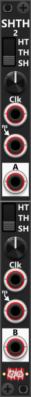
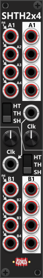

# Sample-and-hold / Track-and-hold / Hold-and-track
The Infinite-Noise plugin includes two SHTH modules capable of performing traditional Sample-and-Hold (**S&H**/**SH**) along with Track-and-Hold (**T&H**/**TH**), and Hold-and-Track (**H&T**/**HT**) operations. Sample-and-Hold typically responds to a trigger input *(short signal)*, determining when to sample a new input value. In contrast, Track-and-Hold and Hold-and-Track operate based on a gate signal *(typical "longer" signal)*, altering behavior depending on whether the clock-gate is high or low. The three modes function as follows:

+ **Sample-and-Hold (S&H)**: A high trigger samples the input value, which is then held until the next trigger occurs.
+ **Track-and-Hold (T&H)**: While the gate is high, the input is continuously tracked (passed through). When the gate goes low, the last value is held.
+ **Hold-and-Track (H&T)**: While the gate is high, the last input value is held. When the gate goes low, the input is tracked (passed through).

**TIP**: Since T&H and H&T typically rely on gate signals, they can also be controlled using trigger signals by passing the trigger through an [On/Off Switch](Switch.md#onoff-switchp) module. This On/Off-Switch should be configured to toggle between "ON" (10V) and "OFF" (0V), which is equivalent to gate high-/low-levels. Routing this toggled output into the Hold input of an SHTH module allows the module to alternate between tracking and holding with each trigger received by the On/Off-Switch. Alternative a [Flip-Flop](FlipFlop.md#flip-flop) in T-mode (with the trigger input into the "T/D" port) can also be used (each trigger-input will toggle the Q output high/low).

If no external Clock input is connected, both SHTH modules features an internal LFO that can drive the Clock-rate. When active, the LFO frequency is adjustable via the knob next to the Clock input. Since T&H and H&T operate on gates rather than triggers, the internal LFOs generates a pulse wave where the high and low phases are equal by default (50% duty cycle). However, using the context menu, this ratio can be adjusted in 10% increments, from 10%/90% to 90%/10%. Additionally, in the SHTH2x4 module, if a Clock signal is plugged into the A-section, it will be normalized to the B-section, unless a separate Clock signal is supplied. This allows a single Clock input to control all 8 sample/hold pairs (4 in the A-section and 4 in the B-section).

The context menu also offers a **Rate Chaos** setting (per section) for the internal LFO, which randomizes the speed of each individual cycle so the sampling/holding happens slightly - or wildly - irregularly instead of at a perfectly steady rate. This option appears on several other modules too and is described in the [main manual](manual.md#rate-chaos). *The Rate Chaos is only used with the internal LFO, hence not in use when a Clock-input is connected.*

When generating a **polyphonic output**, there are three ways the module determines the number of channels. These are evaluated in priority order (top to bottom):
* **Polyphonic input**: If the **A input** is polyphonic, the A output will match its number of channels.
* **Polyphonic clock trigger**: If no A input is connected, the module uses its built-in noise generator, and the output channel count will match the number of channels in the clock trigger.
* **Context menu setting**: If neither an A input nor a clock-input is connected, the output channel count is determined by the context menu (default is a single channel).

By default, the built-in noise source generates bipolar random values (**white noise**) between −5V and +5V. You can change this to other ranges—such as 0V to 10V for unipolar signals—via the context menu. For "other kinds of noise" you can connect the output from a VCV Noise module (which can both do white-, pink-, red-, vilolet-, blue-, gray- and black-noise). If you need more control over the range or distribution of the random values, you may want to use a [Random-4](Random.md#random-4paq) module instead, which also supports trigger-based operation or its built-in LFO.

**TIP**: For probabilistic tracking or holding, route the Clock signal through a [Bernoulli Switch](Switch.md#bernoulli-switchp) module. By connecting the signal to the Clock input of the Bernoulli Switch, and then routing either the "A" or "B" output (from the "→A/B" section) into the Clock input of the SHTH module, you can introduce randomness into whether the module tracks or holds (producing longer/shorter track/hold-times).

## S&H/T&H-2(paq)

 
The SHTH2 module operates in Sample-and-Hold (S&H), Track-and-Hold (T&H), or Hold-and-Track (H&T) mode, as selected via the three-way switch. If a Clock input is provided, the module will use it to determine when to sample or hold/track the input signal. Otherwise, the built-in LFO takes over, with its frequency adjustable via the knob near the Hold input. *Some general info regarding the S&H/T&H/H&T are listed in the top.*

The Clock inputs in both sections support polyphonic signals, allowing you to sample/track/hold individual channels independently. If you provide a monophonic Clock signal, all channels will follow that same Clock input. When using a polyphonic Clock signal, make sure it has at least as many channels as the signal input. Likewise, when using a polyphonic Clock together with the internal noise generator (i.e., no external input connected), the module will automatically match the number of output channels to the number of channels present in the Clock input.

If no external input signal is supplied, the module generates random values using its internal white noise generator, which by default produces values in the range of -5V to +5V. However, this range can be adjusted in the context menu. The noise generator initially outputs a monophonic random signal, but it can be configured to produce a polyphonic signal with up to 16 channels, where each channel generates a unique random value.

 

**TIP**: You can set different sample-and-hold frequencies in the **A** and **B** sections, then route the **A** and **B** outputs into a single [Bernoulli Switch](Switch.md#bernoulli-switchp). In this setup, the Bernoulli Switch determines whether the output comes from the “fast” or the “slow” sample-and-hold path. This allows you to create a signal that "randomly" alternates between frequently changing and Infrequently changing values, with the probability controlled by the Bernoulli Switch.

## S&H/T&H-2x4(paq)

 
The SHTH2X4 module features 2 independent sections, each containing 4 input/output pairs for processing multiple signals simultaneously. Like the SHTH2, each section operates in S&H, T&H, or H&T mode and can be controlled via an external Clock input or the built-in LFO, which is adjustable using the associated knob. *Some general info regarding the S&H/T&H/H&T are listed in the top.*

If a Clock input is supplied to the A-section, but not to the B-section, the A-section’s Clock signal will also control the B-section, ensuring synchronization. However, if no Clock input is provided for either section, each will default to its own independent LFO. If a Clock input is connected to the B-section, it will override the shared signal, allowing A and B to operate separately—one using the internal LFO and the other responding to an external Clock signal. *If you only supply the B-section with a Clock-signal, the B-section will use this Clock-signal, whereas the A-section will use its internal LFO*.

All input signals for both sections are normalized to an internal white noise generator, which by default produces random values from -5V to +5V. This range can be modified in the context menu. 

 

## Sample and Update(pq)

 
The **Sample & Update (S&U)** module is not a traditional S&H/T&H/H&T module, although it can be configured to behave similarly. The module provides three sections — **Sample**, **Update**, and **Reset** — each with a manual button and a corresponding CV input. 

Between the large button and the CV input in each section, there is a small toggle button that controls how they behave. By default (**red**), each section operates in **Single mode**. In this mode, the button is momentary, and the CV input is treated as a **trigger**. Pressing the button—or receiving a trigger—causes the section to perform its action (e.g., sample) for a single processing cycle only, regardless of how long the button is held or the input signal remains high. Pressing the small toggle button switches the section to **Continuous mode** (**green**), where the large button becomes latched. In this mode, the section continues performing its action (e.g., sampling) for as long as the button is latched or the CV input remains high.

You can think of this module as a “delayed” sample-and-hold. When you press **Sample** or provide a Sample trigger, the input signal is captured and stored in memory—but the output does not necessarily update immediately. Instead, the output changes only when you press **Update** or provide an Update trigger. To emulate a traditional sample-and-hold, set the **Sample** section to **Single mode** (red), and set the **Update** section to **Continuous mode** (green) with the button latched. In this configuration, the module continuously outputs the last stored value, while new samples are written to memory only when triggered. To emulate a Track & Hold module, you set the sample section into continious mode, so it will continious update as long as the sample-input is high (or button is pressed/latched).

The **Reset** button or CV input clears the stored values (one per polyphonic channel) by setting them to 0V, and the output is updated accordingly. Through the context menu, you can choose a different reset value and optionally configure Reset to update memory only—meaning the output will not change until the next **Update** action is triggered.

**Action overview:**
* **Sample**: Input → Memory (stores one sampled value per channel)
* **Update**: Memory → Output (the output updates to the stored value; the last value is held while Update is inactive)
* **Reset**: Clears memory (sets it to 0V), then optionally updates the output

The input and output at the bottom of the module both support monophonic and polyphonic signals. For example, if you input a 4-channel polyphonic signal, the output will also be 4-channel polyphonic. However, the **Sample**, **Reset**, and **Update** inputs are monophonic. When a Sample gate or trigger is received, all channels are sampled simultaneously. *If a polyphonic signal is connected to any of these inputs, only the first channel is used to determine the gate/trigger state.*

 

The 3-way **Mode** switch lets you choose between three different operating modes:
* **Value mode (default)**: The module samples and stores the actual input signal values.
* **Gate mode**: Similar to Value mode, but the input is interpreted as a gate signal. By default, input values ≥ 1V are treated as a high gate. When the output is updated, high gates are output as 10V and low gates as 0V. These thresholds and output levels can be adjusted in the context menu—for example, allowing you to invert gates by outputting high gates as 0V and low gates as 10V.
* **Trigger mode**: Instead of storing signal values, the module detects whether any triggers occur during the sampling period (and count the number of detected triggers). When an update is requested (via the **Update** button or input), the module outputs a single trigger if any triggers were detected, or 0V if none were detected.

Hovwever using the context menu you can set the module to count the number of input-triggers it shold detect (1-16). No matter what you set the trigger-count to (e.g. 4), it will only output a sigle trigger once the specified count have been achieved (or more). By default the internal count of input triggers is automatic cleared when the module recieves a reset- (no matter internal count), or an update-input while the specified count have not yet been accomplished. Hence if requested count have not yet been achieved, it will not clear the count. 

You can customize this behavior in the context menu (Only on Reset):
* **Only on Reset**: Trigger count is only cleared on Reset.
* **Only on Update (count reached)**: Trigger count is only cleared on update, when desired count have been reached.
* **Reset and Update (count reached)**: Trigger count will both clear on Reset, and update, when desired count have been reached.

If the **Update** button is not pressed/latched, or you are not supplying a continuous high gate, the module can detect more triggers than the specified count. For example, if **Sample** is latched but **Update** is only triggered occasionally (e.g., by a clock signal), the module will only evaluate the trigger count when an update is requested. The configured count acts as a **minimum threshold**—so if it is set to 4, the module will output a trigger whenever the detected count is 4 or higher at the moment an update occurs.

**Warning**: If you in trigger mode set the trigger-count to only clear on reset, and you set the update-button/input to operate in continious mode, the output will keep generating a stream of output-triggeres as soon as the desired count have been reached. 

**TIP**: While in Gate mode the module can function as a Data Flip-Flop. Where you input the "data signal" into the sample-input, and press the sample button latched (so it samples all the time). You then input your trigger signal into the "Update" CV-input (in trigger mode). Whenever the the module receives an Update trigger it will update the output, and because we set the module Mode-switch to Gate-mode the sample Data-signal is output as a gate.

**TIP**: While in Trigger mode the module can function as a clock-divider (though outputting a trigger). Used as such you'll latch both Sample- and Update-buttons to on, connect your clock-input to the IN-port and set trigger-count to the desired division (e.g. 3). In this configuration the OUT-port will generate a trigger-signal each time the module have observed 3 clock signals ("read as triggers"). 

[Go back to modules overview](manual.md#modules)