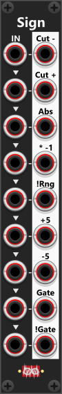

# Sign(pq)
The Sign module is designed to manipulate the "sign" (polarity) of incoming signals, providing nine different output variations based on a single or multiple input signals. Each of the nine inputs has a corresponding output, with all inputs being normalized to the previous one, meaning a single input signal can be used across all outputs if no additional inputs are provided. The module fully supports polyphonic signals, ensuring that each output maintains the same number of channels as its respective input. *As I recall Sign was the very first module I created for this plugin, as it was easy (didn't have to learn about triggers/gates nor knobs - only input/ouput). The first implementation was monophonic only, so support for polyphonic signals were added later along with a context menu.*

 

Like other Infinite-Noise modules, the output is hard-clipped to -12V to +12V by default. However, this clipping range can be modified or disabled via the context menu, which also provides settings for inversion range, voltage detection threshold (defaulting to ≥1V for gate detection), and custom gate output levels (default 0V for low, 10V for high). Each of the nine outputs applies a different transformation to the input signal:

+ **Cut-**: Sets all negative values to 0V, effectively removing the negative range.
+ **Cut+**: Sets all positive values to 0V, removing the positive range.
+ **Abs**: Converts all negative values to positive, providing the absolute value of the signal.
+ **×-1**: Inverts the signal by multiplying it by -1, flipping positive and negative values (useful for bipolar signals).
+ **!R**: Inverts values according to a user-defined inversion range (defaulting to 0V to 10V for unipolar signals).
+ **+5**: Adds 5V to the signal, shifting a bipolar signal (-5V to +5V) into a unipolar range (0V to 10V).
+ **-5**: Subtracts 5V from the signal, shifting a unipolar signal into a bipolar range.
+ **Gate**: Outputs 10V when the incoming signal meets or exceeds 1V (threshold can be adjusted in the context menu).
+ **!Gate**: Outputs 10V when the incoming signal is below 1V (threshold adjustable via context menu).

## Types of Inversion (Bipolar vs. Unipolar Signals)
There are two main methods for inverting a signal. The "standard approach" is multiplying by -1, which works well for bipolar signals (e.g., -5V to +5V). However, this approach may not be suitable for unipolar signals (e.g., 0V to 10V). For example, if an envelope signal ranges from 0V to 10V, a simple -1 multiplication would shift it to -10V to 0V, which may not be desirable. Instead, a vertical flip is often preferred, where a value of 8V becomes 2V, a value of 6V becomes 4V, and so on. This mirrored inversion requires knowledge of the expected signal range, which can be adjusted in the context menu using the inversion range setting.

## Gate-outputs.
The last two outputs convert the input into gate signals. By default, the module detects signals ≥1V as "on/high" and outputs 10V (both threshold and output levels can be customized via the context menu).

+ Gate Output: Outputs 10V when the input signal is ≥1V; otherwise, it outputs 0V.
+ !Gate Output: Outputs 10V when the input signal is <1V, effectively inverting the gate signal.

**TIP**: The !Gate output can be used to invert a gate signal. If a high gate is fed into the !Gate input, the !Gate output will produce a low gate, and vice versa. If multiple gate signals need to be inverted simultaneously, the Sign4 Mk I module (described later) offers a more efficient way to handle up to four gate signals at once.

# Sign4 modules (Mk I and Mk II)
The Sign module described earlier features nine distinct processing sections, each applying a different transformation to a single input. In contrast, the Sign4 Mk I and Mk II modules each contain four sections (labeled A, B, C, and D), but instead of performing different operations, all four sections apply the same transformation. The operation is determined by a three-way toggle switch at the top of the module. The input signals can be monophonic or polyphonic, with the number of channels preserved across the inputs and outputs.

**TIP**: The Mk I and Mk II versions together provide most of the functionality of the original Sign module, except for the +5V and -5V operations. The +5V operation converts a bipolar signal (-5V to +5V) into a unipolar signal (0V to 10V), while -5V shifts a unipolar signal (0V to 10V) into a bipolar range (-5V to +5V). If you need to add or subtract 5V, you can achieve the same result using the [Tweak-4](Tweak.md#tweak-4-mk-ipq) module by simply applying a +5V or -5V offset to the input signal.

## Sign4 Mk I(p)
The Sign4 Mk I module provides three types of signal inversion, selectable via a three-way toggle switch at the top. By default, the module operates in **!Gt** (Gate Inversion) mode, where a high-gate is converted into a low-gate, and vice versa. Any input at or above 1V is considered a high-gate, and the module outputs 10V for high-gates and 0V for low-gates. Both the detection threshold and output levels can be customized via the context menu. In this mode, the module functions identically to the "!Gate" output of the original Sign module. Each of the four sections (A, B, C, and D) operates independently and supports both monophonic and polyphonic signals. For example, if a monophonic signal is connected to Input A, the A output will remain monophonic. If an 8-channel polyphonic signal is fed into Input B, the corresponding B output will also be 8-channel polyphonic.

Switching the module to **×-1** mode will multiply the input by -1, effectively inverting a bipolar signal (e.g., -3V becomes +3V). Selecting the **!R** mode (inversion within a defined Range) will invert values within a specified range, which can be adjusted via the context menu. By default, the inversion applies to a unipolar 0V to 10V range, meaning an input of 3V would be transformed into 7V (e.g. useful for flipping an uniplolar envelope-signal).

**TIP**: The [logical compare modules](Compare.md) of the Infinite-Noise plugin lets you invert the logical inputs either with a knob directly on the panel or via the context menu. If you are using other compare modules without this feature, you can use a Sign4I to invert up to 4 signals - simply by using the !Gt output - before passing them on to other modules.

**TIP**: If you need to convert incoming signals into gates without inverting them, simply set the three-way switch to "!Gt" mode and adjust the context menu settings so that high-gates output 0V and low-gates output 10V. This configuration makes the module behave like the "Gate" output of the original Sign module.

## Sign4 Mk II(p)
Similar to the Sign4 Mk I, the Sign4 Mk II features four independent sections (A, B, C, and D), each with its own input and output. The three-way switch at the top determines how the input signal is processed for each section. By default, when the switch is set to **Abs** (Absolute Value Mode), the module outputs the absolute value of the input, converting negative values into positive values. In **Ct-** mode (Cut Negative), all negative values are replaced with 0V, effectively removing the negative portion of the signal. For example, when processing a bipolar sine wave, the module will retain the positive half-cycle, while the negative half-cycle is flattened to 0V. Conversely, in **Ct+** mode (Cut Positive), all positive values are replaced with 0V, allowing only the negative portion of the input signal to pass through.

 

**TIP**: When using this module with bipolar signals (-5V to +5V), you effectively reduce the dynamic range by half, as either the negative or positive portion of the signal is removed. If you need to adjust the dynamic range, you can process the output through one of the [Tweak modules or the Auto-Scale4 module](Tweak.md) for scaling and offset adjustments.

**TIP**: Passing a bipolar signal through this module in **Cut−** mode (where all negative values are set to 0V) and then into a CV input - of another module - ensures it only drives the parameter in the positive direction—equivalent to turning the associated knob clockwise (only positive values and 0V). Conversely, using **Cut+** mode (where all positive values are set to 0V) restricts the signal to negative values, effectively driving the parameter in the opposite direction—like turning the knob counterclockwise. In both cases, if the input is a standard bipolar waveform (without PWM), the output will be 0V for half of the waveform’s cycle, since one half of the phase is "removed" (changed to 0V).

[Go back to modules overview](manual.md#modules)