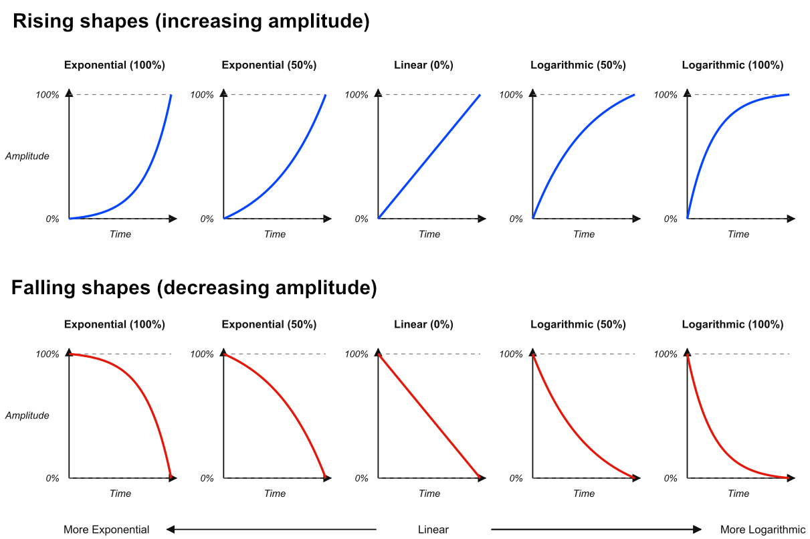
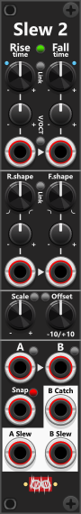
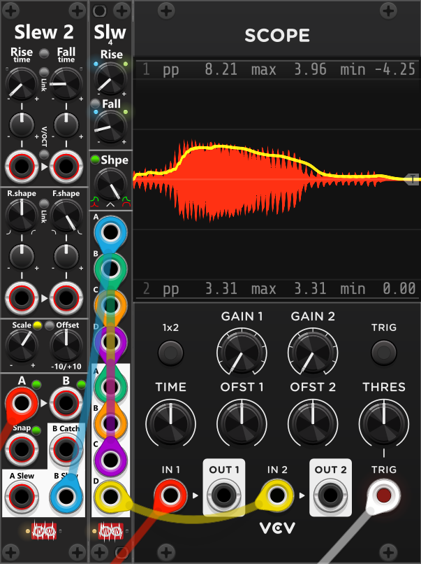

# Slew
The Infinite-Noise slew modules lag an input toward its current voltage, either using constant rate (default) or constant time (selected via context menu). Rise and fall can take different times, and the curve can be exponential, linear, or logarithmic. *The logarithmic curve is actually an inverted exponential in order to generate a "symetrical" output. Via the context menu the linear can be changed to S-curve or reversed S-curve.*

**Time** knobs will by default set a rate of **seconds to move 10 V**. A 10 V step still takes that time at any Shape; Shape only bends the slope. Linearly, a 5 V jump takes half as long as a 10 V jump. Times use **quadratic** knob mapping (knob² × max): default is **0** (pass-through), noon is 2.5 s, and fully clockwise is 10 s. **0 is pass-through**: the output follows the input immediately. A **Time scale** of 0.1× / 1× / 10× stretches that max to 1 / 10 / 100 s without moving the knobs. On Slew 4 the scale is a context-menu item, and tiny lights at the top-right of the Rise and Fall knobs show it: **green** = 0.1×, **off** = 1× (default), **red** = 10×. Slew 2 uses the same colours on a panel button instead of a menu, where the button cycles the 3 different modes.

The slew modules defaults to **Constant Rate**, where the time dialed in by the rise/fall time knobs defines the time a 10V change will take (e.g. from 0V to 10V, or from -5V to +5V). However using the context menu the **Slew-mode** can be changed to **Constant Time**. In this mode the time knobs in stead defines the time any change will take. *Tiny changes (under about a millivolt) do not restart the slew; only a clearer step toward a new level does.* Next to each time-knob there is a small light which indicate the active slew-mode selected via the context menu (dim=constant rate, blue=constant time).

**TIP**: A constant rate slew is more commonly used, hence why it's the default mode. However **a constant time slew can be used for many different things**, but one typical usage is **Glide/Glissando**. Here the slew time would be the same whether you slew from **C3 to G3** or you slew from **C3 to C4**. Since the clock used by a squencer is typical fixed, the various outputs of the sequencer also tend to change at a "fixed rated". So if you want to slew the outputs of the sequencer (not necessarily only the V/OCT-output), you might prefer using a constant slew time over a constant slew rate, as this would ensure each slew will take the same time, no matter how far you have to slew between changes (e.g. ensure each slew will finish before the next clock starts, which might change the sequencer output).

The **shape** knob is −1 to +1. Center (0) is **linear** (but can also be **S-Curve** - see below). Turn counterclockwise for **exponential**, clockwise for **logarithmic**. An **exponential rise/fall** starts slow and steepens toward the target. A **logarithmic rise/fall** does the opposite (fast then slow). The illustration below shows 100% / 50% exponential, linear, and 50% / 100% logarithmic in both directions. The logarithmic shape is actually an inverted exponential shape, so the two remain symmetrical. The exact same shapes are utilitzed by [ADR Envelope](Envelope.md#adr-envelope) and [ADSDR Envelope](Envelope.md#adsdr-envelope).

When the Shape knob is centered, the slew will be linear by default. However, via the context menu, you can change the **Linear-mode** to **S-Curve** (slow at the start -> fast in the middle -> slow at the end) or **Reversed S-curve** (fast at the start -> slow in the middle -> fast at the end). The S-curve shape can generate smooth curves when you have dialed in a slew time that matches the frequency at which the input changes (hence perhaps "best" when using **Constant time** slew-mode). The reversed S-curve on the other hand will generate output which will look like the "Spiky" output of a [Random Curve](Random.md#random-curve) module. When S-curve or reversed S-Curve is enabled, you can still turn the Shape knob clockwise (exponential) or counterclockwise (logarithmic). If you don't turn the Shape knob fully, the S-curve/reversed S-curve will be mixed into the exponential/logarithmic shape.

**TIP**: Patch a gate through Slew 2/4 into a [cross-fade](CrossFade.md) CV input for a time-driven fade. Rise/Fall set how long the fade takes; Shape sets how it eases.

## Slew 2
 
**Slew 2** is a 4HP lag processor with two independent polyphonic sections (**A** and **B**). Shared **Rise** and **Fall** time and shape drive both sections. Each of those four controls has a knob, trim, and CV port. *Some general info regarding the slew modules are listed at the top.*

The small button between the Rise and Fall labels sets **Time scale** (0.1× / 1× / 10×): **green** = 0.1× (0 to 1 s), **black** = 1× (0 to 10 s, default), **red** = 10× (0 to 100 s). That is the same scale as Slew 4’s context menu, on the panel instead of in a menu. The small button below it **links Fall time to Rise time**. While linked (green), the Fall time knob, and trim knob will follow the rise knobs. The module defaults to **constant rate**, however using the context menu this can be changed to **constant time**.

Between the Rise and Fall time input-ports is a **V/Oct button**. **Black** (default) keeps normal time CV. **Green** makes those ports scale the time dialed in by the knobs exponentially: **at trim +100%, +1 V halves the time and −1 V doubles it**. This means you must have dialed in a non-zero time using the knobs (as doubling/halving 0 has no effect). Trims still apply, and they default to 0%, so tracking does nothing until you open them. Fall input is normalized to Rise input, so one cable into Rise tracks both times if both trims are at +100%. Set the Fall trim to 0% if Rise should not affect Fall. *Different Rise/Fall trims require that Time-link is not enabled*.

**TIP**: If you for some reason needs **extreme long rise/fall** times you should consider using **Time scale 10x** and/or **enabling V/OCT mode**. If you enable Time scale 10x, and dial the time knob to its fully counter clockwise position, the time will be set to 100 seconds. If you at the same time (with V/OCT enabled) input a negative signal with the trim knob set to 100% - or input a positive signal with the trim knob set to -100% - each 1 volt will double the time. With an input of -2V, trim 100% (or 2V, trim -100%) a time of 100 seconds will in fact be 400 seconds (first -1V doubles 100 to 200, and second -1V doubles 200 to 400). *Since this scaling is based on CV-input, you can easily switch between long/short rise/fall times by changing the level of the input. Just remember that with V/OCT enabled each 1V with either half or double the time set by the knobs. So you might consider dialing in a low trim-setting to not go too crazy. If you do input a changing signal, you might want to pass this signal through another slew module, to ensure changes don't occur too quickly.*

The small button between R.shape and F.shape **links Fall shape to Rise shape**: **black** (default) is independent; **green** sets F.shape = R.shape; **red** sets F.shape = −R.shape. While linked, the Fall shape knob and trim are inactive.

Shared **Scale** and **Offset** knobs apply to both A- and B-input. **Scale** attenuverts −1× to +1× (e.g. setting scale to -1x you can invert a bipolar signal). **Offset** range is −10V to +10V (e.g. offseting +5V you can "convert a bipolar signal to a unipolar signal"). The small button next to the "Scale" label toggles the **Scale-range mode**: **off** = 1× **green** = 2×, **yellow** = 5×, and **red** = 10×. The small button next to the "Offset" label in stead toggles **order-mode**: **black** (default) is Scale then Offset (`in × scale + offset`); **blue** is Offset then Scale (`(in + offset) × scale`). Both scale and offset are applied to the A/B-input **before** slew is performed.

Next to each A/B input is an **Envelope follower** button. **Black** (default) leaves the input as-is. **Green** takes the **absolute value** (`|in|`) before the slew. **Red** sets negative values to **0 V**. When enabled, the slew outputs will generate a positive envelope which enables the module to double as an Envelope follower, where **Rise is attack**, and **Fall is decay**. Typical with an envelope followever you might prefer a short attack (rise), and a slower release (fall) *The scale/offset knobs mentioned above can be used to increase/decrease the amplitude of the generated envelope output, when using this module as an envelope follower.* 

The small button next to the **Snap-input** cycles the input-mode between gate (default) and trigger. This Snap feature both affect the A and the B input. In **gate-mode** (**Green**), while the gate is high the slew output will track the input (output = scaled/offset input), whereas when the gate is low the output will slew towards the input. In **trigger-mode** (**Red**), a high trigger will snap the slew output to the scaled/offset input, and then "slewing from there". *If one the envelope follower modes are enabled, catch will still only produce non-negative outputs, even if the input is negative.*

To the left of the Snap input, you find the **B Catch** output. This output will generate a **high gate** when the slewed B output has "caught up" with the B input (basically when "it is no longer slewing"). Since this is the only gate output in the module, you can use the context menu to invert it. Simply configure the module to use 0V for a high gate and 10V for a low gate.

To the left of the Snap-input you find the **B Catch** output. This output will generate a high gate when the slewed B-output have *caught up* with the B-input (basically when *it is not slewing anymore*). Since this is the only gate output in the module you can use the context menu to invert this output. You simple setup the module to use 0V for a high-gate, and 10V for a low-gate.

**All inputs/outputs supports polyphonic signals**, which means it is possible to have individual time/shape settings for each channel. Likewise the Snap input also supports a polyphonic signals, which enables individual "snap" for each channel. When monophonic inputs are supplied the same/monophonic signal is used for all channels. If you do supply polyphonic inputs, make sure they at least have as many channels as the A/B-inputs. The B Catch output is able to generate a polyphonic output, so if your B-input is polyphonic so will the B Catch output be - hence you will get a gate for each channel. *If you need to monitor all channels (to detect when they have all "caught up" or some of them have "caught up") you can process this output with a [Poly-Logical Compare](PolyTools.md#poly-logical-compare).*

## Slew 4
 
**Slew 4** is a 2HP lag processor with four independent sections (**A–D**). Hence compared to the Slew 4 (described above) it supports 2 more sections (4 in total), however have less features. Each section is a polyphonic input/output pair. **Rise-** and **Fall-time** can be set directly by knobs, however a single **Shape knob** set both the Rise- and Fall-shape at the same time. The small button between the Rise- and Fall-knobs **links Fall time to Rise time**. While linked (green), the Fall knob is inactive and follows Rise. By default the time knobs covers a range from 0 to 10 seconds, however using the context menu, Time scale can be changed between 0.1×, 1× and 10× (**green** = 0.1×, **off** = 1×, **red** = 10×). *Some general info regarding the slew modules are listed at the top.*

Compared to a Slew 4 the Slew 2 module only have a single knob to control shape. The small "Fall shape" button above the shape knob controls how the fall shape is linked to the rise shape. In its default **green** state the fall shape will be identical to the rise shape (e.g. if the rise shape is exponential the fall shape will also be exponential). When the fall shape button is **red** the fall shape will be the reversed of the rise shape (e.g. if the rise shape is exponential, the fall shape will be logarithmic).

*As the Slew 4 is less complex than the Slew 2, it is slightly more efficient (uses a bit less CPU bandwidth), so for your bread-and-butter slew requirements it might be "a better choise" than the Slew 2 (even when you only need to slew a single or 2 signals). Having said this, it's still not a bad slew, and via the context menu it can either be configured for **Constant rate** (default) or **Constant time**. Likewise the context menu also lets you change the linear-shape to **S-Curve** or **Reversed S-Curve** (defaults to linear).*

**TIP**: Thanks to its 4 input/output pairs, Slew 4 can be used to smooth the same signal multiple times for an even "smoother" signal. In the screenshot below, the Slew 2 module is used as an envelope follower (the red signal is audio from a sampler). Due to its fast attack (rise time) and slow release (fall time), the blue signal (envelope follower) can be a bit "jagged". To smooth the signal further, I passed it through a Slew 4 multiple times. The blue signal (envelope follower) goes into input A, then from output A to input B (green), from output B to input C (orange), and from output C to input D (magenta). Finally, the "smoothed" signal is patched from output D into the scope (yellow).

[Go back to modules overview](manual.md#modules)
