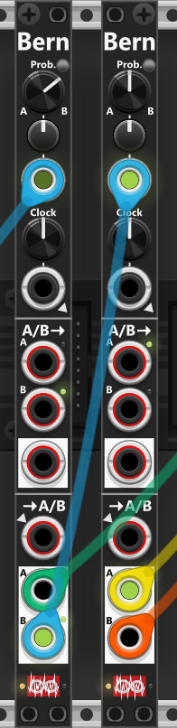

# Cross-fade switches
Before diving into the Cross-Fade Switches, the On/Off-Switch, Bernoulli Switch and Combine, it’s worth mentioning that the Infinite-Noise plugin also includes dedicated [Cross-fade modules](CrossFade.md), which can double as switches thanks to their built-in A/B toggle buttons and their input can be set to toggle on trigger-detection. Similarly, the [CV Toggle](ManCV.md#cv-toggle-8) module have 8 sections which can function as a two-input/one-output switch, allowing you to toggle between an On and Off stage via a gate/trigger input. Additionally, the compare-modules [LMCP2, VCMP1 and VCMP2 Mk I](Compare.md) can also act as switches, as they can switch between the "True" and "False" input signals based on incoming signals. 

Among the two Cross-Fade Switch modules described here, one features (up to) 4 inputs that can be switched/cross-faded to a single output, while the other has a single input that can be switched/cross-faded across (up to) 4 outputs. At the top of these two modules, a knob, CV-input, and trim control determine the switch operation. Next to the knob, there’s a cross-fade button—when enabled (green), the module will smoothly cross-fade between inputs/outputs. When disabled, it will simply switch between them. By default, both modules operate in switch mode, so if you want to activate cross-fade functionality, you need to press this button. By default, the switch CV-input selects ports based on the CV level and trim setting, but a small button next to the CV-input lets you switch to trigger mode (red). In this mode, each trigger pulse advances the switch to a new port. The context menu allows you to configure how the switch advances, with options including:

+ **Next** (moves forward through ports in order)
+ **Prev** (moves backward through ports)
+ **Ping-pong** (alternates between forward and backward movement)
+ **Random** (selects any port, including the currently active one)
+ **Random-Diff** (selects a random port, ensuring it is different from the current one)

When trigger mode (red) is active, the trim knob is ignored, meaning its position has no effect on the selection. When operating in switch mode with trigger input, the Reset input (trigger) can reset the selection. A reset pulse will move the switch knob fully counterclockwise, forcing the selection to return to the first input/output, regardless of the trigger-order selected in the context menu. However, if the module is not configured for switch operation with trigger input, the reset function is ignored.

Below the reset input, a 3-way switch allows you to limit the selection to 2, 3, or 4 ports. For example, if set to 3-port mode, the full range of the switch knob/CV-input will cycle through only ports 1 to 3.

At the bottom of the module, small indicator lights next to the four input/output ports provide visual feedback of the signal levels. When cross-fading, two lights may illuminate at different intensities to indicate a transition between ports. In switch mode, however, only one light will be fully illuminated at a time, indicating the active input/output.

Both Cross-Fade Switch 4to1 and 1to4 support polyphonic signals:

+ When feeding a polyphonic signal into the 1to4 switch, each output will carry as many channels as the input.
+ When inputting polyphonic signals into the 4to1 switch, all inputs should ideally have the same number of channels, as the output will adopt the highest channel count of the inputs (you can however mix monophonic and polyphonic signals).

The switch/cross-fade CV-input is monophonic, meaning all polyphonic channels switch/cross-fade in unison. If a polyphonic signal is fed into the switch/cross-fade CV-input, only its first channel is used—the same applies to the Reset input.

**TIP**: If you need to switch stereo audio signals there are multiple ways to do it (as you could argu that the switch modules are mono in nature). However as the switch-modules support polyphonic signals, you can use a [Poly-Stereo](PolyTools.md#poly-stereo) to **encode** separate/monophonic left/right audio-signals into a compound 2-channel polyphonic signal, then pass this signal to one of the switch-modules, and once switched **decode** it back to separate left/right audio-signals.

## Cross-fade switch 4to1
 
This module allows you to switch or cross-fade between (up to) 4 input signals, with the selected signal being sent to a single output. When the cross-fade button (next to the switch knob) is activated (green), the module smoothly transitions between inputs, blending them together. When deactivated, the module functions as a simple switch, selecting only one input at a time without blending. *Some general info regarding the Cross-fade switches are listed in the top.*

A red button next to the switch/cross-fade CV input enables **trigger mode**. When activated, the CV input is treated as a trigger, cycling through inputs based on the "Trigger Order" setting, which can be customized via the context menu. As noted earlier, the reset input is only functional when the module is configured for switch mode with trigger input, in which case the trim-knob is also ignored.

Inputs are not even required if you want to switch between fixed voltage levels. By default, all four inputs are normalized to 0V when no cables are connected. However, via the context menu, you can assign a custom normalization voltage to each input. For example, combined with trigger mode, the module can act as a probability-based switch. You could configure three inputs to output 0V and one input to output a fixed 10V (or connect a signal to it). In this setup, using it as a 4-way switch, there would be a 1-in-4 (25%) chance that the output is 10V (or your signal), and a 75% chance that it remains at 0V. *If in fade mode, you can instead fade between fixed voltage levels.*

 

**TIP**: For example, you can take four different outputs from an LFO module or four different curve outputs from the Random-Curve module and feed them into the Cross-Fade Switch 4to1 module. When configured for cross-fading, the switch/cross-fade knob and/or CV input can be used to dynamically transition between the four signals. Alternatively, you might want to cross-fade between inputs from different LFOs or random modules, each running at different frequencies or using different waveforms. This allows for more complex and evolving modulation, especially when using random modules with varying output ranges and/or distributions.

## Cross-fade switch 1to4
 
This module allows you to switch or cross-fade a single input signal across up to four outputs. When the cross-fade button (next to the switch knob) is activated (green), the module smoothly transitions between outputs. When deactivated, it functions as a simple switch, selecting only one output at a time without blending. *Some general info regarding the Cross-fade switches are listed in the top.*

A red button next to the switch/cross-fade CV input enables trigger mode. When activated, the CV input is treated as a trigger, cycling through outputs based on the "Trigger Order" setting, which can be adjusted via the context menu. As noted earlier, the reset input is only functional when the module is configured for switch mode with trigger input.

An input cable is not required if you want to route a fixed voltage. By default the CV input is normalized to 0V when no cable is connected. Via the context menu you can assign a custom normalization voltage, then use the switch/cross-fade to send that fixed level to the selected output(s).

 

# Other switches
The following section provides descriptions of other switch modules available in the Infinite-Noise plugin. However, as mentioned earlier, the plugin includes additional devices that also offer switching functionality. While the modules listed here are dedicated switches, they are not the only options for performing switching operations.

## Bernoulli Switch

 
This compact 2HP module provides a probability-based switching mechanism that determines whether the A or B input/output is selected upon receiving a clock signal *(described further down, it can also be used as a Bernoully Gate)*. At the top of the module, a probability knob (0% to 100%) and a CV input (with trim) is used to set the probability. By default the knob is at 50%, so there is an equal chance of selecting A or B. Turning the knob counterclockwise (below 50%) favors A, clockwise (above 50%) favors B. *Bascially you dail in a percentage-chance that B will be selected.*

Next to the probability knob, there is a small toggle button that changes the **Probability mode**. By default, the module operates in **Probability(B)** mode, where the knob and its associated CV input set the probability percentage that **B** will be selected: P(B). Pressing the toggle switches the module to **Switch** mode. In this mode, the probability control instead determines the chance that the module will switch between A and B. For example, with no CV input and the knob fully counterclockwise (0%), no switching will occur and the current selection (A or B) remains unchanged. With the knob fully clockwise (100%), a switch WILL occur every time a trigger is received.

Below the probability control are a clock knob and trigger input. When no clock-input is connected, the built-in LFO runs at the frequency set by the knob. When an input is connected the frequency-knob is ignored. Each time a clock (or internal cycle) occurs, the module uses the probability settings. When using the internal clock, the context menu also offers a **Rate Chaos** setting that randomizes the speed of each individual cycle, so the "coin-flips" happen at slightly - or wildly - irregular intervals instead of at a perfectly steady rate. This option appears on several other modules too and is described in the [main manual](manual.md#rate-chaos).

The module has two switch-sections: the upper is a 2-in, 1-out switch (A or B to one output); the lower is 1-in, 2-out (one input to A or B). Green lights by the ports show the current selection. The context menu **"Sections: shared or independent A/B"** lets you use the same A/B choice for both sections (default) or let each section choose independently on each trigger.

In the top switch-section, the module routes either the A or B input to the single output below. If no input cables are not connected, the input-ports will be normalized to values selected in the context menu (default: 10V for the A-input, and 0V for the B-input). This allows you to configure the module to switch between static values without needing to connect any input-cables. This section supports polyphonic signals, with the output carrying as many channels as the input with the most channels. If necessary, the [Poly-Shuffle](PolyTools.md#poly-shuffle) module can be used to match the number of channels in both inputs.

The bottom switch-section routes a single input to either the A or B output. The selected output port is indicated by a small green light, while the unselected port outputs 0V by default (this can be changed in the context menu). In the context menu you can choose between a **fixed level** for the unselected output (for example 0V, 10V, etc.) or **“Last A/B-value”**, where the unselected port holds the last voltage that was sent from the input when that port was selected. This “last value” behaviour is tracked **per polyphonic channel**, so when the input is polyphonic, each channel of A and B remembers and restores its own last value independently. If no input cable is connected, the input will normalize to the clock input at the top of the module, meaning the clock signal itself will be routed to either output A or B based on the selected probability.

While this module is techically a Bernoulli Switch (switching between inputs/outputs) it can just as easily be used as **Bernoulli gate**. Thanks to normalization in the lower section, the input will **normalize to the clock-input** (or the internal clock if no clock-input is connected). As a result, when a "Clock occur" this clock (gate) will either be sent to the A- or the B-output. *Basically you are "splitting" the input-clock (based on probabillity-settings) into 2 parts, which can be routed to two different destinations.*

**TIP**: A Bernoulli Switch can serve various purposes. One simple application is to create probabilistic triggers or gates, such as randomly triggering a drum sound. To achieve this, set the desired probability, feed a trigger or gate signal into the Clock input, and take the output from the B output in the bottom section. The more clockwise the probability knob is turned, the greater the chance that the input trigger/gate will be passed to the B output. The module can also be used to randomly distribute clock pulses between two destinations. For example, feeding a clock signal into the Bernoulli Switch allows you to route alternating clock pulses to different modules via outputs A and B. This method can be extended by sending one of these outputs into another Bernoulli Switch to further subdivide and distribute clock pulses.

E.g. if you want to route a clock signal to one of **three** destinations with an equal probability, feed the clock into the first Bernoulli Switch and set its probability so that **B** is selected **66.7%** of the time. Then route the **B** output into a second Bernoulli Switch, configured with a **50%** probability. This results in an equal distribution: there is approximately a **33.3%** chance that the clock appears at the **A** output of the first Bernoulli Switch, a **33.3%** chance that it appears at the **A** output of the second switch, and a **33.3%** chance that it appears at the **B** output of the second switch. *In the screen-shot below there is a 33.3% chance that either the **green**, **yellow** or **red** cable with output the clock that was feed into the leftmost Bernoulli switch.*

*E.g. if you want to route a clock signal to one of 3 destinations with the same probability that either of those 3 receives the clock, you would input your clock into the first Bernoulli swich and set probablity to 66.6% that B will be selected. The B-output you then route to the 2nd Bernoulli switch where you set the probabillity to 50% (50% of 66.6% is 33.3%). Hence in this configuration where is a 33.3% chance the clock will either be routed to the A-output of the first Bernoulli swirch and 33.3% it will be routed to either the A- or the B- output of the 2nd Bernoulli switch.

**TIP**: Since the A-input by default mormalize to 10V and the B-input to 0V, the upper switch-section can simply be used to output a high- or a low-gate based on the dialed in probability settings. Likewise when **Probability mode** is set to **Switch**, the probability knob sets the chance to switch on each trigger. At 0% the selection never changes; at 100% it toggles every time.

**TIP**: The Bernoulli Switch can also function as a **probability-driven mute module**. Simply route the signal you want to control into the **A input**, and use the AB output. Each time the module receives a trigger, it will either pass the A signal through or switch to the B input. Since the B input is left unconnected (and therefore outputs 0V), the result is that your signal is effectively “muted” at random, based on the selected probability. If in stead you set the mode to Switch, and dial in a probability of 100%, each clock input will simply switch between "muted/un-muted".

## ON/OFF Switch
 
The On/Off-Switch module is a simplified version of the [Manual CV 8 Mk. II and CV Toggle](ManCV.md#manuel-cv-8-mk-ii), featuring a single switching section instead of multiple. At its core, it functions as a 2-to-1 switch, selecting between an ON and OFF state based on either manual controlled values or external gate/trigger-input. At the top of the module, a large push-button manually toggles the module between the ON and OFF states, with a small green light indicating the active state. Adjacent to this button is a latching switch (red when enabled). Below these controls, a CV input is available to toggle the module’s state externally. By default, this input operates in gate mode (green), meaning a high gate signal switches the module to ON, and a low gate switches it to OFF. However, pressing the small button next to this input toggles it to trigger mode (red), where each received trigger alternates the module between ON and OFF. When the large manual button is actively pressed or latched ON, the module remains in the ON state regardless of gate/trigger-input.

Both the ON and OFF states have configurable output values, set using dedicated knobs that cover a range of -10V to +10V (default: 0V). Each section also supports CV input, allowing external signals to define the output values. When a CV signal is present, it is attenuverted by a corresponding trim knob and added to the manually set value, effectively allowing the knob to serve as an offset. *E.g. setting the offset to -5V or +5V enables conversion between bipolar and unipolar signals*. Also you could feed the same signal into both the ON- and the OFF- input, but then set the "offset-knobs" diffrently in each section, e.g. one adds an offset, while the other subtracts an offset (adds a negative offset) or simply output the signal without offset.

The module’s output contains as many channels as the ON/OFF-input with the highest number of channels. If neither ON nor OFF has a polyphonic input, the module outputs a monophonic (single-channel) signal. When one input (e.g., ON) is polyphonic, but the other (e.g., OFF) is monophonic or absent, the single OFF value is applied to all active channels in OFF mode. However, the ON/OFF gate/trigger input is always monophonic, affecting all output channels uniformly (if a polyphonic signal is supplied, only channel 1 is used).

**TIP**: This module can serve many functions beyond simple switching. For example, if only the OFF input is connected while leaving the ON knob set to 0V, the module acts as a mute switch, outputting either the OFF signal or 0V when engaged. This functionality extends beyond audio signals—it can mute gate-/clock-, trigger-, or modulation-signals as well. Used in this way a high-gate will "mute the input". If you instead input your signal into the On input, a low-gate will output 0V (dialed-in by the Off knob), hence a low-gate will mute the input.

**TIP**: Another useful application is gate inversion. Feeding a gate signal into the ON/OFF input while in gate mode, and setting the ON value to 0V and the OFF value to 10V, causes the module to output an inverted version of the input gate. A high gate input produces 0V (low gate) output, while a low gate input produces 10V (high gate) output. 

**TIP**: By setting the CV input to **Trigger mode**, the **ON** knob to 10V, and the **OFF** knob to 0V, the module can be used to "convert triggers into gates". Each odd-numbered trigger will activate the ON stage and set the output to 10V, while each even-numbered trigger will activate the OFF stage and set the output back to 0V. *In this configuration the module will function as a Toggle Flip-Flop.*

*The ON/OFF gate/trigger-input in the top of the module (to toggle between the ON- and OFF-stages) is monophonic-only, so the ON/OFF Switch will switch all channels of a polyphonic signal at the same time. Hence the ON/OFF Switch is not able to switch individual channels between their ON/OFF stages. However [Poly-Tweak Mk II](PolyTools.md#poly-tweak-mk-ii) is able to do this using its "disable" section (described as a tip for the Poly-Tweak Mk II).*

## Combine
 
This module “combines” two inputs by switching between them based on three different algorithms (for example, using the upper half of one input and switching to the other when the first is no longer in that range). Each algorithm has a single parameter, controlled by the knob and CV input at the top of the module. The parameter CV input supports both monophonic and polyphonic signals, allowing you to use the same parameter value across all channels or different values per channel. When changing mode, the tooltips for the param-knob, -trim and -CV input will update to remind you how the param is used for that mode.

Below the parameter controls, you’ll find a 3-way mode switch to select the mode/algorithm (described below), and beneath that a 2-way switch to choose the input range: **bipolar** (−5V to +5V) or **unipolar** (0V to 10V). *The specified range is only used while in **U/L** mode, to determine the "location" of the "breakpoint" (see description of modes below).*

At the bottom of the module are the A and B inputs, followed by two outputs: A/B and Gt. If both inputs are polyphonic, they should ideally have the same number of channels, although it is possible to mix a polyphonic signal with a monophonic one. The **A/B** output uses the A input as the primary source, applying the selected algorithm to determine when to switch to the B input. However each channel is processed separatly (e.g. channel-1 of the A/B-output might output channel-1 of the A-input, and channel-2 of the A/B output might output channel-2 of the B-input).

By default, the **Gt.** output produces a high gate whenever the A input is selected by the A/B output. This behavior can be changed in the context menu so that the gate instead goes high when the B input is selected. A small indicator light next to the "Gt." label shows the current mode: it's dim when “gate high = A selected” (default), and red when “gate high = B selected”. *By feeding two signals into this module, you can use the **Gt.** output as an erratic/chaotic gate signal without using the **A/B** output at all. This gate signal can then be used for many different purposes. For example, you could feed it into an [ON/OFF Switch](Switch.md#onoff-switch) to switch between two completely different signals than those connected to the A/B inputs.*

Below is a description of the three modes (algorithms) and how they use the parameter and the A/B-inputs. In the first two modes, a rapidly changing parameter (via CV input) can cause frequent switching between the A and B signals. If you plan to modulate the parameter, it’s generally best to use a slow-moving signal—for example, the output from a [Random-Curve](Random.md#random-curve) module running at a low frequency. *If you are only using the gate-output, and you based in input/setting are seing many gate-changs (between low/high), you could choose to feed this signal through a clock-divider.*

### Mode: Upper/Lower (U/L)
In this mode, the parameter defines a **breakpoint** (threshold) within the selected range (bipolar/unipolar). By default, the parameter knob is centered and the range is set to bipolar (−5V to +5V), placing the breakpoint at **0V**. As long as the A input remains above this breakpoint, the **A/B** output passes the A signal. When the A input drops below the breakpoint, the output switches to the B signal. The parameter (knob and CV) can shift the breakpoint ±5V.

**TIP**: If you combine two waveform outputs from the same LFO (for example, from a [Tiny LFO](LFO.md#tiny-lfo)), you can create a hybrid waveform—such as using a saw wave for the upper half and a sine wave for the lower half, since both signals come from the same LFO, they will share the same frequency. Alternatively, you can use two separate LFOs that support sync (for example, [LFO-1](LFO.md#lfo1)). This allows each LFO to run at a different frequency while still staying synchronized. For instance, the first half of the output could be driven by a slow saw wave, while the second half could use a sine wave running at three times the frequency.

### Mode: A greater than B (A>B)
In this mode, with the parameter centered, the **A/B** output passes the A input as long as it is greater than the B input; otherwise, it switches to the B input. Here, the parameter acts as a **bias** (−5V to +5V). For example, setting the parameter to +1V means that A must exceed B by at least 1V (A > B + 1V) for the output to remain on A, otherwise it switches to B.

**TIP**: When using **A>B** mode without a B input connected, the parameter knob effectively acts as a fixed B value. For example, with the parameter at its default center position, the A signal will only be output when it exceeds that threshold—meaning you will only "use the upper half” of the waveform. This works best with a bipolar signal, since the bias set by the parameter knob spans the full −5V to +5V range, covering the entire bipolar range. Naturally when A is not greater than the value set by the parameter knob/CV, the "A/B" output will in stead output the parameter-value when no B-input is connected.

### Mode: Rise/Fall (R/F)
In this mode, the **A/B** output follows the A input as long as the signal is detected as either rising or remaining steady after a rise. It will only switch to the B input when the A signal is detected as falling (or steady after a fall). The parameter defines a **delta threshold** between two consecutive samples. If the difference between consecutive samples is smaller than this threshold, the change is neither considered rising nor falling, and the signal is treated as steady (hence no switch will occur). *In this mode the parameter basically defines a minimum slope between two samples.*

**Warning**: When using **R/F mode**, it’s generally not a good idea to use a saw waveform as the A input. For example, a falling bipolar saw will only be detected as rising at the single sample where it jumps from −5V (end of the cycle) to +5V (start of a new cycle). Similarly, a rising saw will be detected as rising almost the entire time, except for the single sample where it jumps from +5V to −5V.

You may also want to reconsider using a square/pulse waveform for the A input. When the signal transitions high, it will be detected as rising, but then it remains constant (so A continues to be selected) until it abruptly falls—typically from +5V to −5V at the midpoint of the phase (unless using PWM). *Of course, this may be exactly the behavior you want in some cases.*

[Go back to modules overview](manual.md#modules)