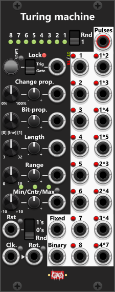

# Turing Machine

 
This module is my interpretation of a Turing machine, built around an internal 32-bit shifting register. By default, each incoming Clock signal shifts the pattern one bit to the right. The probability settings determine whether the pattern remains fixed (whether bits will change). Although the internal pattern consists of 32 bits, the module allows you to define a sequence length using a dedicated knob or CV input. The sequence length defaults to 8 bits/steps but can be freely adjusted within a range of 3 to 32 bits/steps. 

Since the outputs are always derived from an 8-bit segment, if the sequence length is greater than 8, only the lowest 8 bits will be used to generate the outputs. If the sequence length is less than 8, the pattern will repeat to fill the 8-bit output. For example, with a sequence length of 4, the lowest 4 bits are repeated twice to form a full 8-bit output for value and gate/trigger generation. *When referring to the “lowest 8 bits,” this includes either the actual lowest 8 bits of the pattern (when the sequence length is 8 or more), or a repeated segment when the sequence length is less than 8*.

The top section of the module displays the lowest 8 bits of the internal 32-bit sequence using a series of indicator lights. If the selected sequence length is shorter than 8, the displayed bits will repeat to maintain an 8-bit structure. Below on the left side, you will find knobs and CV inputs for adjusting various parameters that influence the behavior of the module. These controls allow you to set probability of change, the sequence length, and other key settings that define how the Turing machine operates. The right side contains 16 gate/trigger outputs. The first/left column outputs the lowest 8 bits directly, while the second/right column applies an AND operation to two bits at a time, reducing the likelihood of activation. Each of these outputs features a small toggle button, allowing you to switch between gate mode (green) and trigger mode (red) based on your preference. At the bottom of the module, you will find controls for resetting/randomizing the internal bit pattern, as well as Clock and Rotate inputs that manage the shifting of the sequence. Additionally, the module provides two CV outputs derived from the active 8-bit segment: `Binary bit-weights` and `Fixed bit-weights`.

A Turing machine can serve multiple purposes within a modular synth setup. Both `Binary bit-weights` and `Fixed bit-weights` can be used as pitch CV sources, either routed through a quantizer module or directly into an oscillator’s V/Oct input to generate musical sequences. By default, these outputs are not quantized, but the context menu allows you to enable quantization to the nearest musical note. *You might want to pass this signal through "a real" quantization-module where you can select scale/key, and/or manually select individual notes.* The 16 gate/trigger outputs can be used to trigger drum modules, sequencers, or other devices. 

**TIP**: If you want to use the **Binary/Fixed** output to generate a melody, you can shape both the pitch range and the note distribution before the signal reaches the quantizer module (and from there to the V/Oct input on your oscilliator). Start by configuring the Turing Machine to output values in the range **−5V to +5V**. Route this signal through a [Wave Shaper 2](WaveShaper2.md#wave-shaper-2) and turn the **Mod** knob counterclockwise. This changes the distribution so that values are more likely to occur near **0V**, while values near **−5V** and **+5V** become less frequent. Next, pass the signal through a [Tweak module](Tweak.md) to **scale** it—for example, reducing the range from **−5V...+5V** to **−1V...+1V** (set scale to 0.2x). Likewise, the Tweak module can at the same time also **offset** the signal to a desired root-note. Feeding this into a quantizer limits the generated melody to approximately **±1 octave**, while also making notes near the root pitch occur more frequently than notes near the extremes.

The probability controls determine how often the internal bit sequence changes, allowing for patterns that evolve gradually or change more frequently. If you stumble upon a pattern sequence you want to maintain, you can lock the module to prevent further changes. The 32-bit internal sequence is saved with the patch, so when reloaded, the pattern remains intact. In many hardware implementations, the probability knob also acts as a lock, preventing bit changes when set to 0%. However, this module includes a dedicated latchable push-button and a CV input for **locking**, making it easier to freeze the sequence at the press of a button or by sending a gate/trigger signal. The lock toggle switch allows you to choose between Gate mode or Trigger mode. In Gate mode, the module remains locked while receiving a high gate (default threshold: 1V). In Trigger mode, each trigger pulse toggles between locked and unlocked states. A red LED next to the "Lock" label lights up when the module is locked. While the lock button is pressed manually (or latched pressed), the CV input is ignored. 

By default, locking only prevents any bit from changing, hence the (up to) 32 bits of the pattern will not change, but the pattern will still rotate. However using the context-menu this behavior can be changed so that the lock both affect bit-change and rotation or only affect rotation. Another/separate menu-item in the context menu lets you choose whether the lock should also prevent the module to react to Reset-requests. By default these reset-requests are not afffect by the lock (i.e. you can still Reset while the module is locked).

At the bottom left, the **Clock and Rotate inputs** are accompanied by small manual push-buttons. If no cable is connected to the Rotate input, it normalizes to the Clock input signal, meaning that without an external rotation signal, the bit sequence will shift with each incoming clock pulse. If both Clock and Rotate signals are received in the same cycle, the pattern rotates first, then undergoes possible bit changes based on the probability settings. A Rotate trigger will shift the active bits unless rotation is locked. A Clock trigger will initiate a probability-based decision on whether a bit changes, unless change is locked. By default, the lowest (rightmost) bit is affected, but using the 2-way toggle switch in the upper right corner, you can instead set the module to randomly flip one of the lowest 8 bits (or fewer if the sequence length is set below 8).

**TIP**: A useful approach when working with Clock and Rotate inputs independently is to use the same [Bernoulli Switch](Switch.md#bernoulli-switch) to control both. For example, connect the A-output of the Bernoulli Switch to the Clock input of the Turing Machine and the B-output to the Rotate input. Since the In>A/B section of the Bernoulli Switch normalizes to its Clock input, you only need to provide a clock signal to the Bernoulli Switch (or use it's rate knob). Each time the Bernoulli Switch receives a clock pulse, it will randomly decide whether the Turing Machine should change a bit or rotate the pattern. The probability setting on the Bernoulli Switch allows you to fine-tune the likelihood of each action occurring. In this setup, it is recommended to set the Change Probability of the Turing Machine to 100% (or at least a high value) to ensure that when a clock signal is received, an actual bit change occurs.

Below the Lock controls, you will find two rows of **probability settings**, which are ignored when the module is locked for changes. The first row controls the probability of a bit changing when a clock signal is received. If the module determines that a bit should change based on this setting, the second row determines what the bit should change to. When the Bit Probability knob is in its default center position, the selected bit will **always invert** (0 becomes 1 and vice versa). Turning this knob counterclockwise increases the chance that the bit will change to (or remain being) "0" rather than being flipped, while turning it clockwise increases the chance that the bit will change to (or remain being) "1" rather than being flipped. As mentioned earlier, the two-way switch in the upper right corner (next to the 8 bit-lights) allows you to choose whether the lowest bit or a random bit within the sequence will be affected.

Below the probability settings, you will find the **Sequence Length** control, which determines how many bits from the internal 32-bit sequence are actively used. Since 10V of CV-input is equivalent to a full knob rotation, and the Length knob have 29 steps (3-32) each ~0.345V (10V/29) of CV-input is equivalent to adding one more step to the number of steps dialed in by the knob.

Below the length controls, two additional rows defines the **output range** for both CV outputs (derived from the lowest 8 bits). The upper row allows you to set the range (default: 10V), while the lower row lets you select the reference point—Center (default), Minimum, or Maximum. The small push button next to the "Max" label cycles through Min, Center, and Max modes, with an indicator light showing the active selection.

The **Binary bit-weights**** converts the lowest 8 bits into a value between 0 and 255, then maps that across the selected voltage range (255 steps), whereas **Fixed bit-weights** uses equal weight for each of the 8 bits (so the output depends only on how many bits are high, not their positions). This produces a more uniform set of quantized levels (9 steps: 0..8 high bits), which often sounds less “binary-ish” than "Binary bit-weights".

At the bottom of the module, you will find **Reset controls** for initializing the 32-bit pattern. Pressing the Reset button or sending a reset trigger clears the sequence based on the three-way switch setting. The default "Rnd" (Random) mode generates a fully randomized bit pattern. Switching the 3-way switch to "0’s" or "1’s" forces all bits in the sequence to be reset to either 0 or 1, respectively.

**TIP**: To create a minimalistic pattern with mostly 0-values, begin by resetting the pattern to all 0's. Then, turn the Bit Probability knob counterclockwise toward [0] to increase the likelihood that any changed bits will remain/change into 0 rather than switch to 1. This reduces the chances of bits being inverted. However, since inversions flip 0s into 1s, a pattern dominated by 0s means that when an inversion does occur, it is more likely to introduce 1s. To maintain a predominantly 0-based pattern, you may need to turn the knob further counterclockwise than you initially expect.

## Pulses (gate/trigger-outputs)
On the right side of the module, you'll find 16 pulse outputs, each of which can be individually set to output either a gate (default) or a trigger signal. When configured as a gate, the output remains high as long as the corresponding bit(s) are 1. For example, if two consecutive bits are 1, the gate output will turn high when the first bit shifts into position and will remain high until a 0 takes its place. Likewise, when set to trigger mode, the output will send a short trigger pulse only when a bit transitions from 0 to 1. This means that if two consecutive bits are 1, the trigger will only fire once—when the first 1 appears. The bit must first switch back to 0 before another 1 can generate a new trigger.

The leftmost 8 pulse outputs correspond directly to the lowest 8 bits of the internal sequence, as indicated by the lights at the top of the module. The rightmost 8 pulse outputs perform an AND operation on two bits at a time, reducing the statistical likelihood of these outputs firing. For example, the "1×2" output will only go high if both bit 1 and bit 2 are 1 at the same time, while the "1×3" output will only go high if both bit 1 and bit 3 are active simultaneously.

**TIP**: If you need to combine bits in a different way or perform an OR operation instead of AND, you can route the individual outputs (1 to 8) into one of the [Logical compare modules](Compare.md). The Tiny LMCP2 module features two sections, each capable of performing AND/NAND, OR/NOR, or XOR/XNOR on up to four inputs simultaneously. The LCMP6x2 might be "a better option" than the LMCP2, as it offers six sections, each capable of AND/NAND, OR/NOR, or XOR/XNOR on two inputs at a time, while generating up to 6 outputs based on its logical operations. 

All 16 individual pulse outputs are combined into a single **polyphonic "Pulses" output**, allowing you to send all 16 gate signals through a single cable to another module. Even if some individual pulse outputs are set to trigger mode, the polyphonic "Pulses" output will always send gates for all 16 channels.

**TIP**: The polyphonic "Pulses" output can be fed into a [Bits-to-Value module](Bits.md#bits-to-value), which processes the first 8 channels (corresponding to bits 1 through 8) and generates both a Value and an Inverted Value. By default, this module matches the Turing Machine’s "Binary bit-weights" output, but its weight knobs allow you to customize how each bit contributes to the final output, enabling entirely new values based on the same bit sequence.

[Go back to modules overview](manual.md#modules)
