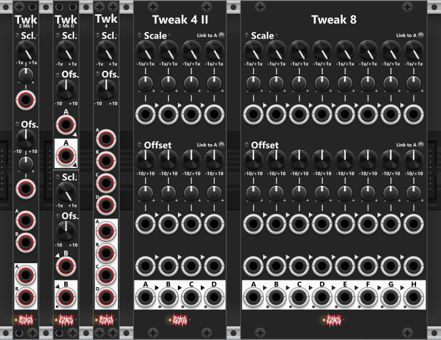
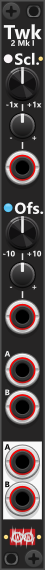
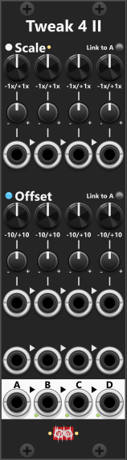
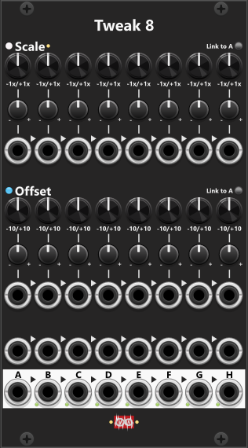
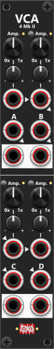

# Tweak modules (VCA and others below)
All Tweak modules share a common set of features, making them an essential part (at least in my own racks). These modules allow for **scaling** (attenuverting between -1x and +1x, or up to -10x/+10x selectable via context menu), **offsetting** (-10V to +10V), **clipping**, **quantization**, and **mixing** signals (except for Tweak-2I, and Tweak4I which cannot mix). When first added to a rack, each module is initialized with default settings: scaling set to 1x, scaling mode set to linear, offset set to 0V, and perform scaling before offset. This means the output will initially be identical to the input signal. 

To keep the panel uncluttered, clipping and quantization settings are only accessible through the context menu. By default, all outputs are hard-clipped at -12V to +12V, but this range can be adjusted or disabled. Quantization is off by default but can be enabled via the context menu. Available quantization options include 1/12V (for semitones/notes), multiple semitone steps, whole octaves (1V), or multiple octaves.

The scale knobs allow for attenuverting between -1x and +1x by default, but this can be expanded using the **Scale Range Mode** in the context menu. Options include 1x, 2x, 5x, and 10x scaling. The label on the physical panel always shows "-1x" to "+1x", but a color-coded indicator light to the left of the Scale label reflects the active mode:

+ **1x** Mode (default) → No light
+ **2x** Mode → Green
+ **5x** Mode → Yellow
+ **10x** Mode → Red

Without needing to open the context menu, these colors provide a quick reference for the active scale range. In 1x mode, the scale knob adjusts from -1x (-100%) to +1x (+100%), while in 10x mode, it spans -10x (-1000%) to +10x (+1000%). If you plan to output signals beyond ±12V, **ensure that clipping is disabled** in the context menu, otherwise with the default settings the signal will be clipped to the range -12V to +12V.

Most Tweak modules include a CV input for controlling the scale parameter. The CV input value is added to the manual scale setting, but the total scaling remains clamped within the selected Scale Range Mode. By default, the scaling is linear, but it can be adjusted via the context menu to Exp (green) or Log (red). This light is dimmed when using default linear scaling.

**TIP**: If you need to multiply two signals (e.g., mixing two LFO outputs), it's advisable to keep their amplitudes within -1V to +1V (bipolar) or 0V to 1V (unipolar) to ensure the product remains within the same range (or at least keep one of the signals within this range). The 5x and 10x modes of the Tweak modules are particularly useful for scaling signals: To amplify a bipolar signal (-1V to +1V) to -5V to +5V, using 5x mode, and to amplify a unipolar signal (0V to 1V) to 0V to 10V, using 10x mode.

In terms of **polyphony**, only Tweak-2I, Tweak-2II, and Tweak-4 Mk I support polyphonic signals, and will output as many channels as you input. In Tweak-2II when mixing the A- and B-output, it will always match the number of channels from the input with the highest channel count. For example, if a 4-channel signal is fed into the A-input and an 8-channel signal into the B-input (without connecting a cable to the A-output), the B-output will produce an 8-channel polyphonic signal, with the additional 4 channels from B mixed with 0V. For optimal results when mixing two signals, both should ideally have the same number of channels. However, if one input is monophonic, its signal will be automatically applied across all channels of the polyphonic signal. 

Tweak-2I offer CV-input for both Scale and offset. This input both support monophonic- and polyphonic-signals. When you input a monophonic CV-signal all channels will be scaled/offset by the same amount, however if you input a polyphonic signal, you are able to scale/offset individual channels by different amount.

 

As seen in the previous screenshot, the Tweak modules come in multiple versions, each differing in the number of sections, whether scale and offset settings are applied individually per section or shared across multiple sections, and whether adjustments can be made using CV inputs or only through knobs. All modules allow for scaling (attenuverting/amplifying) and offsetting the input signal. By default, the **scale operation is performed before the offset operation**, but this **order can be changed** via the context menu. If set to "Offset → Scale", a blue light next to the Offset label will illuminate, indicating that offsetting occurs before scaling. When this light is off, the default "Scale → Offset" order is active.

Among the Tweak modules, Tweak-2I, and Tweak-4I are the only one that does not support mixing signals. The other modules, such as Tweak-2II, Tweak-4II and Tweak-8, allow for mixing. Tweak-2II has two sections labeled A and B, and if no cable is inserted into the A-output, the B-output will contain a normalized mix of both sections—effectively averaging their signals. 

## How does the mix-operation work
For a section to be included in the mix operation, it must have an input cable connected. If no input is present, any previously accumulated mix values will be cleared. The first active output (connected to both an input and output cable) will generate a mix of its own section along with all preceding sections that also have an input cable connected (but no outputs). However, if a section lacks an input or has an output connected, the accumulated mix is reset, starting "a new mix" at the next active section. The actual output level of the mix is determined by summing all included sections and dividing by the number of sections in the mix. Small green lights next to each output (except for the A-output) indicate when a port is outputting a mix of two or more inputs.

The actual generated mix is an **averaging mix** as it typical don't need a lot of scale-reduction as additional signals are added to the mix (or scale-increase when signals are removed from the mix). In an averaging mix all signals are added, and the divided by the number of inputs. E.g. mixing the signals 1V, 2V and 3V will generate and output of 2V ("(1+2+3)/3=2").

If needed, **mix mode can be disabled** via the context menu. For example, in Tweak-2, when both A and B inputs and outputs are connected, each output will independently process its corresponding input (A-output will only output the tweaked A-input, and B-output will only output the tweaked B-input). However, if the A-output is disconnected, the B-output will start outputting a mix of both A and B inputs (indicated by the lit green light next to the B-output). If you prefer the B-output to remain independent, you can disable mix mode in the context menu, ensuring that the B-output only processes the B-input, regardless of whether the A-input remains connected. When mix mode is disabled, the green light will remain off, indicating that the output is not mixing multiple signals.

### A few mix-examples (Mix-mode enabled)
Below are 3 examples to better illustrate how the mix of signals are functioning:

+ **Example-1**: In a scenario we will use a Tweak 4 Mk II (or Tweak 8) where four sections (A, B, C, and D) each have an input connected, but only B and D have an output cable. The B-output will mix A and B (sum divided by 2), while the D-output will mix C and D (also sum divided by 2). Each mixed value is calculated after applying individual scale and offset settings. For instance, if A-input = 1V, A-offset = +4V, and B-input = 3V (with no offset), the output at B will be 4V: (1+4+3)/2.
+ **Example-2**: If inputs are connected to A, B, C, and D, but only C and D have outputs, the C-output will mix A, B, and C (sum divided by 3), while the D-output will process only the D-input since the accumulated mix is reset at section C.
+ **Example-3**: In another case, where inputs are connected to A, B, and D (but not C), and only D has an output, the absence of an input at C "clears the mix of A and B", resulting in the D-output containing only the processed D-input. Additionally, since C lacks an input, it normalizes to the previous input (B). If an output is connected to C, it will clear the accumulated mix and output only the normalized B-input.

**TIP**: A module designed to scale and offset signals has a wide range of practical applications. At its simplest, you can use the offset knobs alone to generate fixed voltage outputs ranging from -10V to +10V without requiring an input signal. Many modules for VCV Rack lack built-in controls for attenuverting CV inputs, so passing the signal through a tweak module beforehand allows for precise control over scaling and offsetting. For example, if a module generates an unipolar envelope ranging from 0V to 10V, and you want to invert it — so that an input of 7V becomes 3V, and an input of 2V becomes 8V — you can set the scale to -1x (which inverts 7V to -7V) and then apply an offset of +10V (shifting it to +3V). This effectively flips the envelope while keeping the output within the desired 0V to 10V range. If a different range is needed, such as 0V to 5V, setting the scale to -0.5x and the offset to +5V will achieve that result.

**TIP**: Similarly, a tweak module can be used to refine the output of a random signal generator, limiting its range to a specific voltage window before passing it on. Additionally, the module’s quantization feature can be used to convert a smooth random signal into quantized note values, making it suitable for melodic sequencing before being sent to an oscillator—potentially via a Sample-and-Hold module. The quantization function is not limited to pitch control; any continuously varying signal can be transformed into a "stepped waveform" with fixed interval steps. By enabling quantization, the output signal will adopt a stair-stepped pattern with 12 steps per volt (or other selected increments), which can be adjusted via the context menu.

## Tweak-2 Mk I(pq)
The Tweak-2 Mk I module is a compact 2HP utility with two inputs and two outputs which uses the same knob/CV-input to scale/offset both inputs. Since the same knobs/CV-inputs are used for scaling and offset both the A- and the B-signal, this module is ideal if/when you need to tweak a **stereo audio signal** (e.g. needs to anneuvert it). The scale knob allows adjustment from -1x (inverting and amplifying to -100%) to +1x (amplifying to 100%). The offset knob ranges from -10V to +10V, and when no input signal is connected, it can be used to generate a fixed output voltage using the offset-knob. In addition to manual control via the knobs, both scale and offset can be modified dynamically using CV inputs. The context menu provides further customization, allowing you to reverse the order of the scale and offset operations, disable the default -12V to +12V clipping, or modify the clipping range. Tweak-2I supports polyphonic signals, making it a flexible tool for both monophonic and multi-channel CV processing. *Some general info regarding the Tweak-modules are listed in the top.*

*As mentioned previously the Tweak2I can accept- and generated polyphonic (multi-channel) input/output. Also it's CV-input for both Scale and Offset also accept polyphonic-signals, allowing you to scale/offset each channel individual. If/when you only apply a monophonic CV-input for Scale and/or Offset, all channels will be scaled/offset by the same amount*.

## Tweak-2 Mk II(pq)
The Tweak-2 Mk II module is a 2HP utility featuring two independent sections, labeled "A" and "B", each with its own input and output. However, if no cable is connected to the "A" output, the "B" output will carry a **averaging mix** of both sections, effectively summing the A and B signals and dividing the result by two (mixing can be disabled in the context-menu). When processing polyphonic signals, the mix feature will adjust the B-output to match the higest number of channels found in the A/B inputs. *Some general info regarding the Tweak-modules are listed in the top.*

Unlike Tweak-2I, Tweak-2II does not support CV modulation for scaling or offset. Instead, both sections have dedicated manual scale and offset knobs, allowing fine-tuned control over each signal. When no input is connected, the offset knobs can be used to generate fixed voltage outputs in the range of -10V to +10V. If no cable is inserted into the "B" input, it is normalized to the "A" input, meaning a single signal can be processed in two different ways simultaneously. For example, inserting a signal into "A", setting its scale knob to +100% (default), and setting the "B" scale knob to -1x, will result in the "A" output providing an unchanged copy of the input, while the "B" output produces an inverted version of the same signal.

By default, Tweak-2 II allows independent scaling and offset settings for each section. However, using the context menu, you can link the B-section to the A-section, ensuring both use identical scaling and offset values. This is particularly useful when processing stereo signals, as it ensures that left and right channels remain consistent. When the B-section is linked to the A-section, a small red indicator near the B-input port will illuminate.

## Tweak-4 Mk I(pq)
The Tweak-4 Mk I module is a 2HP utility designed for applying uniform scaling and offset to up to four separate signals. Unlike the Tweak-4 Mk II, which allows individual control over each section, Tweak-4 uses a single pair of scale and offset knobs that affect all four input/output pairs equally. This makes it particularly useful when you need to apply the same scaling or offset across multiple signals simultaneously, such as converting multiple bipolar signals to unipolar or vice versa. *Some general info regarding the Tweak-modules are listed in the top.*

Each section (A through D) is processed independently, meaning they will output as many polyphonic channels as they receive. However, unlike some other Tweak modules, Tweak-4 Mk I does not support mixing (for that, the Tweak-4 Mk II is a better choice, as it allows individual scaling for each channel and mixing of inputs). The Tweak-4 Mk I does **not support mixing** of input. 

**TIP**: The Tweak-4 Mk I is an excellent tool for converting multiple bipolar signals to unipolar, or vice versa. By applying a +5V offset, a bipolar signal (-5V to +5V) can be shifted to a unipolar range (0V to 10V). Similarly, applying a -5V offset can convert a unipolar signal (0V to 10V) into a bipolar range (-5V to +5V). 

**TIP**: Since Tweak-4 Mk I only provides knob-based scaling, you can pair it with a VCA-4 for CV-controlled scaling (amplification) while using Tweak-4 primarily for offset control. Depending on your setup, you might want to process the signal through the VCA-4 first, then offset it with the Tweak-4, or apply scaling first using Tweak-4 before routing it to VCA-4 for further modulation via CV. 

## Tweak-4 Mk II(q)
Compared to Mk I, Tweak-4 Mk II offers individual scaling/offset for each section, and it can be regarded as "half a Tweak-8". If works exactly like the Tweak-8, where the only difference is it only have 4 sections (A through D), whereas the the Tweak-8 have 8 sections (A through H). So see the description below for the Tweak-8. Unlike the Tweak Mk I, the Mk II do **support mixing**, hence it will work perfectly for mixing up to 4 signals (or mix 2x2 signales - e.g. 2 stereo signals). *Some general info regarding the Tweak-modules are listed in the top.*

In both the Scale- and Offset parts of the panel you find a latchable "Link to A" button. When enabled the knobs for section B-D will be "grayed out" and they will automatically adjust to the changes made to the A-section. This way you can easily dial in the same Scale- and/or Offset- settings for all 4 sections.

**TIP**: Since all inputs are normalized to the previous one, you can use **Tweak-4** to build a chord from a single base note (1V/Oct). Simply feed your base note into input A, then use the offset knob on each output (up to four) to create the additional chord notes. In this configuration each output will represent one note of the chord, with the offset defining the interval (you can use the context menu to select specific musical intervals). *The [Poly-Offset](PolyTools.md#poly-offsetp) module can achieve a similar result, but outputs the chord as a single polyphonic signal instead.*

**TIP**: Similar to the tip above, you can also use a Tweak-4II to transpose notes by octaves, simply by offsetting by whole volts (e.g. offset by +1V to transpose notes by 1 octave). This way you can feed 1V/Oct notes from a sequencer into input-A, and then dial in up to 4 differents transpose (offsets) to your melodi/note-sequence. You will however need another module to pick "which transposed version" (outputs A-D) to use. E.g. a [Cross-fade switch 4to1](Switch.md#cross-fade-switch-4to1p) do exactly this.

## Tweak-8(q)
The Tweak-8 module is the largest of the Tweak-series, featuring eight fully independent sections, each with their own scale and offset knobs as well as CV inputs. Like the other Tweak modules, you can use each of the eight individual outputs, or simply take the final "H" output to get a fully mixed signal from all eight sections. *Some general info regarding the Tweak-modules are listed in the top.*

If you frequently find yourself using multiple Tweak-2I modules or need submixing of multiple signals, the Tweak-8 is an ideal solution. For cases where you need to adjust the amplitude of the full mix at the "H" output, you can simply route it through a Tweak-2I module and use its scale knob to control the overall mix level. If you only need to mix six signals instead of eight, you can manually route the "F" output into the "G" input (cable from F-out to G-in), and then use the scale knob of section "G" to attenuate the mix. The "G" output will then carry the adjusted mix of six signals.

Both in the Scale- and Offset-sections you find a "Link to A" button. When pressed (green) knobs B through H will be linked to the A-knob, hence all knobs will follow the A-knob while being linked. When you enable link, linked knobs will be "covered" by an opaque square to illustrate they can no longer be manipulated (only the A-knobs remain active).

# VCA modules
I chose to describe the VCA modules in this section of the manual because they function similarly to the Tweak modules discussed earlier. The primary difference is that Tweak modules can attenuvert in the range from -10x to +10x, while the VCA modules are designed strictly for attenuation, ranging from 0% to 100%. Additionally, Tweak modules allow for offsetting signals by adding or subtracting a fixed value, whereas VCA modules do not support this functionality. Essentially, Tweak modules offer more flexibility, but if you only need voltage-controlled attenuation, the VCA modules are the more appropriate choice. 

Since the **VCA** covers a range from **0× to 1×**, while the **Tweak** modules by default cover a range from **−1× to +1×**, they respond differently to CV input. For example, if you set the VCA knob to **0×**, you need to apply **+10 V** to reach a gain of **1×**. In contrast, for a Tweak module, **0×** is at the center position (between −1× and +1×). This means you only need a **+5 V** CV signal to reach **1×** gain. The "idea" is that **10 V corresponds to a full knob range sweep**.

By default, the amplification scaling (0% to 100%) is set to linear mode. However, using the context menu, you can switch to exponential (exp) or logarithmic (log) scaling. A small indicator light next to the "Amp." label provides a visual cue for the active scaling mode. In linear mode, the light remains dim. When exponential scaling is selected, the light turns green. For logarithmic scaling, the light turns red. This allows you to quickly identify the current scaling mode without needing to open the context menu.

When **polyphonic** signals are fed into the VCA module, the output will contain the same number of channels. Additionally, you can input a polyphonic amplify signal, allowing each output channel to be amplified by a different amount. If the amplify input is monophonic however, all channels will be amplified by the same amount.

## VCA-2(p)
As the name suggests, this 2 HP module contains two independent Voltage-Controlled Amplification (VCA) sections labeled A and B. Each section features a knob and CV input to control amplification. The knob allows manual adjustment of amplification from 0% to 100%, while the CV input provides dynamic control. The incoming CV signal is added to the knob's setting but is always clamped within the 0% to 100% range. If additional amplification is needed, consider using a Tweak module, which supports scaling up to 10x. *Some general info regarding the VCA-modules are listed above.*

The default scaling mode is linear, but this can be modified via the context menu. Both sections share the same scaling mode. As indicated by the arrow markings, the CV input for amplification in section B is normalized to the CV input of section A. This allows the same amplification signal to be applied to both sections, which is particularly useful for stereo signals (left/right channels).

At the top of the **B section**, you’ll find a small toggle button that controls **link mode**. When enabled (**green**), the amplify and trim knobs in the B section follow the settings of the A section. This makes it easy to apply identical amplification to both sections—for example, when using a single **VCA-2** module to process the left and right channels of a stereo signal. As indicated by the small arrowheads, the CV input in the B section is normalized to the CV signal connected to the A section. If you do not want to use this CV signal in the B section, simply leave the B-section trim knob at **0** (default/center position).

## VCA-4 Mk I(p)
Similarly housed in a 2 HP module, the VCA-4I features four independent input/output pairs, allowing it to amplify four separate signals simultaneously. However, unlike the VCA-2, all four sections share the same knob and CV input for controlling amplification. This means that the same amplification level is applied to all four signals. *Some general info regarding the VCA-modules are listed above.*

The amplification knob allows for manual adjustment within a 0% to 100% range, while the CV input provides external control. For instance, applying a 5V CV signal with a 100% trim setting will scale the input signal to 50%. The incoming CV scaling is combined with the knob’s setting but is always clamped within the 0% to 100% range. If higher amplification is required, the Tweak modules offer scaling up to 10x. By default, the scaling mode is linear, but this can be adjusted via the context menu to use exponential or logarithmic scaling.

## VCA-4 Mk II(p)
Like the Mk I version, this module can amplify four independent input/output pairs. However, it adds knobs and CV inputs that allow you to apply different amplification levels to each of the four sections. Thanks to the link controls and input normalization, it’s easy to apply consistent—but different—amplification across multiple sections (for example, when processing the left and right channels of a stereo signal). All four sections support polyphonic signals, and each output will produce the same number of channels as its corresponding input. *Some general info regarding the VCA-modules are listed above.*

In the top half of the module, you’ll find sections **A** and **B** side by side. In the lower half, sections **C** and **D** are arranged in the same way. As indicated by the arrowheads, the CV input for amplification is normalized from one section to the next. This means that if you connect a CV signal only to **CV-A**, the same signal can be used by all four sections. If you do not want to use this normalization, simply leave the trim knob at its default **0** position, in which case the CV input is effectively ignored.

The **C input** is normalized to the **A input**, and the **D input** is normalized to the **B input**. This allows you to connect a stereo signal (left/right) to inputs **A** and **B**, link **B to A** to apply the same amplification to the stereo pair in the top section, and at the same time link **D to C** to apply a different amplification (independent of A/B) to the lower section to the same stereo signal. But then again, it can process 2 different stereo signals (A/B anc C/D), or 4 totally different signals (A, B, C and D).

# Other amplification/mixer modules
The previous sections covered the Tweak modules first, followed by the VCA modules. This section introduces additional modules that, while not part of either the Tweak or VCA families, are still designed for amplification purpose. Amoung the Controlers/Converter-part of the manual you'll find a few dedicated [Manuel Mix modules](ManCV.md#manuel-mix-4-mk_ip).

## Clamp 4(po)
This 2HP clamp module features four inputs and four outputs, with Min and Max knobs at the top, allowing you to define a voltage range between -10V and +10V. If an input voltage exceeds the specified range, the signal is clamped to fit within it. Each input has an indicator light that illuminates whenever an input value exceeds the defined range, dimming gradually.

If the Min knob is set to a value greater than the Max knob, the signal is not only clamped but also inverted within the defined range. When this occurs, a small red light next to the Min knob is illuminated to indicate inversion mode. By default, the module clamps signals within a -5V to +5V range, but preset voltage ranges can be selected via the context menu, or you can manually adjust them as needed.

Between the **Min** and **Max** knobs, you’ll find a small **Link** button that lets you link the Max knob to the Min knob. When enabled, the Max knob mirrors the Min knob. For example, if you set the Min knob to **-3 V**, the Max knob will automatically be set to **+3 V**. This makes it very easy to dial in a symmetrical bipolar range.

The module has three operational modes:
+ **Clamp Mode** (Default):  In this mode, all incoming signals are clamped to ensure they remain within the range set by the Min and Max knobs. If inversion mode is activated (Min > Max), the signal will also be inverted.
+ **Diff Mode**: Instead of clamping signals, Diff modes monitors- and output how much the input signal "overflows" the range defined by the min-/max-knobs. For example, with a range of -5V to +5V, an input of +6V produces an output of +1V, while an input of -7.5V results in an output of -2.5V. By default, this output is signed, but the context menu allows switching to absolute difference mode instead. *Note: Inversion mode is only available in Clamp Mode and does not apply to Diff Mode*.
+ **Gate Mode**: In this mode, the module outputs a 10V gate whenever the input exceeds the specified range (default behavior). This behavior can be inverted using the context menu, making the gate output high while the input is within the defined range instead. Additionally, the gate’s high and low voltage levels can be adjusted via the context menu. *Note: Inversion mode is only available in Clamp Mode and does not apply to Gate Mode*.

**TIP**: While in Diff mode, if you want to isolate the "peaks" of a sine wave from an LFO outputting a bipolar -5V to +5V signal, you can set Min/Max to -3V/+3V in Diff Mode. The output will only contain the "peaks" but within a range of -2V to +2V. If you need to rescale this to -5V to +5V, you could manually adjust it with a Tweak module, but an Auto-Scale module (described below) can automatically adjust the scaling.
    

## Auto-Scale 4(p)
The Auto-Scale 4 module closely resembles the Clamp 4 module, featuring Min and Max knobs, four inputs, and four outputs. However, instead of a three-way mode switch, it includes a Reset (both a CV input and a small push-button). Unlike the Clamp 4, which restricts signals within a defined range, the Auto-Scale 4 automatically scales and offsets input signals to fit within the range specified by the Min/Max knobs.

Between the **Min** and **Max** knobs, you’ll find a small **Link** button that lets you link the Max knob to the Min knob. When enabled, the Max knob mirrors the Min knob. For example, if you set the Min knob to **-3 V**, the Max knob will automatically be set to **+3 V**. This makes it very easy to dial in a symmetrical bipolar range.

This module is useful in situations where maintaining a specific voltage output-range is necessary. For example, when mixing two different LFO waveforms, even if both have a range of -5V to +5V, their combined (average mixed) output might not "fill this range". While a Tweak module could be used to manually scale and offset the mixed signal, it would require trial and error to find the exact values. The Auto-Scale 4 handles this adjustment automatically.

Like the Clamp 4 module, if the Min knob is set to a value greater than the Max knob, the module inverts the output, and a small red light next to the Min knob will illuminate. The default range for the Min/Max knobs is -5V to +5V, but commonly used ranges can be selected via the context menu. If a polyphonic signal is fed into one of the four inputs, all channels (up to 16) will be processed using the same automatically calculated scale and offset values. Each of the four sections has its own independent scaling and offset values, meaning they are adjusted separately. However, the context menu allows you to link all four sections to use the same scale and offset values if desired.

There may be times when you need to **reset** the internally calculated scale/offset values. For example, if previous input values had a larger dynamic range but the new input values have a smaller dynamic range, a reset ensures the module adjusts accordingly. You can reset the module by sending a trigger signal to the Reset input or pressing the small push-button next to the Reset input. Resetting will clear the stored scale/offset values for all four inputs, allowing them to be recalculated for new incoming signals. Additionally, disconnecting a cable from any input automatically resets that specific input's scale and offset values, preparing it for recalculations when a new signal is connected.

By default, the module continuously updates its internal scale/offset values in response to incoming signals. However, the context menu includes an option to lock the current values. When locked:
+ The scale and offset remain fixed at their last calculated values.
+ Any new input signals that would exceed the defined Min/Max range will be clamped/clipped instead of adjusting the scaling.
+ Changes to the Min/Max knobs will not affect the scaling.
+ Resetting the module (via a trigger or button press) will automatically disable the lock, allowing normal automatic scaling to resume.

[Go back to modules overview](manual.md#modules)