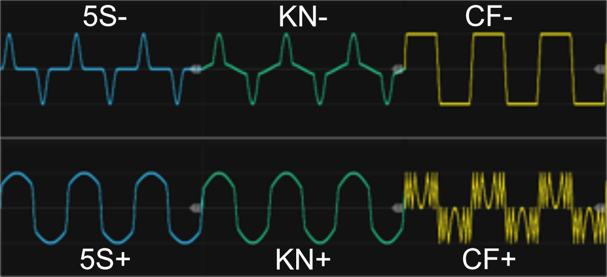

# Wave Shaper 2

 
This module features two independent sections (A and B) for applying **wave shaping**. While both sections share the same settings, the input signals are process separately. At the top, you can control the modulation amount using a knob and/or trim+CV input, with a range of -1 (counterclockwise) to +1 (clockwise). Below this, a three-way switch allows you to select between different shaping-algorithms (explained later), while another three-way switch sets the input signal range (also detailed later, along with the reset button/input to reset range while in Auto mode). 

At the bottom of the module, you'll find the A/B inputs and their corresponding A/B outputs, where each section processes its respective signal independently. The module can both be used to process modulation CV-signals and audio signals, hence you could use the A/B sections to process a (left/right) stereo signal. Via the context menu 2x oversampling can be enabled (off by default).

 

### Shape mode (algorithms)
As mentioned, the module includes a three-way switch that allows you to choose between three different shaping modes (algorithms). Each algorithm behaves differently depending on whether the modulation amount (set via the knob or CV input) is negative (towards -1) or positive (towards +1). When the modulation amount is set to 0 (center position), no modulation is applied, and the module simply outputs a copy of the input signal, though it may still be clamped based on the selected clipping-range (defaults to -12V/+12V).

+ **1 - 5Sine**: Uses 5x compound sine curves. When the mod knob is turned counterclockwise (negative range), it applies a logarithmic-like modulation, while turning it clockwise (positive range) applies an exponential-like modulation. In this mode waveforms tends to get "sharper/thinner" the more counter clockwise you turn the knob, and "rounder/fatter" (more "square like"), the more clockwise you turn the knob. *This mode functions similarly to the Mod knob in the [LFO1 module](LFO.md#lfo1), except that the LFO module applies special handling to its square waveforms*.
+ **2 - Knee**: Piecewise-linear (hard) knee shaping. With positive mod: 15% of input expands to 85% of output, 85% compresses to 15%. With negative mod: 85% compresses to 15%, 15% expands to 85%.
+ 3 - **Clamp/Fold**: In the negative modulation range, the amplitude increases, but the signal is clamped, meaning that "the peaks" of the incoming waveform are hard-limited while an automatic gain adjustment ensures the overall amplitude remains stable. In the positive modulation range, the amplitude also increases, but instead of clamping, the signal is folded (perhaps multiple times). *This is however a different kind of folding, than the folding done by the [Fold](Fold.md#fold) module, as values in the top-half keeps folding in the top-half while value in the bottom-half keeps folding in the bottom-half*.

### Value range
For the modulation algorithms to function correctly, the range of the incoming signal must be defined. The 3-way "Value Range" switch allows you to select one of three operating modes:

+ **A = Automatic**: In this mode, the module continuously analyzes the incoming signal to determine its lowest and highest values, dynamically adjusting its internal scaling and offset based on the detected range. This means that as long as the module remains in Automatic mode, it will adapt to the amplitude of the signal over time. If needed, you can reset the detected range—useful when switching to a new signal with a lower amplitude. Reset can be performed by inputting a reset trigger, pressing the small reset button, or momentarily cycling the modul to one of the other range modes. By default, the A and B inputs have independent scaling and offset calculations, but via the context menu, you can choose to apply a shared scaling/offset for both sections (e.g. for a stereo signal).
+ **B = Bipolar (-5V to +5V)**: In this mode, the input range is fixed at -5V to +5V. Any incoming signal outside this range will be clamped before being processed.
+ **U = Unipolar (0V to 10V)**: In this mode, the module operates within a fixed 0V to 10V range. Any input signal that exceeds this range is clamped before processing.

**TIP**: The three shaping algorithms (or technically six, as they behave differently in the negative and positive ranges) allow you to transform basic waveforms into something much more dynamic and engaging. By using the[LFO modules](LFO.md) included in this plugin alongside this module—and potentially the [Cross-fade/Switch 4-1](Switch.md#cross-fade-switch-4to1) to blend or switch between up to four different signals—you can quickly take a simple, repetitive waveform and turn it into something more varied and expressive.

**TIP**: The random modules in the Infinite-Noise plugin — such as [Random-4](Random.md#random-4) - offer different distributions. For example, using the **Edge** distribution and turning the distribution knob clockwise increases the likelihood that values cluster near the extremes (top or bottom limits). You can approximate a similar effect even with random sources that don’t provide distribution controls. By routing a random signal through this module in 5Sine or Knee mode and you increase the Mod-parameter, you effectively "push" values away from the center toward the edges. Likewise when you decrease the Mod-parameter in these modes, you effectively "push" values towards the center so it will approximate the effect of a **Center** distibution performed by the Random modules.

[Go back to modules overview](manual.md#modules)
