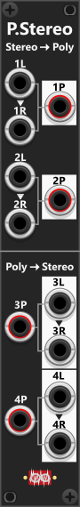
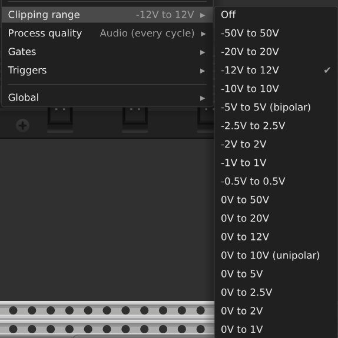
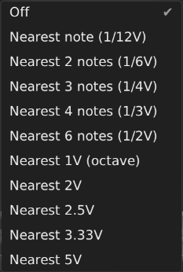
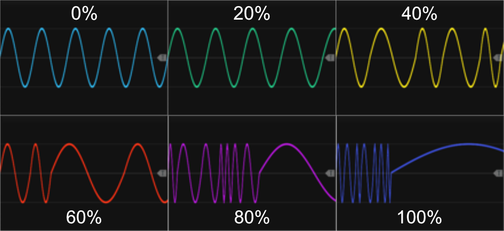
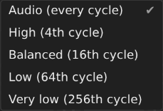
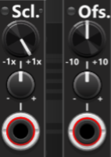
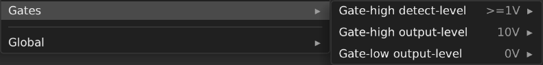

# Infinite-Noise rack modules - Manual
At the bottom, in the [Modules section](#modules), you'll find a list of all available modules. Clicking on a module's title will take you to its dedicated manual page, where you'll find details about that specific module or a "family" of similar modules. Before diving into individual modules, I'll first go over some common features shared by many modules in this plugin. If this is your first visit, you may find it helpful to review these general features. 

## Known issues (not bugs)
The Infinite-Noise modules are designed to perform certain housekeeping tasks only once every 256 processing cycles. This reduces the amount of work that needs to be done during the following 255 cycles, improving overall performance. For example, many modules only check which input and output ports are connected, and how many channels are present on each input, every 256 cycles. As a result, there can be a delay of up to 255 samples before a module adapts to a newly connected cable or detects that an input now has a different number of channels than before. At a sample rate of 48 kHz, this corresponds up to approximately **5 ms** (approx a 187th of a second). *Statistical it will be half that time (2.5 ms / a 375th of a second), depending on the last house-keeping cycle in relation to the cable change.*

Once a cable-change has been detected, there is **no delay** in reading or processing the signal itself. Only changes to the connection state or channel count are subject to this brief "detection delay". In practice, this is rarely noticeable, since most modules output a fixed number of channels unless you explicitly change your patch (for example, by adjusting a module's polyphony setting). Unless you are using a module whose output channel count changes dynamically and frequently during a performance, this behavior is unlikely to have any practical impact.

**The modules require a connected output for them to fully operate**. It will be mentioned again when discussing [process quality](#process-quality), but I wanted to highlight it here as well. For performance reasons, most modules remain inactive ("sleep") unless an output is connected. This means that without an output cable, certain visual indicators—such as the frequency light on an LFO module—will not flash. Similarly, some modules may have status lights that are expected to respond to input signals or button presses, but this behavior may not occur unless an output is connected. Likewise in modules with multiple (often identical) "sections", only sections with connected outputs (or sometimes connected inputs) are processed. Before reporting a bug or assuming a module is not working, make sure you have connected an output cable and tested the module properly.

## Layout and common module-features
I prefer when a module's functionality is clear just by looking at the panel, so I've structured all panels to ensure knobs, input/output ports are arranged in a logical and intuitive way (at least I think so myself). I'm also not a fan of overly colorful panels, where fancy artwork or port-arrangement takes priority over readability, or for that sake, pannels without labels next to input/output-ports. Instead, I’ve focused on clarity and usability, keeping the interface clean and functional. Since rack space is valuable, I’ve designed many Infinite-Noise modules to be as compact as possible, often fitting into just 2 or 4 HP. For the same reason, I’ve avoided unnecessary graphical clutter, such as decorative marks or excessive scales around knobs and buttons. Instead, you’ll typically find a label indicating the function of a port or knob, and in some cases, min/max values are listed above or below a knob. 

Because of this minimalist panel design, it is highly recommended that you enable **tooltips** in VCV Rack (View → Show tooltips). Tooltips not only display precise values as you adjust a knob but also provide helpful descriptions of each knob, button, or input/output port. This reduces the need to constantly reference the manual while using Infinite-Noise modules. In many cases, the tooltip will also indicate if an input port is normalized to the input or output of another port when no cable is connected. Tooltips for all input- and output-ports will by default either be prefixed by "**(m)**" or "**(p)**" to indicate if they only support monophonic (single channel) signals or polyphonic (up to 16 channel) signals. You can show or hide these prefixes via the **Global** menu (right-click any Infinite-Noise module → **Global** → **Port prefix**).

Most push-buttons in these modules come in two sizes. The larger buttons are the same size as "standard knobs" and are meant to be manually pressed during a performance to trigger actions or make real-time changes. For example, in an [On/Off Switch](Switch.md#onoff-switch) module, a large push-button can toggle the module between its ON and OFF states (beside CV-input). The smaller buttons are typically used to enable or modify behavior, or to switch between different modes (typical a setting you specify once, and then leave it as it is). For instance, next to many CV inputs, you’ll find a small green/red button that changes how the input is processed — when green, the input is treated as a gate, and when red, it switches to trigger mode. In other cases, these small buttons appear next to a larger button, where they act as a toggle for latching or momentary behavior of the bigger button. If space allows, a small label (e.g., "Latch" or "Gt/Tr") is placed near these buttons. But in all cases, the tooltip provides a clear description of its function. For the best experience, enable tooltips in VCV Rack to quickly understand what each button does without needing to reference the manual. In cases where the tooltip changes based on the state of the button (e.g. "Trigger mode" or "Gate mode"), the text states the current/active mode.

All Infinite-Noise modules are available in two panel themes: a **light** theme and a **dark** theme. By default, the panel theme is set to **Auto**, meaning the modules will appear in either light or dark mode depending on the theme selected in VCV Rack (whether "Use dark panels if available" is enabled/disabled within the "View" menu). However, at the bottom of the context menu for any Infinite-Noise module, you will find the **Global** menu. This menu provides access to global settings, including the option to force either the light or dark theme regardless of the VCV Rack setting.

All panels show **screws** in the top and bottom corners, or **mounting points** (empty recesses) where a screw would otherwise sit. By default, newly placed modules use **Random** mount style: the number and placement of screws varies with panel width and chance (typically one, two, or four screws, with mounting points filling any unused corners). If you don't like this random placement, you can change this via **Global** → **Mount style**, which offers **None** (no screws or mounting points), **Mounting points only**, **Two screws** (fixed top-left and bottom-right), **Four screws**, or **Random**. This setting applies only when a module is inserted in the rack — modules already in your rack keep the layout they were created with (loading a previous saved patch, all panels will load with the active setting).

The panel background also makes it easy to distinguish **input ports** from **output ports** at a glance:
+ Using the light theme, input ports are shown directly on the light background, while output ports have a dark background.
+ Using the dark theme, this is reversed—input ports are shown on the dark background, and output ports have a light background.

Additionally, ports that can accept or generate polyphonic signals are marked with **a thin red ring** inside the port. This allows you to quickly identify polyphonic-capable ports just by looking at the panel, or equally important identify ports that only accept/generate monophonic signals (as they will not have this "red ring"). However these polyphonic ports do not necessarily require a polyphonic input, and the modules typically only generate polyphonic output when fed a polyphonic input. A few [Polyphonic-tool modules](PolyTools.md) have been explicitly designed with polyphony in mind (e.g. to convert between polyphonic and monophonic), however most of the Inifinite-Noise modules (with few exceptions) supports polyphonic signals. 

In Infinite-Noise modules, **normalization** is visually represented using graphical **arrows/arrow-heads** on the panel. Normalization allows one port to default to the signal from another port when no cable is inserted. Where space allows, a full arrow illustrates the entire signal path of the normalized connection. However, in most cases, only arrowheads are shown:

+ An arrowhead pointing away from an input-port indicates that this input may also serve as a normalization source for another port.
+ An arrowhead pointing into an input-port means that this port defaults to another port’s signal when no cable is connected.

In the previous screenshot you can see arrowheads as well, however as the port that have its input normalized to the input/output of another port are placed horizontal above each other, you will only see a single arrowhead between the two ports. In the screenshot below, the ports "sending" their input to other ports are not placed next to each other. As a result you will see 2 arrowheds for each normalization (1 pointing away from the port which will "send" their signal, and another pointing into the port which will "receive" this nomalization signal).

For output ports, arrowheads can have a slightly different meaning. In some modules, the output from one output port is used as normalization for another input port. E.g. the [Merge/Mult-4](MergeMult.md#mergemult-4) where the output of the Merge-section is used as nomalization-input for the Mult-section. However, in a few modules, such as the Tweak modules, multiple outputs can be mixed if no cable is connected to "previous" output ports. If an arrowhead is pointing away from an output port (e.g., output "A"), it indicates that the signal is routed elsewhere when no cable is inserted. Conversely, if an arrowhead is pointing into an output port (e.g., output "B"), it means that its signal is being mixed with another output signal where no cable was connected. In all cases, hovering over a port will reveal a tooltip specifying the exact normalization behavior, letting you quickly determine which signal is used when no cable is connected. *Some input ports (without visible arrowheads) default to values that can be adjusted through the context menu; otherwise, they simply normalize to 0V.*

### Context-menu
In the hardware world, many modules allow you to modify their default behavior by adding or removing jumpers on the back before installing them in the rack. For example, the [Doepfer A-145-4V quad-LFO](https://doepfer.de/a1454.htm) lets you adjust the frequency range of each LFO via jumpers. Similarly, Infinite-Noise modules allow you to adjust default behaviors and values (such as voltage ranges or specific voltage levels), but instead, these settings are modified via the context menu. 

Many modules feature various status lights that indicate when non-default values have been selected through the context menu. In some cases, the color or brightness of these lights provides specific information about the active settings. In other cases, they simply indicate that a default-setting has been changed, requiring you to check the context menu for details. To better understand what each light represents, make sure to check the tooltip when hovering over them.

Most of the Infinite-Noise modules will be happy to process inputs exceeding +/-10V (or for that matter +/-12V). However by default, most modules in this library apply a "**-12V to +12V**" (hard) clipping to all output signals, ensuring that outputs remain within a "normal voltage range". However, this clipping can be disabled/changed via the context menu *(e.g., if you plan to deliberately exceed this range for some reason)*. A few modules don't have a menu for setting clipping-range, as they can simply not generate output which exceeds the range E.g. [Clamp 4](Tweak.md#clamp-4) will clamp output to a range specified by its min-/max-knobs, hence it has no need for the clipping-menu. Likewise, modules that can only generate gate/trigger-output don't need the clipping-menu, as they have menu-items that lets you customize the output-levels for high/low gate/triggers.

To make it easier to see which clipping range is currently active, all modules have **a small status light to the left of the Infinite-Noise logo** at the bottom of the panel. This light is dim when clipping is turned off, green when wider ranges such as ±20V/50V or 0–20V/50V are selected, bright yellow for the default ±12V range (50% yellow for ±10V), and more red as the selected range becomes narrower (for example, ±5V, ±2.5V or smaller). In either case, the tooltip for this light will indicate exactly which range is currently active. *This clipping status light can be disabled via the Global menu (at the bottom of the context menu) if you find it annoying*.

The context menu also provides various options to adjust default values, such as min/max voltage ranges, normalization values (for when no cable is connected), true/false settings, and mode selection. For modules that allow voltage customization, most menus include preset voltage options like 1V, 1.5V, 2V, 2.5V, 5V, 8V and 10V — sometimes available in both positive and negative values. Range settings are typically available in two formats: an unipolar range starting from 0V and a bipolar ± range, centered around 0V.

*Remember that while you hold **CTRL** (probably **CMD** on Mac), you can click multiple menu items while keeping the context menu open. This allows you to perform several selections or actions at once, without having to reopen the context menu multiple times.*

### Polyphony
Most Infinite-Noise modules can accept, process, and generate polyphonic signals (with 2 to 16 channels), though a few modules do not support polyphony. As previously mentioned, input and output ports that support or generate polyphonic signals are **marked with a thin red circle** and by default the port tool-tip is either prefixed by "**(m)**" (monophonic) or "**(p)**" (polyphonic). However, this does not mean that you must input a polyphonic signal, nor does it guarantee that the module will always output polyphonic signals. In most cases, monophonic signals can be used as inputs, and output ports are capable of generating both monophonic and polyphonic signals, depending on how the module is used. However when a port does not show the "red circle" and the tool-tip shows the "(m)" prefix, you can be certain that only port-1 of an input signal is used (if fed a polyphonic signal), and as output it can only generate monophonic signals.

In the module list below, a "**p**" in the parenteses next to a module's name indicates that it supports and/or generates polyphonic signals. Some modules, like the [Tiny LFO](LFO.md#tiny-lfo), uses a primary input (such as frequency-CV) to determine the number of output channels. For example, if you feed its frequency input a 4-channel polyphonic signal, each waveform output will also generate 4-channel polyphonic signals. Some modules do not have a dedicated polyphonic input, but polyphony can still be enabled via knobs or the context menu. For instance, the outputs of the  [Manual Push2](ManCV.md#manuel-push-2) module are monophonic by default, but the context menu allows you to set the number of output channels. Other modules, such as [Merge/Mult-4](MergeMult.md#mergemult-4), determine the number of output channels based on the input with the highest channel count. If you send a 4-channel polyphonic signal to the first input in the merge section and an 8-channel polyphonic signal to the second input, the merged output will have 8 polyphonic channels. Any missing channels from a lower-channel input are automatically normalized to 0V, so in this example the 4 last channels of the 2nd signal (with 8 channels) will be merged with 0V (as the first signal only had 4 channels).

When a module, such as a merge module, has multiple inputs which you want to process multiple polyphonic signals, these input should ideally have the same number of channels. **Monophonic signals are handled in a special way**, so you can merge a monophonic signal with a polyphonic signal. When doing so all channels of the polyphonic signal will be merged with the same monophonic signal.

To ensure a signal have as many channels as another signal, you can use a module like [Poly-Shuffle](PolyTools.md#poly-shuffle) which can adjust polyphony—whether you need to add, repeat/clone, or remove channels. For more control over polyphonic routing, the [PolySplit](PolyTools.md#poly-split) module allows you to separate a polyphonic signal into individual monophonic/polyphonic signals, which is particularly useful when processing channels individually in modules that do not support polyphony. Conversely, the [PolyMerge](PolyTools.md#poly-merge) module lets you combine multiple monophonic/polyphonic signals into a single polyphonic signal, making it easier to reintegrate individual channels into a structured polyphonic workflow. Additionally, you’ll find more polyphonic utility modules, each designed for specific tasks related specifically to polyphonic signal processing.

In the [Modules section](#modules) at the bottom, you find a list of all modules included in the Infinite-Noise pluging. Whithin this list you find the category **Polyphonic-tools**. These are all utility modules aimed at processing polyphonic signals in various ways, and convert between monophonic and polyphonic signals.

### Saving- and loading patches
By standard when you save/load your patches in VCV, it will save/load all modules with connected cables, values dialed in by knobs, and the selections made by (latched) toggle-buttons and 2/3-way switches. In addition the Infinite-Noise modules will also save/load the selections you made using the context-menu, and it will also save/load "the state" of the module. E.g. the [Turing Machine](TuringMachine.md#turing-machine) have a 32-step internal bit-sequence which is saved/loaded with the patch. Likewise the [S&H/T&H/H&T modules](Shth.md) will save/load the last hold sample-values and so on.

### Quantized output
In addition to clipping output to a selected range (e.g., -12V to +12V) as previously mentioned, some modules also offer output quantization, such as those in the [Tweak modules series](Tweak.md). Unlike a dedicated quantizer module, where you typically select a scale and key, or manually choose which notes to include, the quantization feature in these modules works differently. While I chose to label it as "quantize," you can think of it more as a "rounding" feature. By default, this feature is disabled, but it can be enabled via the context menu in certain modules. When activated, it converts an otherwise smooth signal into a "stair-stepped" signal, where the selected quantization mode determines the "size of these steps". This feature allows you to transform continuously varying signals into structured, stepped signals.

### Rate Chaos
Several Infinite-Noise modules contain an internal LFO or "rate" that determines how fast something happens: the waveforms of the [LFO modules](LFO.md), how often the [Sample & Hold modules](Shth.md) samples a new value, or how often the [Random modules](Random.md) generate new values. By default this internal rate is perfectly steady: once you dial in a frequency/rate, every cycle takes exactly the same amount of time as the previous one. The **Rate Chaos** setting (available in the context menu) lets you break up that regularity by making each cycle run at a slightly - or wildly - different speed than the one before it.

The setting ranges from **0% (default, off)** up to **100%** in 5% steps. At 0% the module behaves exactly as before. With Rate Chaos enabled, every time a cycle completes a new random "speed factor" is picked for the next cycle, so successive cycles become a little (or a lot) shorter or longer. The rate stays constant *within* each cycle and only changes at the cycle boundary, so for an LFO the waveform itself is never distorted - only its period drifts from one cycle to the next (e.g. "a slow" full sine waveform-cycle, may be followed by "a fast" full sine waveform-cycle).

The rate chaos amount controls both how far the rate can stray and how the random speeds are distributed:

+ **Low settings** (e.g. 5%-20%) only nudge the rate by a few percent, and the distribution is heavily weighted toward the dialed-in rate, so most cycles stay close to normal with only occasional small deviations - a subtle "humanized" wobble.
+ **Higher settings** widen the spread and flatten the distribution, so larger deviations become increasingly likely.
+ At **100%** a single cycle can run anywhere from one-tenth to ten times the dialed-in rate, with the extremes just as likely as values near the middle.

The effect is symmetric: speeding up and slowing down are equally likely, so the rate still hovers around the value you set rather than drifting steadily in one direction. Where a module has several independent sections or LFOs (such as the quad LFOs or the dual Sample & Hold modules), each one has its own Rate Chaos setting and their random speeds are uncorrelated. The only LFO without this option is the Phase-Driven LFO (PDLFO), which has no internal oscillator and instead follows whatever phase signal you feed it.

**TIP**: While the Rate Chaos is controled via the context menu (not CV-input), you can have multiple modules (e.g. TLFO's) each with different Rate Chaos settings, and then fed these multiple outputs to a switch/crossfade module, so you can switch/crossfade between outputs running with different chaos rates.

## The nerdy stuff – For those who love the details
To conserve CPU bandwidth, many of the Infinite-Noise modules are designed to only run when necessary. For example, the LFO modules feature a small phase light next to the frequency knob, which flashes at the start of each LFO cycle to indicate its rate. However, as mentioned in the top, most modules will "sleep" when no output cables are connected, meaning this light (and other indicators) will not update unless an output-port is actively in use. Similarly, other modules have status lights that reflect their operational state. 

### Process quality
All but a few modules allow you to adjust their internal **process quality**, which controls how frequently their internal algorithms are executed. By default, most modules operate at Audio Rate, meaning they process data at the full sample rate (e.g. 48,000 times per second when running at 48 kHz). This level of precision is necessary for audio signal processing to avoid degradation. However, for slow-moving modulation sources like LFOs, recalculating their output thousands of times per second is unnecessary. To optimize performance, all modules allow you to manually adjust their processing rate, reducing CPU usage when high precision isn’t needed. Below are the 5 available process quality settings:

+ Audio – Default and highest setting; the module runs its internal algorithm on every cycle (48,000 times per second at 48 kHz).
+ High – Runs every 4th cycle (12,000 times per second at 48 kHz or 11,025 at 44.1 kHz).
+ Balanced – Runs every 16th cycle (3,000 times per second at 48 kHz or 2,765 at 44.1 kHz).
+ Low – Runs every 64th cycle (750 times per second at 48 kHz or 689 at 44.1 kHz).
+ Very Low – Runs every 256th cycle (187 times per second at 48 kHz or 172 at 44.1 kHz).

By adjusting process quality, you can reduce CPU load, particularly for LFOs, slow modulations, or non-audio signals, without compromising performance where high precision is necessary.

In many cases, reducing process quality has little noticeable effect. For example, if you pass a slow-moving LFO through a module, you likely won’t see or hear any difference whether the LFO is running at Audio Rate (every cycle) or Balanced (every 16th cycle). However, for audio signals, running at a lower process quality will be noticeable, often introducing artifacts. In some situations, deliberately lowering the process quality can be used as a creative tool, effectively acting as a form of "sample rate reduction" for signals. 

**Warning**: However, **if a module processes trigger or clock signals, lowering the process quality too much can introduce latency or missed triggers**. A trigger signal should last 1ms, which at 48 kHz sample rate equals to only 48 samples. If the module has a trigger input that it must react to, you should not lower process quality below "Balanced" (every 16th cycle)—otherwise, triggers may be missed. For example, at "Low" (running every 64th cycle), a trigger could be sent and end during the 63 cycles when the module "is asleep", meaning it would not be detected.

A few modules, such as [some of the LFOs](LFO.md), [the SHTH modules](Shth.md), and several [Random modules](Random.md), include an **Auto** setting (labeled **Auto select process quality** in the context menu). When enabled — which is the default setting for these modules — the module will automatically adjust its process quality based on the highest dialed-in frequency, and connected ports. Since some of these modules have frequency modulation inputs, the incoming CV can override the manually set frequency. If a frequency modulation cable is connected, the module will automatically switch to "Audio" rate, as it has no way of predicting how quickly the input signal might change. If you know the modulation source is slow-moving, you may want to disable Auto mode and manually select a lower process quality. However, when Auto mode is enabled, the module will drop to "Very Low" rate when no output cables are connected, further reducing CPU usage when the module "is not used". To manually adjust process quality for these modules with the "Auto" setting, you **first must disable the Auto setting** in the context menu, after which you can freely select the desired rate.

The **Auto setting is very conservative**, meaning it selects a process quality that ensures smooth updates, minimizing "stepping" in signals like LFO waveforms. The logic behind this is that an LFO should be updated at least 2048 times per full waveform cycle, keeping output transitions smooth (output updates at least every ~0.176° of the phase). For a 48 kHz sample rate, the module automatically switches between process-quality settings based on frequency:

+ Audio Rate (every cycle) → Above ~23.43 Hz
+ High (every 4th cycle) → Above ~5.85 Hz
+ Balanced (every 16th cycle) → Above ~1.46 Hz
+ Low (every 64th cycle) → Above ~0.366 Hz
+ Very Low (every 256th cycle) → Below ~0.091 Hz

At the bottom of each pannel, **just right to the logo there is a small light** which indicate the process quality that the module is using, whether it have been manually- or automatically selected (e.g. the LFO modules will default to use an automatic selected process quality). The following modes will set the light as follows:

+ Audio (each cycle): Dimm/Off.
+ High (4th cycle): Green.
+ Balanced (16th cycle): Yellow.
+ Low (64th cycle): Orange.
+ Very low (256th cycle): Red.

**Warning**: Modules that update output only every 4th–256th cycle (lower process quality than "Audio") hold the same value between updates. This will normally not be an issue, however if a module that receives this signal needs to detect changes between each cycle, it can be an issue. For the same reason, the [Slope Detector 2](SlopeDetector2.md#slope-detector-2) module uses **latched** Rise / Steady / Fall phases and a configurable **Steady hold time** (default 6 ms) so brief flat gaps on a ramp (e.g. due to a lower process quality setting) do not flip phase to Steady. If you lower the Slope Detector’s own process quality, ensure **Steady hold time** is at least as long as one process interval—a red light next to the threshold knob warns when it is too short. See the [Slope Detector 2 manual](SlopeDetector2.md) for detail and tuning. For other modules that compare **per-sample** deltas (without hold time), a slow LFO into a fast-running detector can still produce misleading “steady” intervals between LFO updates. E.g. if an LFO only updates its output each 16th cycle, it means it will output the same value for 15 cycles.  In those cases, match process quality between source and detector, or run the source at Audio rate, to ensure new/changed values are generated at each cycle.

### Knob/CV-Input and trimming (attenuvert)
Many Infinite-Noise modules feature a combination of a manual knob and a CV input that is affected by a trim knob, allowing you to attenuvert the CV signal within a range of -100% to +100%. The CV input value, after being scaled by the trim knob, is "added" to the value set by the manual knob. However, in some cases, the final result may be clamped to a specific range depending on how the value is used.

While there is no strict standard for CV input scaling accross modules from different developers, my general approach is that **a 10V range should correspond to a full knob rotation** (e.g. from far left to far right). For example, in the Tweak2I module, a knob/CV/trim combination controls the scaling of values (from -1 to +1). If you turn the knob fully counterclockwise (to -1x) and then feed the CV input with a Unipolar 0V to 10V signal, it will produce the same result as manually turning the knob fully from left to right (+1x). Similarly, centering the knob (0x) and instead supplying a Bipolar -5V to +5V CV input will yield an equivalent effect, where -5V corresponds to a 50% leftward turn (to -1x) and +5V corresponds to a 50% rightward turn "added" to the knob-position (to +1x).

I believe this is the most logical way to handle CV inputs (10V range = full knob range), **but there are exceptions**. Some knobs cover a -10V to +10V range, such as the Offset knob in the [Tweak modules](Tweak.md) or the Min/Center/Max range knobs in the [Random-Curve](Random.md#random-curve) module. For example, in a Tweak module, the Offset knob’s CV input directly offsets the signal by the incoming CV amount (assuming the trim knob is set to 100%). This means that supplying a 5V CV input results in a 5V offset to the signal. However, since the full manual knob movement in this case covers a 20V range (-10V to +10V), achieving the same effect through CV alone would require a 20V input range. Turning the knob fully counterclockwise (-10) and feeding in 20V CV would be equivalent to turning the knob fully clockwise (+10). Alternatively, you can center the knob at 0V, where a -10V input behaves like turning the knob fully counterclockwise from center (-10), and a +10V input behaves like turning it fully clockwise from center (+10). So for knobs that directly specify a volt-level, the CV-input is directly "added" to the knob-value.

### Default Volt-levels (can be changed using context-menus)
By default, all modules that output gates or triggers use a **10V high / 0V low** standard. For gate inputs, a signal is detected as high when it reaches **1V or more** and low when it drops below 1V. For trigger inputs, the signal switches high when it reaches **1V or more**, but unlike gates, it will only switch low once the input drops below **0.1V**. This means that after detecting a high trigger, the signal must fall below 0.1V before another trigger can be registered. These high/low thresholds are however not fixed and can be adjusted via the context menu. However, only modules that accept or generate gates/triggers include the relevant menu options for modifying these levels. These adjustments apply individually to each module, allowing fine-tuned control over detection thresholds if/when needed. While most users will likely stick to the default values, there may be cases where adjusting these settings is beneficial for a specific setup (e.g. you can "invert" a gate-output by setting the high-output to 0V, and the low-output to 10V).

 

Some modules feature default (normalized) inputs and may output signals that represent a "true/ON" or "false/OFF" state. For example, logical comparison modules follow the same gate detection settings, meaning an incoming signal is considered "true/ON" when it reaches 1V or more and "false/OFF" when below this threshold. Similarly, if a logical comparison evaluates as true, the module will output 10V, whereas a false evaluation will result in a 0V output.

### Trigger-outputs
All trigger outputs are designed to maintain a **1 ms high phase (default 10V) followed by a 1 ms low phase (default 0V)**. This ensures that downstream modules reliably detect both the rising and falling edges of the trigger signal, even if they do not check for triggers on every sample cycle. For example, at a 48 kHz sample rate, a 1 ms trigger pulse remains high for only 48 samples. The forced low-gap between triggers prevents consecutive triggers from merging into a single/continuous pulse. However, this also means that only one trigger can fire within a 2 ms window (1 ms high + 1 ms low), effectively limiting the trigger output to a **maximum of 500 triggers per second**. While this "restriction" is unlikely to cause issues in most use cases, it is worth noting. 

# Modules
The sections above covered features that are common to all Infinite-Noise modules. Below, you'll find links to each module, where you can read about individual modules or families of similar modules. Many modules include a number in their name (e.g., "Manual Trigger 8" or "Auto-Scale 4"). This number typically indicates how many "sections" the module has, which determines how many different signals can be processed simultaneously. Typically a single module which can process multiple sections (thereby multiple signals) at the same time, is more efficient than using multiple modules which each only processs a single signal. A few of the modules comes in Mk I and Mk II versions, where these modules are similar, but still different (e.g. one might only have knobs, wheras the other both support knobs and CV-input and/or one might have a single set of knob/cv-controls affecting all sections, and the other might have individual knob/cv-controls for each section).

A large number of Infinite-Noise modules can accept and generate polyphonic signals (ranging from 2 to 16 channels). In the list below, a "**p**" in the parenteses next to a module's name indicates that it supports and/or generates polyphonic signals. For example, the Tweak-2I, -2II, and -4I modules support polyphonic signals, whereas the larger Tweak modules (Tweak-4II and Tweak-8) with more sections only process monophonic signals. If a polyphonic signal is fed into one of these monophonic-only versions, only channel 1 will be processed, while the rest of the channels are ignored, and the module will output a monophonic signal.

Beside the "p" in the parenteses next to the module name (as mentioned above), you might also see an "**a**" for modules wich can automatic change its process quality (e.g. based on an internal LFO frequency), or a "**q**" for the modules which can quantize its output (e.g. to quantize to nearest note). Regarding modules supporting "automatic" process-quality, it will be enabled by default, whereas those that supporting quantize ("rounding of output") it will be disabled by default. In both cases it can be enabled/disabled using the context-menu for those modules.

Most Infinite-Noise modules are primarily designed for processing control signals. For this reason, you can often reduce CPU usage by lowering the process quality (for example, by executing the internal algorithm only every 4th or 16th cycle). However, when used for audio processing, modules should typically run at **Audio rate** (executing every cycle). Some modules are however more likely to be used with audio signals as well, and therefore provide an optional 2x oversampling (disabled by default). In the list below, modules marked with an "**o**" (shown in parentheses next to the module name) support input oversampling, which you can enable in the context menu if using these modules to process audio-signals.

## LFO's
+ [Simple LFO4-ss](LFO.md#simple-lfo4-ss)(a): Simple knob-controlled Quad-LFO, with internal sync (Saw and Sine).
+ [Simple LFO4-st](LFO.md#simple-lfo4-st)(a): Simple knob-controlled Quad-LFO, with internal sync (Square and Triangle).
+ [Tiny LFO](LFO.md#tiny-lfo)(pa): Tiny (2HP) knob/CV-controlled single LFO with PWM (Saw, Square, Triangle, and Sine).
+ [LFO1](LFO.md#lfo1)(pa): Knob/CV-controlled single LFO with PWM, MOD, external sync and n-shot mode (Saw, Square, Triangle and Sine). Using the Square-output with modulation, it also acts as a wavetable (Triangle<->Square<->Saw).
+ [Phase-Driven LFO](LFO.md#phase-driven-lfo)(p): Phase-driven LFO (input-phase) with PWM/modulation, outputting Saw, Square, Triangle and Sine, and inverted.

## Tweak (attenuate/amplify, offset and mix)
+ [Tweak-2 Mk I](Tweak.md#tweak-2-mk-i)(pq): 2 section: (same) knob/CV-controlled (1x,2x,5x,10x) attenuverter/amplifier, offset.
+ [Tweak-2 Mk II](Tweak.md#tweak-2-mk-ii)(pq): 2 section: (individual) knob controlled (1x,2x,5x,10x) attenuverter/amplifier, offset, mixer.
+ [Tweak-4 Mk I](Tweak.md#tweak-4-mk-i)(pq): 4 section: (same) knob controlled (1x,2x,5x,10x) attenuverter/amplifier, offset.
+ [Tweak-4 Mk II](Tweak.md#tweak-4-mk-ii)(q): 4 section: (individual) knob/CV-controlled (1x,2x,5x,10x) attenuverter/amplifier, offset, mixer.
+ [Tweak-8](Tweak.md#tweak-8)(q): 8 section: (individual) knob/CV-controlled (1x,2x,5x,10x) attenuverter/amplifier, offset, mixer.
+ [VCA-2](Tweak.md#vca-2)(p): 2 section VCA each with knob/CV for each.
+ [VCA-4 Mk I](Tweak.md#vca-4-mk-i)(p): 4 section VCA with shared knob/CV (same for all 4 sections).
+ [VCA-4 Mk II](Tweak.md#vca-4-mk-ii)(p): 4 section VCA with knob/CV for each.
+ [Clamp 4](Tweak.md#clamp-4)(po): Clamp/clip (invert) up to 4 inputs, in selected range.
+ [Auto-Scale 4](Tweak.md#auto-scale-4)(p): Automatic scale/offset (invert) to selected range of up to 4 inputs.

## Controllers/converters
+ [Manuel Trigger, Gate and CV](ManCV.md#manuel-trigger-gate-and-cv)(pq): Controller to manually output 1 trigger-, 2-gate and 2 CV-signals.
+ [Manuel Push 2](ManCV.md#manuel-push-2)(p): Controller with 2 buttons, that each fires a gate and high/low-triggers. Can also convert gates to triggers (or vice versa).
+ [Manuel Trigger 8](ManCV.md#manuel-trigger-8)(p): Controller to manually output 8 trigger-signals (mono/polyphonic).
+ [Manuel Gate 8](ManCV.md#manuel-gate-8)(p): Controller to manually output 8 gate-signals (mono/polyphonic).
+ [Manuel CV 8 Mk I](ManCV.md#manuel-cv-8-mk-i)(pq): Controller to manually set 8 fixed CV outputs (mono/polyphonic).
+ [Manuel CV 8 Mk II](ManCV.md#manuel-cv-8-mk-ii)(pq): Controller to manually set 8 fixed ON/OFF CV outputs, and switch between them (mono/polyphonic).
+ [Manuel Mix 4 Mk I](ManCV.md#manuel-mix-4-mk-i)(p): Manually knob-operated mixer with 4 inputs and 1 output (averaging or unity mix).
+ [Manuel Mix 4 Mk II](ManCV.md#manuel-mix-4-mk-ii)(p): Manually knob/CV-operated mixer with 4 inputs, individual outputs and 1 mix output (averaging or unity mix).
+ [Manuel Mix 4 Stereo](ManCV.md#manuel-mix-4-stereo)(p): Manually knob/CV-operated mixer with 4 stereo-inputs and stereo mix output (averaging or unity mix).
+ [Manuel Mute 8](ManCV.md#manuel-mute-8)(pq): Controller to manually mute 8 signals.
+ [Mute 2](ManCV.md#mute-2)(p): 2 knob/cv-controlled mute-sections each with a single input/output-pair.
+ [CV-Toggle 8](ManCV.md#cv-toggle-8)(pq): Switch with 8 sections, each with 2 stages (via CV).
+ [CV to Gate](CvToGt.md#cv-to-gate): Fire gate/trigger if CV is within specified range (1 section).
+ [CV to Gate/Trigger 8](CvToGtTr8.md#cv-to-gatetrigger-8): Fire gate/trigger if CV is within specified range (8 sections).

## Merge/Mult
+ [Merge2x4](MergeMult.md#merge2x4)(pq): Merge with 2 section each with 4 inputs (merge can either sum or mix, and can have special handling of negative values).
+ [Mult2x4](MergeMult.md#mult2x4)(p): Mult with 2 section each with 4 outputs (also works as 1-to-8 mult).
+ [Merge/Mult-4](MergeMult.md#mergemult-4)(pq): Merge/Mult with 4 inputs/outputs (merge can either sum or mix, and can have special handling of negative values).

## Logic/Value-compare
+ [Tiny Logic Comparator-2](Compare.md#tiny-logic-comparator-2)(p): 2 sections with 4 inputs for logical compare: AND, OR, XOR (and negated via context-menu).
+ [Logic Comparator-2](Compare.md#logic-comparator-2)(p): 2 sections of logic compare, with true/false input, and two sections of: AND, NAND, OR, NOR, XOR, XNOR.
+ [Logic Comparator-6x2](Compare.md#logic-comparator-6x2)(p): 6 sections each with 2 input for Logic compare (AND, NAND, OR, NOR, XOR, XNOR).
+ [Value Comparator-1](Compare.md#value-comparator-1)(p): One section of value-compare: A=B, A!=B, A>=B, A>B, A<=B, A<B, with threshold knob, A/B-cross trigger and tolerance-clamp.
+ [Value Comparator-2 Mk I](Compare.md#value-comparator-2-mk-i)(p): Value compare with true/false input, threshold and two sections of: A=B, A!=B, A>=B, A>B, A<=B, A<B.
+ [Value Comparator-2 Mk II](Compare.md#value-comparator-2-mk-ii)(p): One section of value-compare: Min, Max, NtZ, FtZ, Abs-diff, Avg, and one section of Int/Frac and simple math: Plus, Minus, Mul, Div.

## S&H, T&H, H&T
+ [S&H/T&H-2](Shth.md#shth-2)(paq): Sample/track-and-hold with 2 sections (1 input/output), each triggered by input or internal LFO.
+ [S&H/T&H-2x4](Shth.md#shth-2x4)(paq): Sample/track-and-hold with 2 sections (4 input/output), each triggered by input or internal LFO.
+ [Sample and Update](Shth.md#sample-and-update)(paq): Sample-and-Update with button/CV for Sample, Reset and Update. Can also count number of triggers detected, and output a trigger when the desired count have been reached.

## Polyphonic-tools
+ [Poly-Merge](PolyTools.md#poly-merge)(p): Merge (up to) 16 monophonic signals (or multiple polyphonic signals) into a polyphonic signal.
+ [Poly-Split](PolyTools.md#poly-split)(p): Split a polyphonic signal into (up to) 16 monophonic signals (or multiple polyphonic signals).
+ [Poly-Stereo](PolyTools.md#poly-stereo)(p): Encode/Decode 2 monophonic left/right signals to/from 2 channel polyphonic signals.
+ [Poly-Quad](PolyTools.md#poly-quad)(p): Encode/Decode 4 monophonic signals to/from 4 channel polyphonic signals (basically an up to 4 channel merger/splitter).
+ [Poly-Shuffle](PolyTools.md#poly-shuffle)(p): Add/Remove/Shuffle channels of a polyphonic signal. Can also be used to construct a polyphonic signal with up to 16 gates.
+ [Poly-Tweak Mk I](PolyTools.md#poly-tweak-mk-i)(p): Invert/Disable (mute/remove) channels of a polyphonic signal based on buttons. Can also be used to construct a polyphonic signal with up to 16 gates.
+ [Poly-Tweak Mk II](PolyTools.md#poly-tweak-mk-ii)(p): Invert/Disable (mute/remove) channels of a polyphonic signal based on CV-inputs. Can also be used to mix individual channels of two polyphonic signals.
+ [Poly-Logical Compare](PolyTools.md#poly-logical-compare)(p): Perform logical-compare (AND,OR,XOR,NAND,NOR,XNOR) on all channels of same polyphonic-signal.
+ [Poly-Value Compare](PolyTools.md#poly-value-compare)(p): Perform value-compare (MIN,MAX,NtZ,FfZ,AVG,R/S) on all channels of same polyphonic-signal. Can also monitor (MIN,MAX,NtZ,FfZ,AVG,R/S) over time (since last reset), accross all channels or individually for each channel.
+ [Poly-Offset](PolyTools.md#poly-offset)(p): Offset individuel- or group of channels of a polyphonic-signal.
+ [Poly-Scale](PolyTools.md#poly-scale)(p): Scale (attenuvert/amplify) individuel- or group of channels of a polyphonic-signal.

## Switch and cross-fade modules
+ [Cross-fade switch 1to4](Switch.md#cross-fade-switch-1to4)(p): Cross-fade/switch 1 input into up to 4 outputs.
+ [Cross-fade switch 4to1](Switch.md#cross-fade-switch-4to1)(p): Cross-fade/switch up to 4 inputs into 1 output.
+ [Cross-fade 1x2](CrossFade.md#cross-fade-1x2)(p): Cross-fade a stereo-signal, or two separate mono signals by knob/CV.
+ [Cross-fade 4x1](CrossFade.md#cross-fade-4x1)(p): Cross-fade 4 separate (mono) signals, by separate- and master cross-fade knob/CV.
+ [Bernoulli Switch](Switch.md#bernoulli-switch)(p): Bernoulli switch with both 'A/B->' (2 input, 1 output) and '->A/B' (1 input, 2 output) sections.
+ [ON/OFF Switch](Switch.md#onoff-switch)(p): Toggles between outputting the ON- or the OFF-signal, using button-, gate- or trigger to switch.
+ [Combine](Switch.md#combine)(p): Combines (switches between) 2 inputs based on 3 different algorithms.

## Misc
+ [Sign](Sign.md#sign)(pq): Outputs 9 different 'signed-versions' of the input signal(s).
+ [Sign4 Mk I](Sign.md#sign4-mk-i)(p): 4 sections that either invert gate-, bipolar- or unipolar-signals.
+ [Sign4 Mk II](Sign.md#sign4-mk-ii)(p): 4 sections that either output absolute value, cut-negative or cut-positive values.
+ [Fold](Fold.md#fold)(poq): Applying gain and bias to input, in order to affect fold or wrap.
+ [Wave Shaper 2](WaveShaper2.md#wave-shaper-2)(poq): Have 3 different wave-shaping algorithms which can be modify 2 separate signals.
+ [Ring Modulator 3](RingMod3.md#ring-modulator-3)(pq): 3 Sections to perform ring-modulation of 3 signals.
+ [Increment/Decrement Offset](IncDecOffset.md#incrementdecrement-offset): Button/CV to increment/decrement offset applied to input signal.
+ [Delta-4](Delta4.md#delta-4)(p): Four sections measuring difference between current input and a captured reference level.
+ [Flip-Flop](FlipFlop.md#flip-flop): Flip-flop module able to both do D-, T- or SR- flip-flops.
+ [Slope Detector 2](SlopeDetector2.md#slope-detector-2): 2 sections with threshold slope detection (rise/steady/fall) with latched phases and configurable Steady hold time.
+ [Patch](Patch.md#patch)(p): Mutable patch with 8 pairs of input/output for routing signals (typically you would use two modules at the same time to patch signals between them).
+ [Random-4](Random.md#random-4)(paq): Generates 4 (mono-/polyphonic) random values with min/max and distribution at each trigger or internal frequency.
+ [Random Curve](Random.md#random-curve)(aq): Generates 6 shaped random cruves with min/max and distribution.
+ [Arm 3 XY](Arm3XY.md#arm-3-xy)(a): Length and rotation of 3 'arms' (basically 3 polar vectors) generates a 'semi-random' curve X/Y-output.
+ [Turing Machine](TuringMachine.md#turing-machine)(q): Turing machine for generating random sequences with 3-32 steps (16 gate/trigger- and 2-value outputs).
+ [Bits-to-Value](Bits.md#bits-to-value): Converts 8 bits (gate-inputs) into a CV-value based on dialed in weights and specified range.
+ [Value-to-Bits](Bits.md#value-to-bits)(p): Converts a CV-input (clamped in specified range) into 8 monophonic- and 1 polyphonic gate-output (up to 16 channels).
+ [ADR Envelope](ADREnvelope.md#adr-envelope)(p): Attack-Delay-Release Envelope with attack/release time and shape (technically it is an Attack-Sustain-Delay-Release Envelope).
